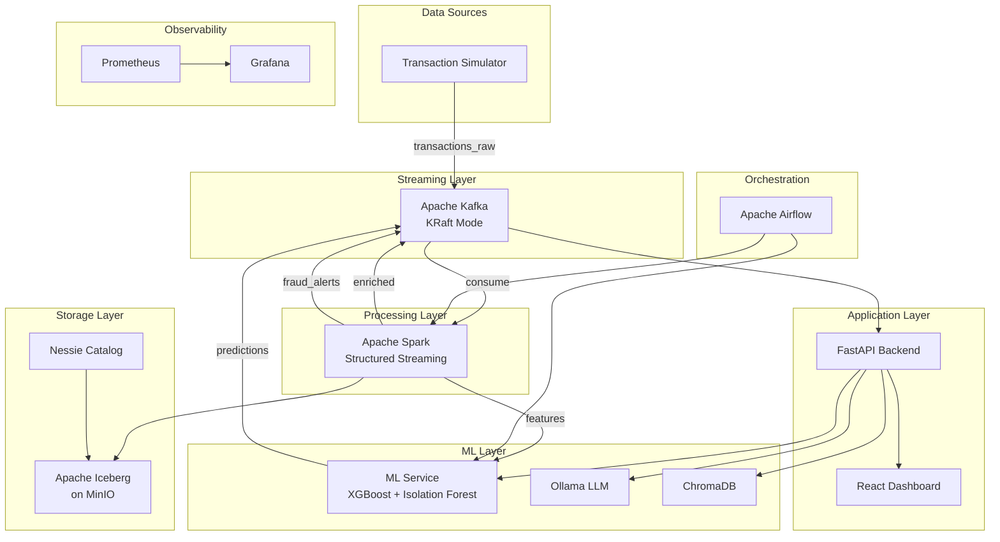
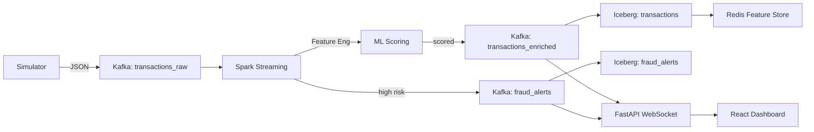
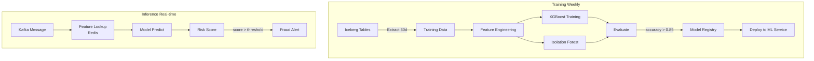
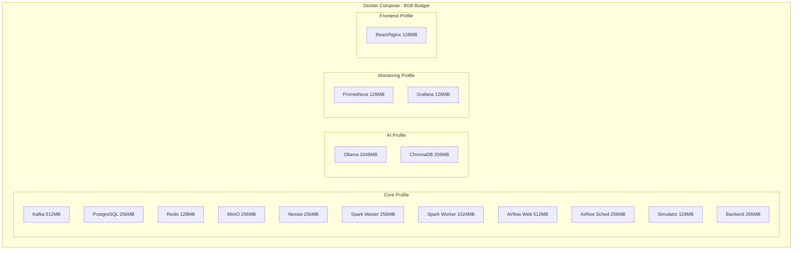

# Fraud Intelligence Platform — Architecture Documentation

## High-Level Architecture

## Data Flow

## ML Pipeline

## Deployment Architecture

## Architecture Decisions & Tradeoffs

### Why KRaft over Zookeeper
KRaft eliminates Zookeeper dependency, saving ~512MB RAM. Single-node KRaft is sufficient for development and supports the same topic/partition semantics.

### Why LocalExecutor over CeleryExecutor
CeleryExecutor requires a message broker (Redis/RabbitMQ) and worker processes, adding ~512MB overhead. LocalExecutor runs tasks in the scheduler process — adequate for the DAG count in this platform.

### Why Iceberg over Delta Lake
Iceberg provides: time-travel queries (critical for the replay engine), hidden partitioning, and native Nessie catalog integration. The ecosystem has broader multi-engine support (Spark, Flink, Trino).

### Why Nessie over Hive Metastore
Nessie is lightweight (~256MB), Git-like catalog with branching support. Hive Metastore requires MySQL/PostgreSQL backend and more memory.

### Why XGBoost + Isolation Forest
XGBoost handles the supervised classification (known fraud patterns), while Isolation Forest catches anomalous transactions not matching known patterns. This dual approach balances precision and recall.

## Scaling Strategy: Local to Cloud

### Local (Current)
- Single Docker Compose on 16GB MacBook
- 8GB Docker memory budget
- Single Kafka broker, single Spark worker
- Target: 100 TPS (~8.6M events/day)

### Small Team (AWS)
- EKS with 3 nodes (m6g.xlarge)
- MSK for managed Kafka (3 brokers)
- EMR Serverless for Spark
- S3 for Iceberg storage
- RDS for Airflow metadata
- Target: 1,000 TPS

### Production (AWS)
- EKS with auto-scaling node groups
- MSK (6+ brokers, multi-AZ)
- EMR on EKS for elastic Spark
- S3 + Glacier lifecycle for cold data
- SageMaker for model training/serving
- Target: 10,000+ TPS

## Production Migration Path

1. **Containerize** — Already done (Docker Compose → Helm chart)
2. **Externalize state** — Move Kafka to MSK, PostgreSQL to RDS, MinIO to S3
3. **Deploy to EKS** — Use the provided Helm chart with production values
4. **Add observability** — Connect Prometheus to Grafana Cloud, enable distributed tracing
5. **Implement CI/CD** — GitHub Actions for build/test/deploy pipeline
6. **Security hardening** — Enable TLS, RBAC, VPC networking, secrets management (AWS Secrets Manager)
7. **Performance tuning** — Kafka partition count, Spark executor sizing, model serving optimization

## Key Technologies

| Component | Technology | Purpose |
|-----------|-----------|---------|
| Event Streaming | Apache Kafka (KRaft) | Real-time transaction ingestion |
| Stream Processing | Apache Spark Structured Streaming | Feature engineering, enrichment |
| Data Lake | Apache Iceberg on MinIO | ACID transactions, time-travel |
| Catalog | Nessie | Git-like table versioning |
| ML Training | XGBoost, Isolation Forest | Fraud classification & anomaly detection |
| ML Serving | FastAPI + scikit-learn | Real-time inference |
| LLM | Ollama (Mistral) | Investigation copilot |
| Vector Store | ChromaDB | Semantic search over alerts |
| Dashboard | React + Recharts | Real-time visualization |
| Backend | FastAPI + WebSockets | API + real-time updates |
| Orchestration | Apache Airflow | Pipeline scheduling |
| Monitoring | Prometheus + Grafana | Metrics and alerting |
| Feature Store | Redis (online) + Iceberg (offline) | Feature serving |
| Graph Analysis | NetworkX | Fraud ring detection |
