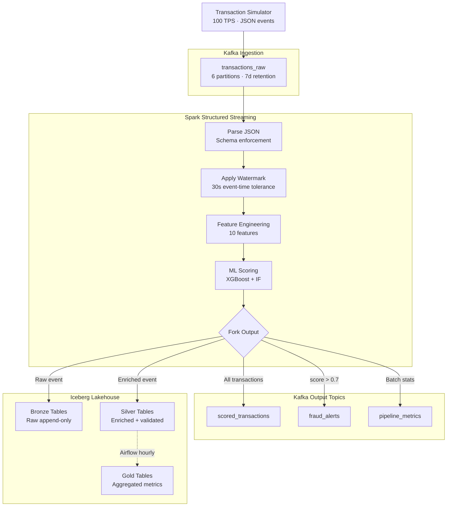
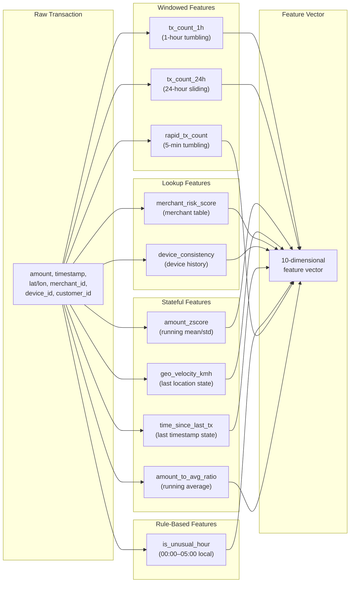
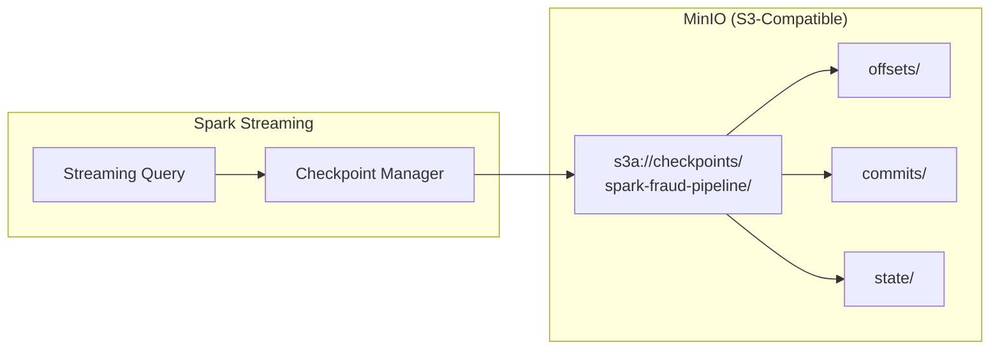
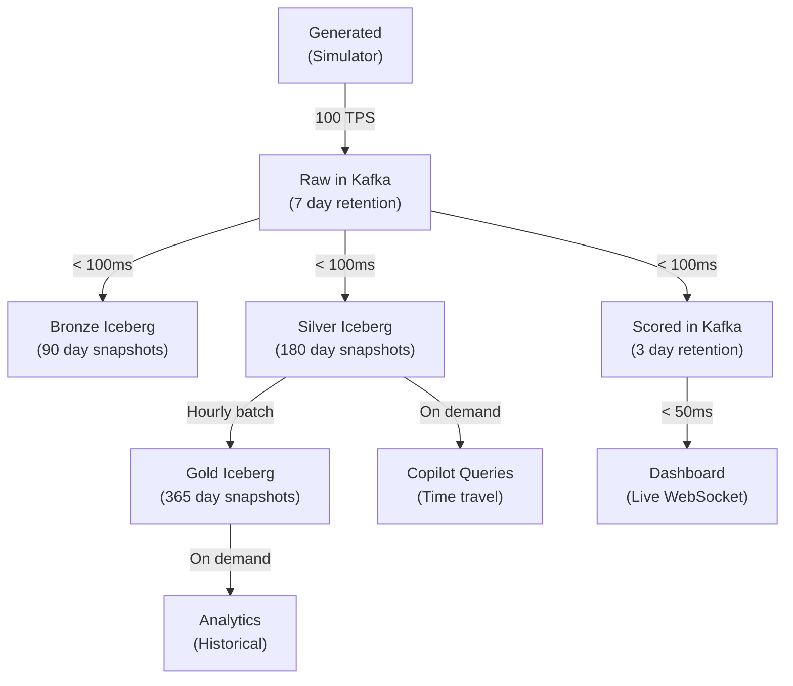

# Data Flow & Pipeline Architecture

This page documents every stage of data movement through the platform — from the moment a transaction is generated to its final resting place in Gold-tier aggregation tables.

---

## Streaming Pipeline



### Pipeline Stages in Detail

| Stage | Operation | Latency | State |
|---|---|---|---|
| **Parse** | JSON deserialization, schema validation, null handling | ~2 ms | Stateless |
| **Watermark** | Event-time watermark with 30-second tolerance for late data | ~0 ms | Metadata |
| **Features** | 10 engineered features: windowed aggregates, stateful metrics, lookups | ~15 ms | Stateful |
| **Score** | HTTP call to ML services, ensemble combination | ~8 ms | Stateless |
| **Fork** | Route to topics and Iceberg tables based on score thresholds | ~1 ms | Stateless |

!!! info "End-to-End Latency"
    From transaction generation to dashboard display, the typical end-to-end latency is **50–120 ms** under normal load. The dominant contributor is the ML scoring HTTP round-trip.

---

## Medallion Architecture

```mermaid
graph LR
    subgraph bronze ["Bronze Layer"]
        direction TB
        B_TX["transactions_bronze"]
        B_META["Raw JSON, append-only<br/>Partitioned: event_date<br/>Retention: 90 days"]
    end

    subgraph silver ["Silver Layer"]
        direction TB
        S_TX["transactions_silver"]
        S_CUST["customer_profiles_silver"]
        S_META["Parsed, validated, deduped<br/>Enriched with 10 features<br/>Partitioned: event_date + tx_type"]
    end

    subgraph gold ["Gold Layer"]
        direction TB
        G_HOURLY["hourly_metrics_gold"]
        G_CUST["customer_risk_gold"]
        G_MERCH["merchant_scores_gold"]
        G_META["Aggregated metrics<br/>Customer profiles<br/>Merchant risk scores"]
    end

    bronze -->|"Parse + Validate<br/>Dedup by tx_id<br/>Add features"| silver
    silver -->|"Aggregate hourly<br/>Profile rollup<br/>Risk scoring"| gold
```



### Bronze Layer

| Property | Value |
|---|---|
| **Tables** | `transactions_bronze` |
| **Write Mode** | Append-only (no updates) |
| **Format** | Iceberg with Parquet data files |
| **Partitioning** | `event_date` (hidden partition from `timestamp`) |
| **Retention** | 90 days (Iceberg snapshot expiry) |
| **Schema** | Raw JSON fields, no transformations |
| **Purpose** | Immutable audit trail, replay source |

```sql title="Bronze Table DDL"
CREATE TABLE fraud_db.bronze.transactions_bronze (
    transaction_id   STRING,
    raw_json         STRING,       -- Original JSON preserved
    kafka_partition  INT,
    kafka_offset     BIGINT,
    event_timestamp  TIMESTAMP,
    ingestion_time   TIMESTAMP
)
PARTITIONED BY (days(event_timestamp))
```

### Silver Layer

| Property | Value |
|---|---|
| **Tables** | `transactions_silver`, `customer_profiles_silver` |
| **Write Mode** | Upsert (MERGE by `transaction_id`) |
| **Partitioning** | `event_date` + `transaction_type` |
| **Transformations** | Schema enforcement, null imputation, deduplication, feature enrichment |
| **Quality Checks** | Non-null `transaction_id`, valid `amount > 0`, valid coordinates |

```sql title="Silver Table DDL (simplified)"
CREATE TABLE fraud_db.silver.transactions_silver (
    transaction_id      STRING,
    timestamp           TIMESTAMP,
    customer_id         STRING,
    amount              DECIMAL(12,2),
    merchant_id         STRING,
    merchant_category   STRING,
    -- 10 engineered features
    tx_count_1h         INT,
    tx_count_24h        INT,
    amount_zscore       DOUBLE,
    geo_velocity_kmh    DOUBLE,
    merchant_risk_score DOUBLE,
    device_consistency  DOUBLE,
    time_since_last_tx  DOUBLE,
    is_unusual_hour     BOOLEAN,
    rapid_tx_count      INT,
    amount_to_avg_ratio DOUBLE,
    -- ML scores
    xgboost_score       DOUBLE,
    isolation_score     DOUBLE,
    ensemble_score      DOUBLE,
    risk_level          STRING
)
PARTITIONED BY (days(timestamp), merchant_category)
```

### Gold Layer

| Property | Value |
|---|---|
| **Tables** | `hourly_metrics_gold`, `customer_risk_gold`, `merchant_scores_gold` |
| **Write Mode** | Overwrite partition (hourly batch via Airflow) |
| **Schedule** | Airflow DAG every hour |
| **Aggregations** | COUNT, SUM, AVG, P95, P99, distinct counts |

!!! tip "Time Travel"
    All three layers support Iceberg time travel. Query any historical state with `AS OF TIMESTAMP` or `AS OF VERSION`. Bronze retains 90 days, Silver 180 days, and Gold 365 days of snapshot history.

---

## Feature Engineering Pipeline



### Feature Definitions

| # | Feature | Type | Window/State | Computation | Fraud Signal |
|---|---|---|---|---|---|
| 1 | `tx_count_1h` | Windowed | 1-hour tumbling | Count of transactions per customer in last hour | Burst activity |
| 2 | `tx_count_24h` | Windowed | 24-hour sliding | Count of transactions per customer in last 24h | Sustained unusual volume |
| 3 | `amount_zscore` | Stateful | Running stats | `(amount - mean) / stddev` per customer | Abnormal spending |
| 4 | `geo_velocity_kmh` | Stateful | Last location | `haversine(prev, curr) / time_delta` | Impossible travel |
| 5 | `merchant_risk_score` | Lookup | Static table | Historical fraud rate per merchant category | High-risk merchant |
| 6 | `device_consistency` | Lookup | Device history | Binary: known vs unknown device for customer | Account takeover |
| 7 | `time_since_last_tx` | Stateful | Last timestamp | Seconds since customer's previous transaction | Rapid-fire fraud |
| 8 | `is_unusual_hour` | Rule | None | `hour(timestamp) BETWEEN 0 AND 5` in local TZ | Off-hours activity |
| 9 | `rapid_tx_count` | Windowed | 5-min tumbling | Count in 5-minute window per customer | Card testing |
| 10 | `amount_to_avg_ratio` | Stateful | Running average | `amount / running_avg_amount` per customer | Spending spike |

!!! warning "State Management"
    Stateful features require Spark checkpoint state. If checkpoints are cleared, running statistics (mean, stddev, last_location) reset and produce inaccurate values until enough data accumulates. See [Checkpointing](#checkpointing-exactly-once-semantics) below.

---

## Kafka Topic Architecture

| Topic | Partitions | Retention | Cleanup Policy | Key | Value | Purpose |
|---|---|---|---|---|---|---|
| `transactions_raw` | 6 | 7 days | delete | `customer_id` | Transaction JSON | Raw ingestion from simulator |
| `scored_transactions` | 6 | 3 days | delete | `transaction_id` | Scored transaction JSON | ML-scored events for API |
| `fraud_alerts` | 3 | 30 days | delete | `alert_id` | Alert JSON | High-risk alerts (score > 0.7) |
| `model_predictions` | 3 | 7 days | delete | `transaction_id` | Prediction JSON | Raw ML model outputs |
| `pipeline_metrics` | 1 | 1 day | delete | `metric_name` | Metric JSON | Internal pipeline health metrics |
| `customer_events` | 6 | 14 days | compact | `customer_id` | Profile JSON | Customer state changelog |
| `dlq_transactions` | 1 | 30 days | delete | `transaction_id` | Failed event JSON | Dead letter queue for parse failures |

### Partitioning Strategy

```
transactions_raw (6 partitions):
  Key: customer_id → murmur2 hash → partition assignment
  Effect: All transactions for a customer land on the same partition
  Benefit: Ordered processing per customer, enables stateful features

fraud_alerts (3 partitions):
  Key: alert_id → fewer partitions for lower-volume topic
  Effect: Alerts spread across 3 partitions
  Benefit: Sufficient parallelism for ~1% fraud rate

customer_events (6 partitions, compacted):
  Key: customer_id → latest state per customer retained
  Effect: Acts as a materialized view of customer state
  Benefit: Fast bootstrap for new consumers
```

!!! note "Consumer Groups"
    Three consumer groups read from these topics: `spark-streaming-group` (processing), `fastapi-alerts-group` (serving), and `airflow-batch-group` (orchestration). Each group maintains independent offsets.

---

## Checkpointing & Exactly-Once Semantics

### Checkpoint Architecture



### How Checkpointing Works

1. **Offset tracking** — Spark records which Kafka offsets have been processed in each micro-batch
2. **State snapshots** — Stateful operations (windowed aggregates, running statistics) serialize state to MinIO
3. **Commit log** — Each completed micro-batch is recorded, preventing reprocessing on restart
4. **Write-ahead log** — Pending writes are logged before execution for crash recovery

### Recovery Scenarios

| Scenario | Recovery Behavior | Data Loss | Duplicates |
|---|---|---|---|
| Spark worker OOM | Worker restarts, resumes from last checkpoint | None | None |
| Kafka broker restart | Spark pauses, retries, resumes when broker returns | None | None |
| MinIO unavailable | Spark pauses writes, retries with backoff | None | None |
| Checkpoint corruption | Must clear checkpoint; state features reset | Stateful features only | Possible during replay |
| Full cluster restart | All services start, Spark resumes from checkpoint | None | None |

### Exactly-Once Guarantee

```
Producer (Simulator) → Kafka: At-least-once (acks=all, retries=3)
Kafka → Spark: Exactly-once (checkpointed offsets)
Spark → Iceberg: Exactly-once (checkpoint commit log)
Spark → Kafka (output): At-least-once (idempotent producer)
```

!!! warning "Exactly-Once Scope"
    True exactly-once applies to the Kafka → Spark → Iceberg path. The output to downstream Kafka topics uses an idempotent producer (at-least-once with dedup). Consumers should handle potential duplicates with idempotent writes or deduplication logic.

---

## Backpressure & Flow Control

| Mechanism | Configuration | Purpose |
|---|---|---|
| `maxOffsetsPerTrigger` | 10,000 | Limits records per micro-batch to prevent OOM |
| `minPartitions` | 6 | Ensures parallelism matches Kafka partitions |
| Watermark | 30 seconds | Drops data older than 30s past watermark |
| Trigger interval | 10 seconds | Micro-batch frequency balances latency vs throughput |
| Kafka consumer `fetch.max.bytes` | 1 MB | Prevents large fetches from overwhelming memory |

```python title="Spark ReadStream Configuration"
df = (
    spark.readStream
    .format("kafka")
    .option("kafka.bootstrap.servers", "kafka:29092")
    .option("subscribe", "transactions_raw")
    .option("startingOffsets", "latest")
    .option("maxOffsetsPerTrigger", 10000)
    .option("minPartitions", 6)
    .option("failOnDataLoss", "false")
    .load()
    .withWatermark("event_timestamp", "30 seconds")
)
```

---

## Data Lifecycle Summary


