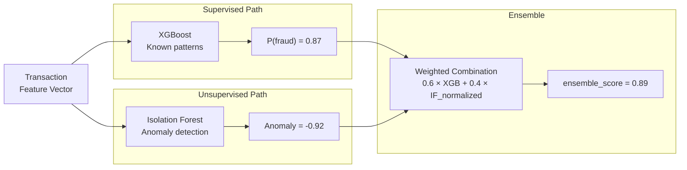

# Architecture Decision Records

This page documents the key architecture decisions made during the design and implementation of the Fraud Intelligence Platform. Each ADR follows a structured format: context, decision, reasoning, and consequences.

---

## ADR-001: KRaft Mode over Zookeeper for Kafka

| Field | Value |
|---|---|
| **Status** | Accepted |
| **Date** | 2024-03-01 |
| **Deciders** | Platform architect |

### Context

The platform runs on a 16GB MacBook with an 8GB Docker memory allocation. Every megabyte matters. Traditional Kafka deployments require Apache Zookeeper for metadata management, which adds a separate JVM process consuming 256–512 MB of RAM.

### Decision

Use **Kafka in KRaft mode**, eliminating the Zookeeper dependency entirely.

### Reasoning

- KRaft mode is production-ready since Kafka 3.6 (we use 3.7)
- Eliminates a 512 MB JVM process (Zookeeper)
- Reduces Docker service count by 1 (simpler `docker-compose.yml`)
- Faster broker startup — no Zookeeper coordination needed
- Metadata operations are faster with the Raft-based controller

### Consequences

!!! success "Positive"
    - Saves **512 MB** of RAM — critical for the 8GB budget
    - One fewer container to manage, monitor, and debug
    - Broker starts in seconds instead of waiting for Zookeeper quorum

!!! warning "Trade-offs"
    - KRaft mode does not support multi-node controller quorums in our single-broker setup (acceptable for local development)
    - Some older Kafka CLI tools have slightly different syntax with KRaft
    - Migration from KRaft to Zookeeper-based (if ever needed) requires cluster rebuild

---

## ADR-002: Apache Iceberg over Delta Lake

| Field | Value |
|---|---|
| **Status** | Accepted |
| **Date** | 2024-03-01 |
| **Deciders** | Platform architect |

### Context

The lakehouse layer needs ACID transactions, schema evolution, and time travel for the medallion architecture. The two leading open table formats are Apache Iceberg and Delta Lake.

### Decision

Use **Apache Iceberg** with the **Nessie REST catalog**.

### Reasoning

| Criterion | Iceberg | Delta Lake |
|---|---|---|
| **Hidden partitioning** | Yes — partition by `days(timestamp)` without exposing it in the schema | No — requires explicit partition columns |
| **Catalog options** | Nessie, Hive, Glue, REST | Unity Catalog, Hive |
| **Multi-engine support** | Spark, Flink, Trino, Dremio, Presto | Primarily Spark (Flink support emerging) |
| **Time travel** | Snapshot-based, configurable retention | Version-based, requires `VACUUM` management |
| **Memory overhead** | Nessie: 256 MB | Unity/Hive Metastore: 512 MB+ |
| **Community** | Apache foundation, vendor-neutral | Databricks-led |

### Consequences

!!! success "Positive"
    - Hidden partitioning eliminates partition column management
    - Nessie provides Git-like branching for catalog operations (useful for testing)
    - Nessie uses 256 MB vs 512 MB+ for Hive Metastore
    - Multi-engine access enables future Trino/Flink integration

!!! warning "Trade-offs"
    - Delta Lake has tighter Spark integration (native `MERGE` optimization)
    - Iceberg documentation is less beginner-friendly than Delta Lake
    - Nessie is less battle-tested than Hive Metastore in production

---

## ADR-003: LocalExecutor over CeleryExecutor for Airflow

| Field | Value |
|---|---|
| **Status** | Accepted |
| **Date** | 2024-03-05 |
| **Deciders** | Platform architect |

### Context

Airflow needs an executor to run DAG tasks. CeleryExecutor is the standard for distributed setups but requires a message broker (Redis or RabbitMQ) and Celery workers.

### Decision

Use **Airflow with LocalExecutor**.

### Reasoning

- The platform runs **5 DAGs** with a maximum of 3 concurrent tasks
- CeleryExecutor would require Redis (128 MB) + Celery worker (256 MB) = 384 MB additional overhead
- LocalExecutor runs tasks as subprocesses of the scheduler — no broker needed
- Task parallelism of 4 is sufficient for our workload

### Consequences

!!! success "Positive"
    - Saves **384 MB** of RAM (no Redis + Celery worker)
    - Simpler debugging — tasks run in the scheduler process
    - Two fewer Docker containers (Redis, Celery worker)
    - Faster task startup (no message broker round-trip)

!!! warning "Trade-offs"
    - Cannot scale beyond a single scheduler host
    - Task failures can impact the scheduler process (mitigated by subprocess isolation)
    - Not suitable if DAG count grows beyond ~20 concurrent tasks

---

## ADR-004: XGBoost + Isolation Forest Ensemble

| Field | Value |
|---|---|
| **Status** | Accepted |
| **Date** | 2024-03-08 |
| **Deciders** | ML engineer, Platform architect |

### Context

Fraud detection requires both identifying known fraud patterns (supervised learning) and detecting novel anomalies that haven't been seen before (unsupervised learning). A single model cannot optimally handle both.

### Decision

Use a **dual-model ensemble**: XGBoost (supervised) + Isolation Forest (unsupervised).

### Reasoning



| Model | Strengths | Weaknesses |
|---|---|---|
| **XGBoost** | High precision on known patterns, feature importance, fast inference (4 ms) | Requires labeled data, misses novel fraud |
| **Isolation Forest** | No labels needed, detects novel anomalies, low memory | Higher false positive rate, no feature importance |
| **Ensemble** | Catches both known and novel fraud, balanced precision/recall | Slightly higher latency (~8 ms total) |

### Ensemble Formula

```python
# Normalize IF score from [-1, 1] to [0, 1]
if_normalized = (1 - isolation_forest_score) / 2

# Weighted ensemble
ensemble_score = 0.6 * xgboost_score + 0.4 * if_normalized

# Risk level thresholds
risk_level = "HIGH" if ensemble_score > 0.7 else "MEDIUM" if ensemble_score > 0.4 else "LOW"
```

### Consequences

!!! success "Positive"
    - Catches known fraud patterns (XGBoost) AND novel anomalies (Isolation Forest)
    - Each model runs as an independent microservice — can be updated independently
    - Total scoring latency is ~8 ms (both models called in parallel)
    - Ensemble approach is standard in production fraud systems

!!! warning "Trade-offs"
    - Two models to train, version, and monitor instead of one
    - Ensemble weights (0.6/0.4) require periodic tuning
    - Slightly more complex serving infrastructure

---

## ADR-005: Ollama phi3:mini for Local LLM

| Field | Value |
|---|---|
| **Status** | Accepted |
| **Date** | 2024-03-10 |
| **Deciders** | Platform architect |

### Context

The investigation copilot needs an LLM for natural-language query responses. Options range from cloud APIs (OpenAI, Anthropic) to local models (Ollama, llama.cpp).

### Decision

Use **Ollama with the phi3:mini model** (3.8B parameters, 2.7 GB on disk).

### Reasoning

| Option | RAM Required | Quality | Latency | Cost | Privacy |
|---|---|---|---|---|---|
| GPT-4 (API) | 0 MB | Excellent | 200–800 ms | $0.03/1K tokens | Data leaves device |
| Llama 3 8B | 5 GB | Very good | 500 ms | Free | Local |
| **phi3:mini 3.8B** | **2 GB** | **Good** | **300 ms** | **Free** | **Local** |
| Gemma 2B | 1.5 GB | Fair | 200 ms | Free | Local |
| TinyLlama 1.1B | 0.8 GB | Poor | 100 ms | Free | Local |

phi3:mini hits the best quality-to-size ratio for the 2 GB LLM budget. It handles structured fraud explanations, risk summaries, and investigation queries well despite its smaller size.

### Consequences

!!! success "Positive"
    - **Zero API costs** — no OpenAI/Anthropic billing
    - **Full data privacy** — no transaction data leaves the machine
    - **Fits in 2 GB** — within the memory budget for the LLM allocation
    - **No API keys** — simpler setup, no secrets management needed

!!! warning "Trade-offs"
    - Lower quality than GPT-4 or Llama 3 8B for complex reasoning
    - Slower on CPU-only inference (acceptable with Apple Silicon acceleration)
    - Limited context window (4K tokens) constrains investigation depth
    - Cannot handle multi-turn conversations as well as larger models

---

## ADR-006: ChromaDB over Qdrant for Vector Store

| Field | Value |
|---|---|
| **Status** | Accepted |
| **Date** | 2024-03-10 |
| **Deciders** | Platform architect |

### Context

The RAG pipeline for the investigation copilot needs a vector store to index and retrieve relevant context chunks (transaction patterns, fraud rules, historical cases).

### Decision

Use **ChromaDB** as the vector store.

### Reasoning

| Criterion | ChromaDB | Qdrant | Weaviate |
|---|---|---|---|
| **Memory** | 256 MB | 512 MB | 768 MB |
| **Setup** | Python-native, single container | Rust binary, single container | Go binary + modules |
| **Persistence** | File-based (SQLite + Parquet) | RocksDB | Custom |
| **Python API** | Native, first-class | Client library | Client library |
| **Max vectors** | ~1M (sufficient) | Billions | Billions |
| **Filtering** | Metadata filters | Advanced filters | GraphQL filters |

### Consequences

!!! success "Positive"
    - Uses only **256 MB** — half of Qdrant's footprint
    - Python-native API integrates seamlessly with FastAPI
    - File-based persistence survives container restarts without extra configuration
    - Simple enough for the copilot's needs (~10K vectors for fraud patterns)

!!! warning "Trade-offs"
    - Not suitable for large-scale production (>1M vectors)
    - Lacks advanced features like distributed mode and sharding
    - Slower at scale compared to Qdrant's Rust-based engine

---

## ADR-007: React + Vite over Next.js

| Field | Value |
|---|---|
| **Status** | Accepted |
| **Date** | 2024-03-12 |
| **Deciders** | Platform architect |

### Context

The fraud dashboard needs a modern frontend framework. The primary options are React with Vite (SPA) or Next.js (SSR/SSG framework).

### Decision

Use **React 18 with Vite 5** as a single-page application.

### Reasoning

- The dashboard is an **internal tool** — SEO is irrelevant, eliminating the primary benefit of SSR
- Vite provides faster HMR (Hot Module Replacement) than Next.js for development
- No server-side rendering reduces complexity — the dashboard is purely client-side
- Vite produces static files that can be served by any HTTP server (or even embedded in the FastAPI container)
- WebSocket connections for live updates work the same in both approaches

### Consequences

!!! success "Positive"
    - Simpler architecture — no Node.js server required in production
    - Static build output can be served by Nginx, FastAPI, or any CDN
    - Faster development iteration with Vite's HMR
    - Lower memory footprint (no Node.js SSR server)

!!! warning "Trade-offs"
    - No SSR means longer initial page load (acceptable for internal dashboard)
    - No built-in API routes (not needed — FastAPI handles all API logic)
    - Must handle routing client-side (React Router)

---

## ADR-008: Nessie over Hive Metastore

| Field | Value |
|---|---|
| **Status** | Accepted |
| **Date** | 2024-03-01 |
| **Deciders** | Platform architect |

### Context

Apache Iceberg requires a catalog to manage table metadata, track snapshots, and resolve table locations. The two primary options for a Docker-based setup are Hive Metastore and Nessie.

### Decision

Use **Nessie REST catalog**.

### Reasoning

| Criterion | Nessie | Hive Metastore |
|---|---|---|
| **Memory** | 256 MB | 512 MB + MySQL (128 MB) |
| **Dependencies** | None (standalone Java app) | Requires MySQL/PostgreSQL |
| **Container count** | 1 | 2 (HMS + database) |
| **API** | REST (HTTP) | Thrift (binary) |
| **Branching** | Git-like branches and tags | None |
| **Setup** | Single container, zero config | Schema init, connection config |

### Consequences

!!! success "Positive"
    - Saves **384 MB** (512 MB HMS + 128 MB MySQL - 256 MB Nessie)
    - Eliminates MySQL dependency — one fewer database to manage
    - REST API is easier to debug (`curl` vs Thrift binary protocol)
    - Git-like branching enables testing catalog changes on branches before merging

!!! warning "Trade-offs"
    - Hive Metastore has broader ecosystem support (Presto, Hive, older Spark versions)
    - Nessie is a younger project with a smaller community
    - Some Spark-Iceberg features may require Hive Metastore-specific configuration

---

## Decision Summary

| ADR | Decision | Primary Driver | RAM Saved |
|---|---|---|---|
| 001 | KRaft over Zookeeper | Memory efficiency | 512 MB |
| 002 | Iceberg over Delta Lake | Multi-engine support | 256 MB |
| 003 | LocalExecutor over Celery | Simplicity | 384 MB |
| 004 | XGBoost + IF ensemble | Detection coverage | — |
| 005 | phi3:mini via Ollama | Quality/size ratio | — |
| 006 | ChromaDB over Qdrant | Python-native simplicity | 256 MB |
| 007 | React + Vite over Next.js | SPA simplicity | ~128 MB |
| 008 | Nessie over Hive Metastore | Fewer dependencies | 384 MB |
| | | **Total RAM saved** | **~1.9 GB** |

!!! tip "Memory-Driven Architecture"
    Collectively, these decisions saved approximately **1.9 GB** of RAM — nearly 25% of the total 8 GB Docker budget. This freed memory was redirected to the ML models and LLM copilot, which are the core differentiators of the platform.
