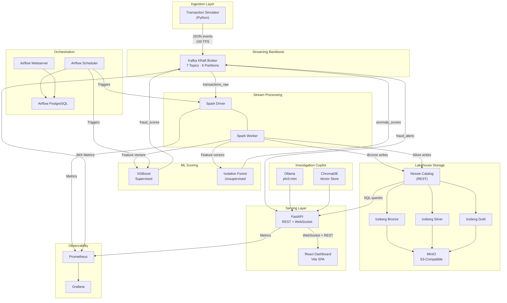
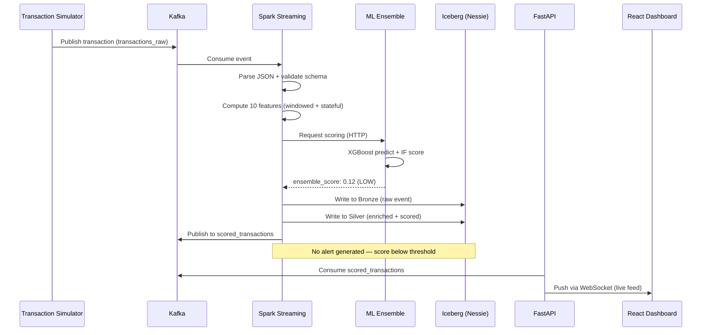
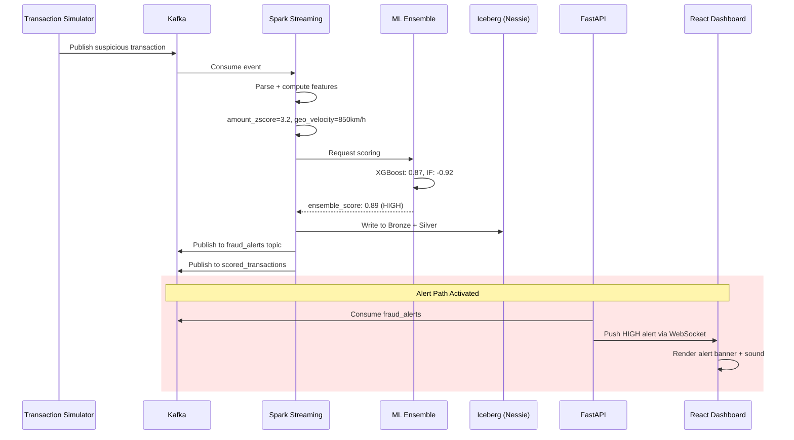
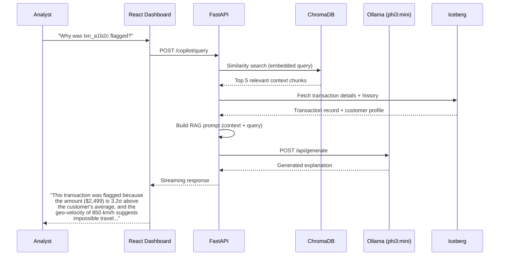
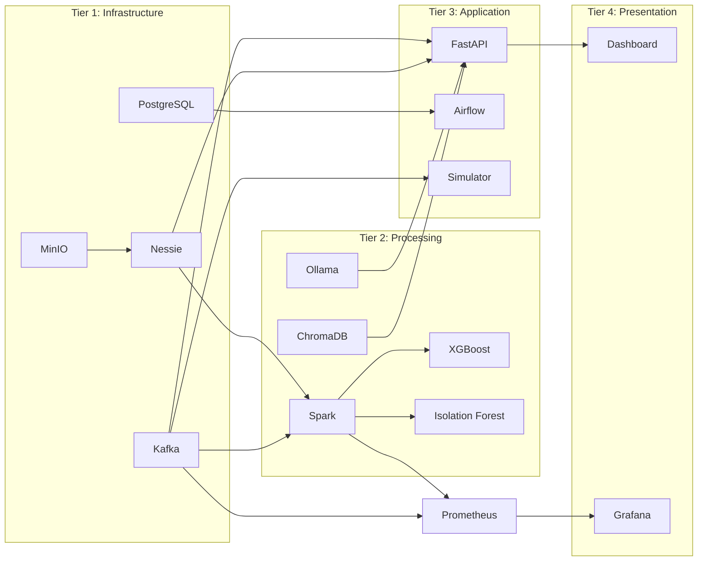

# System Architecture Overview

This page provides a comprehensive view of the Fraud Intelligence Platform architecture: every component, how they connect, what data flows between them, and the key interaction patterns.

---

## High-Level Architecture



---

## Component Inventory

| Component | Technology | Purpose | Memory | Port(s) | Health Check |
|---|---|---|---|---|---|
| Transaction Simulator | Python 3.11 | Generate realistic fraud/legit transactions | 128 MB | — | Process exit code |
| Kafka Broker | Apache Kafka 3.7 (KRaft) | Event streaming backbone | 1024 MB | 9092, 29092 | `kafka-broker-api-versions` |
| Spark Driver | Apache Spark 3.5 | Stream processing coordination | 1024 MB | 4040, 7077 | Spark UI |
| Spark Worker | Apache Spark 3.5 | Stream processing execution | 1024 MB | 8081 | Worker heartbeat |
| Nessie Catalog | Nessie 0.77 | Iceberg REST catalog (Git-like) | 256 MB | 19120 | `/api/v2/config` |
| MinIO | MinIO latest | S3-compatible object store | 512 MB | 9000, 9001 | `/minio/health/live` |
| XGBoost Service | XGBoost 2.0 + FastAPI | Supervised fraud scoring | 256 MB | 8501 | `/health` |
| Isolation Forest | scikit-learn + FastAPI | Unsupervised anomaly detection | 256 MB | 8502 | `/health` |
| Ollama | Ollama + phi3:mini | Local LLM inference | 2048 MB | 11434 | `/api/tags` |
| ChromaDB | ChromaDB 0.4 | Vector store for RAG | 256 MB | 8000 | `/api/v1/heartbeat` |
| FastAPI | FastAPI 0.110 | REST API + WebSocket gateway | 256 MB | 8000 | `/health` |
| React Dashboard | React 18 + Vite 5 | Interactive fraud dashboard | 256 MB | 5173 | HTTP 200 |
| Airflow Scheduler | Airflow 2.8 | DAG scheduling and execution | 512 MB | — | `airflow jobs check` |
| Airflow Webserver | Airflow 2.8 | Airflow management UI | 256 MB | 8080 | `/health` |
| Airflow PostgreSQL | PostgreSQL 16 | Airflow metadata database | 128 MB | 5432 | `pg_isready` |
| Prometheus | Prometheus latest | Metrics collection | 256 MB | 9090 | `/-/healthy` |
| Grafana | Grafana latest | Metrics visualization | 256 MB | 3000 | `/api/health` |

!!! note "Memory Allocations"
    All memory values are Docker container limits. Actual usage may be lower. The total allocation of ~8 GB fits within the Docker Desktop memory limit on a 16 GB MacBook.

---

## Network Topology

```mermaid
graph TB
    subgraph docker_network ["fraud-net (Bridge Network)"]
        direction TB

        subgraph ports_external ["External Ports (Host-Mapped)"]
            P9092["9092 — Kafka"]
            P5173["5173 — Dashboard"]
            P8000["8000 — FastAPI"]
            P8080["8080 — Airflow UI"]
            P3000["3000 — Grafana"]
            P9090["9090 — Prometheus"]
            P9001["9001 — MinIO Console"]
            P4040["4040 — Spark UI"]
            P19120["19120 — Nessie"]
        end

        subgraph internal ["Internal Service Discovery (DNS)"]
            kafka["kafka:29092"]
            spark-master["spark-master:7077"]
            spark-worker["spark-worker:8081"]
            nessie["nessie:19120"]
            minio["minio:9000"]
            xgboost-service["xgboost-service:8501"]
            isolation-forest["isolation-forest:8502"]
            ollama["ollama:11434"]
            chromadb["chromadb:8000"]
            fastapi["fastapi:8000"]
            prometheus["prometheus:9090"]
            grafana["grafana:3000"]
            airflow-postgres["airflow-postgres:5432"]
        end
    end

    P9092 -.-> kafka
    P5173 -.-> fastapi
    P8000 -.-> fastapi
    P8080 -.-> airflow-webserver
    P3000 -.-> grafana
    P9090 -.-> prometheus
    P9001 -.-> minio
    P4040 -.-> spark-master
    P19120 -.-> nessie
```



!!! info "Service Discovery"
    All services communicate over the `fraud-net` Docker bridge network using container DNS names. No hardcoded IPs are used—services reference each other by hostname (e.g., `kafka:29092`, `nessie:19120`).

---

## Data Schemas

### Transaction Event (Input)

```json title="Transaction JSON Schema" hl_lines="5 6 7"
{
  "transaction_id": "txn_a1b2c3d4-e5f6-7890-abcd-ef1234567890",
  "timestamp": "2024-03-15T14:30:00.000Z",
  "customer_id": "cust_00042",
  "amount": 2499.99,
  "currency": "USD",
  "merchant_id": "merch_electronics_0012",
  "merchant_category": "electronics",
  "merchant_country": "US",
  "card_type": "credit",
  "card_network": "visa",
  "entry_mode": "chip",
  "customer_lat": 37.7749,
  "customer_lon": -122.4194,
  "device_id": "dev_iphone14_abc",
  "ip_address": "192.168.1.100",
  "is_international": false,
  "is_fraud": false
}
```

### Fraud Alert (Output)

```json title="Fraud Alert Schema"
{
  "alert_id": "alert_20240315_143000_txn_a1b2c3d4",
  "transaction_id": "txn_a1b2c3d4-e5f6-7890-abcd-ef1234567890",
  "timestamp": "2024-03-15T14:30:01.200Z",
  "customer_id": "cust_00042",
  "amount": 2499.99,
  "xgboost_score": 0.87,
  "isolation_forest_score": -0.92,
  "ensemble_score": 0.89,
  "risk_level": "HIGH",
  "triggered_rules": [
    "amount_zscore_exceeded",
    "geo_velocity_anomaly"
  ],
  "top_features": {
    "amount_zscore": 3.2,
    "geo_velocity_kmh": 850.0,
    "tx_count_1h": 12
  }
}
```

### ML Prediction (Internal)

```json title="ML Prediction Schema"
{
  "transaction_id": "txn_a1b2c3d4-e5f6-7890-abcd-ef1234567890",
  "model": "xgboost_v2",
  "prediction": 1,
  "probability": 0.87,
  "features_used": 10,
  "inference_latency_ms": 4.2,
  "model_version": "2024-03-15-retrain",
  "feature_importances": {
    "amount_zscore": 0.23,
    "geo_velocity_kmh": 0.19,
    "tx_count_1h": 0.15,
    "merchant_risk_score": 0.12,
    "amount_to_avg_ratio": 0.10
  }
}
```

---

## Sequence Diagrams

### Normal Transaction Flow



### Fraud Detection Flow



### Investigation Copilot Interaction



---

## Inter-Service Dependencies



!!! warning "Startup Order"
    Services must start in tier order. Docker Compose `depends_on` with health checks enforces this. Kafka must be healthy before Spark or the Simulator starts; Nessie and MinIO must be ready before any Iceberg writes.

---

## Key Design Principles

1. **Memory-first architecture** — Every component was selected to minimize memory footprint while maintaining production-grade functionality.
2. **Event-driven by default** — Kafka sits at the center; all services communicate through topics, enabling loose coupling and replay.
3. **Medallion data quality** — Raw → validated → aggregated ensures data quality improves at each layer.
4. **Dual-model scoring** — Combining supervised and unsupervised ML catches both known and novel fraud patterns.
5. **Local-first AI** — The LLM copilot runs entirely on-device with Ollama, requiring no external API calls or keys.
