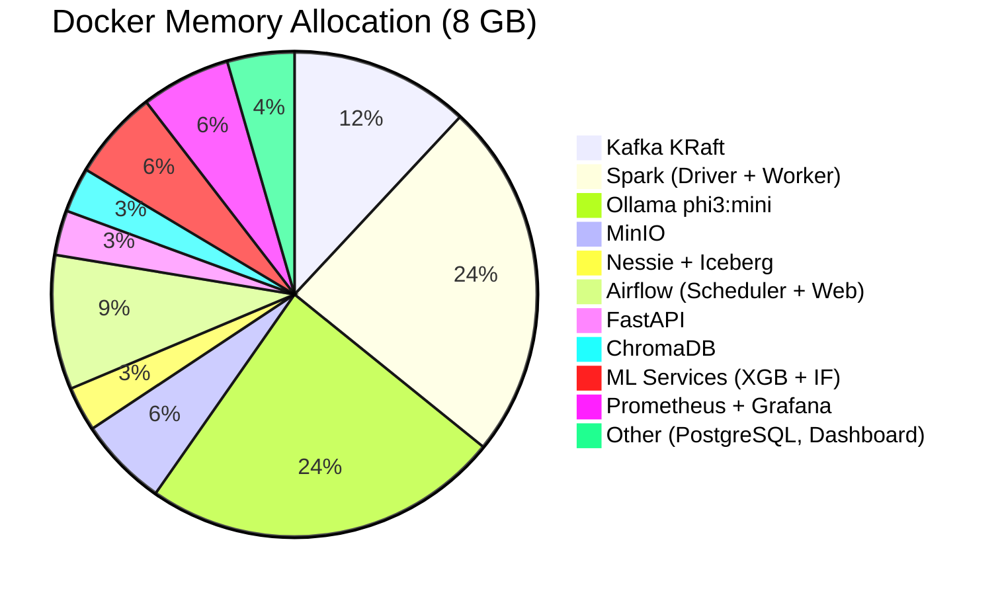
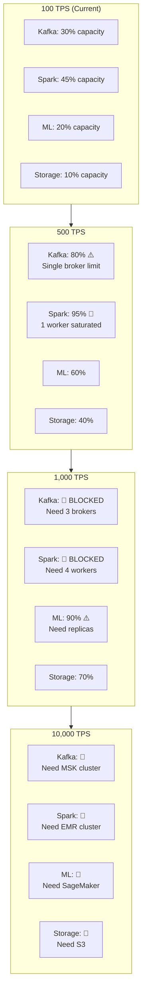
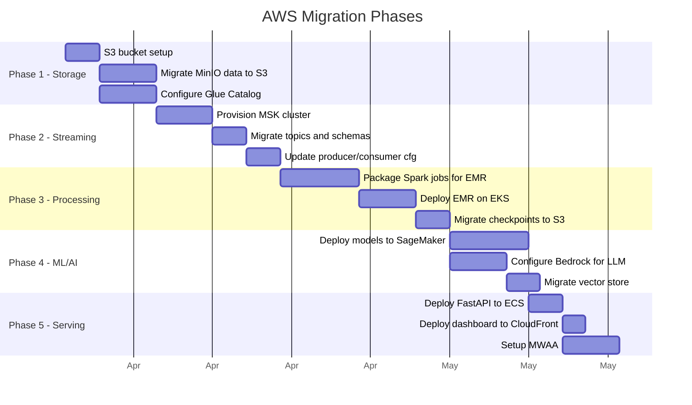

# Scaling Strategy

This page documents the platform's current resource profile, identifies scaling bottlenecks at various throughput levels, and provides a concrete migration path from local Docker Compose to cloud infrastructure.

---

## Local Development (Current State)

### Hardware Profile

| Resource | Specification |
|---|---|
| **Machine** | MacBook Pro, Apple Silicon (M-series) |
| **Total RAM** | 16 GB |
| **Docker Allocation** | 8 GB |
| **CPU Cores** | 8 (shared with host OS) |
| **Storage** | SSD (NVMe), ~50 GB allocated for Docker volumes |

### Current Throughput

| Metric | Value |
|---|---|
| **Ingestion Rate** | 100 TPS (transactions per second) |
| **Daily Volume** | ~8.64M events/day |
| **Kafka Partitions** | 6 (single broker) |
| **Spark Workers** | 1 |
| **Micro-batch Interval** | 10 seconds |
| **End-to-End Latency** | 50–120 ms (P95) |
| **ML Scoring Latency** | ~8 ms (P50) |

### Memory Distribution



---

## Scaling Bottleneck Analysis



### Bottleneck Details

| TPS | First Bottleneck | Symptoms | Resolution |
|---|---|---|---|
| **200** | Spark memory | GC pauses, micro-batch delays increase | Increase Spark worker memory to 3 GB |
| **500** | Spark parallelism | Processing lag exceeds watermark, data drops | Add 2nd Spark worker |
| **500** | Kafka single broker | Producer latency spikes, ISR shrinks | Deploy 3-broker cluster |
| **1,000** | ML scoring throughput | Scoring queue builds up, timeout errors | Deploy ML service replicas behind load balancer |
| **1,000** | MinIO disk I/O | Iceberg write latency increases | Move to S3 or dedicated NAS |
| **5,000** | Kafka partitions | Consumer lag grows, rebalancing frequent | Increase to 12–24 partitions per topic |
| **10,000** | Everything | All components need cloud-grade infrastructure | Full AWS migration |

---

## Migration Path: Local to AWS

### Service Mapping

| Local Component | AWS Equivalent | Migration Complexity | Notes |
|---|---|---|---|
| Kafka (KRaft, Docker) | Amazon MSK (Serverless) | :material-circle-half-full: Medium | Topic configs translate directly; consumer groups need re-registration |
| Spark (Docker) | EMR on EKS | :material-circle: High | Requires job packaging, S3 checkpoint migration, EMR cluster config |
| MinIO | Amazon S3 | :material-circle-outline: Low | Change `s3a://` endpoint from MinIO to S3; IAM role for auth |
| Nessie Catalog | AWS Glue Catalog | :material-circle-half-full: Medium | Rewrite catalog config; Glue has different API semantics |
| Iceberg Tables | Iceberg on S3 + Glue | :material-circle-half-full: Medium | Data files move to S3; metadata moves to Glue |
| XGBoost Service | SageMaker Endpoint | :material-circle-half-full: Medium | Package model as SageMaker container; configure auto-scaling |
| Isolation Forest | SageMaker Endpoint | :material-circle-half-full: Medium | Same as XGBoost — deploy as separate endpoint |
| Ollama (phi3:mini) | Bedrock / SageMaker | :material-circle-half-full: Medium | Switch to Bedrock API or host on SageMaker with GPU |
| ChromaDB | OpenSearch / Bedrock KB | :material-circle-half-full: Medium | Migrate embeddings; rewrite query layer |
| FastAPI | ECS Fargate / Lambda | :material-circle-outline: Low | Containerize and deploy; ALB for load balancing |
| React Dashboard | S3 + CloudFront | :material-circle-outline: Low | `vite build` → upload to S3 → CloudFront distribution |
| Airflow | MWAA (Managed Airflow) | :material-circle-half-full: Medium | Upload DAGs to S3; configure connections via Secrets Manager |
| Prometheus + Grafana | CloudWatch + Managed Grafana | :material-circle-half-full: Medium | Rewrite metric exporters; configure CloudWatch data source |
| PostgreSQL (Airflow) | RDS PostgreSQL | :material-circle-outline: Low | MWAA manages its own database; not needed if using MWAA |

### Migration Phases



---

## Cost Estimation

### AWS Cost at Different Throughput Tiers

| Component | 1K TPS (~86M events/day) | 10K TPS (~864M events/day) | 100K TPS (~8.6B events/day) |
|---|---|---|---|
| **MSK (Kafka)** | $350/mo (3 brokers, m5.large) | $1,200/mo (6 brokers, m5.xlarge) | $8,000/mo (12 brokers, m5.2xlarge) |
| **EMR on EKS (Spark)** | $500/mo (4 workers, m5.xlarge) | $2,000/mo (16 workers, m5.xlarge) | $12,000/mo (64 workers, m5.2xlarge) |
| **S3 (Storage)** | $50/mo (500 GB) | $200/mo (2 TB) | $1,000/mo (10 TB) |
| **SageMaker (ML)** | $300/mo (2x ml.m5.large) | $800/mo (4x ml.m5.xlarge) | $4,000/mo (8x ml.m5.2xlarge + GPU) |
| **Bedrock (LLM)** | $100/mo (est. token usage) | $500/mo | $2,000/mo |
| **ECS Fargate (API)** | $80/mo (2 tasks) | $250/mo (6 tasks) | $1,200/mo (20 tasks) |
| **MWAA (Airflow)** | $350/mo (small environment) | $350/mo (medium) | $700/mo (large) |
| **CloudWatch + Grafana** | $100/mo | $300/mo | $1,000/mo |
| **Networking (NAT, ALB)** | $150/mo | $300/mo | $800/mo |
| **Total Estimated** | **~$2,000/mo** | **~$6,000/mo** | **~$31,000/mo** |

!!! note "Estimates Only"
    These costs are rough estimates based on published AWS pricing as of early 2024. Actual costs depend on region, reserved instance commitments, data transfer patterns, and usage spikes. Spot instances and savings plans can reduce costs by 40–60%.

### Cost Optimization Strategies

| Strategy | Savings | Applies To |
|---|---|---|
| **Spot Instances** for Spark workers | 40–60% | EMR on EKS |
| **Reserved Instances** (1-year) | 30–40% | MSK, SageMaker |
| **S3 Intelligent-Tiering** | 20–30% | Cold Iceberg data files |
| **MSK Serverless** at low TPS | Variable | Development/staging |
| **SageMaker Serverless** inference | Pay-per-request | Low-traffic ML endpoints |
| **CloudFront caching** | 50–70% | Dashboard static assets |

---

## Kubernetes Scaling

For deployments on Kubernetes (EKS, GKE, or self-managed), the following configurations enable horizontal and vertical scaling.

### Horizontal Pod Autoscaler (HPA)

```yaml title="hpa-fastapi.yaml"
apiVersion: autoscaling/v2
kind: HorizontalPodAutoscaler
metadata:
  name: fastapi-hpa
  namespace: fraud-platform
spec:
  scaleTargetRef:
    apiVersion: apps/v1
    kind: Deployment
    name: fastapi
  minReplicas: 2
  maxReplicas: 20
  metrics:
    - type: Resource
      resource:
        name: cpu
        target:
          type: Utilization
          averageUtilization: 70
    - type: Resource
      resource:
        name: memory
        target:
          type: Utilization
          averageUtilization: 80
    - type: Pods
      pods:
        metric:
          name: http_requests_per_second
        target:
          type: AverageValue
          averageValue: "500"
```

```yaml title="hpa-ml-scoring.yaml"
apiVersion: autoscaling/v2
kind: HorizontalPodAutoscaler
metadata:
  name: xgboost-hpa
  namespace: fraud-platform
spec:
  scaleTargetRef:
    apiVersion: apps/v1
    kind: Deployment
    name: xgboost-service
  minReplicas: 2
  maxReplicas: 10
  metrics:
    - type: Pods
      pods:
        metric:
          name: inference_latency_p95_ms
        target:
          type: AverageValue
          averageValue: "15"
  behavior:
    scaleUp:
      stabilizationWindowSeconds: 30
      policies:
        - type: Pods
          value: 2
          periodSeconds: 60
    scaleDown:
      stabilizationWindowSeconds: 300
      policies:
        - type: Pods
          value: 1
          periodSeconds: 120
```

### Resource Requests and Limits

```yaml title="resource-profiles.yaml"
# FastAPI — lightweight, CPU-bound
fastapi:
  resources:
    requests:
      cpu: "250m"
      memory: "256Mi"
    limits:
      cpu: "1000m"
      memory: "512Mi"

# XGBoost — CPU-intensive inference
xgboost-service:
  resources:
    requests:
      cpu: "500m"
      memory: "512Mi"
    limits:
      cpu: "2000m"
      memory: "1Gi"

# Spark Worker — memory-intensive stateful processing
spark-worker:
  resources:
    requests:
      cpu: "1000m"
      memory: "2Gi"
    limits:
      cpu: "4000m"
      memory: "4Gi"

# Ollama — memory-intensive LLM inference
ollama:
  resources:
    requests:
      cpu: "1000m"
      memory: "3Gi"     # Model weights must fit in memory
    limits:
      cpu: "4000m"
      memory: "4Gi"
```

### Node Pool Strategy

| Node Pool | Instance Type | Min/Max Nodes | Purpose | Labels |
|---|---|---|---|---|
| **system** | m5.large (2 vCPU, 8 GB) | 2 / 3 | Kafka, Airflow, monitoring | `pool=system` |
| **processing** | m5.xlarge (4 vCPU, 16 GB) | 2 / 16 | Spark workers | `pool=processing` |
| **ml-cpu** | c5.xlarge (4 vCPU, 8 GB) | 2 / 10 | XGBoost, Isolation Forest | `pool=ml-cpu` |
| **ml-gpu** | g4dn.xlarge (4 vCPU, 16 GB, 1 GPU) | 0 / 4 | Ollama (GPU-accelerated) | `pool=ml-gpu` |
| **serving** | m5.large (2 vCPU, 8 GB) | 2 / 8 | FastAPI, ChromaDB | `pool=serving` |

```yaml title="Node affinity example for Spark workers"
affinity:
  nodeAffinity:
    requiredDuringSchedulingIgnoredDuringExecution:
      nodeSelectorTerms:
        - matchExpressions:
            - key: pool
              operator: In
              values:
                - processing
```

---

## Scaling Roadmap

```mermaid
graph LR
    subgraph phase1 ["Phase 1: Vertical"]
        V1["Increase Docker<br/>to 12 GB"]
        V2["Add 2nd Spark<br/>worker"]
        V3["Increase Kafka<br/>heap to 2 GB"]
    end

    subgraph phase2 ["Phase 2: Multi-Node"]
        H1["3 Kafka brokers"]
        H2["4 Spark workers"]
        H3["ML service<br/>replicas"]
    end

    subgraph phase3 ["Phase 3: Cloud"]
        C1["MSK + EMR"]
        C2["SageMaker"]
        C3["S3 + Glue"]
    end

    subgraph phase4 ["Phase 4: K8s"]
        K1["EKS cluster"]
        K2["HPA + VPA"]
        K3["Multi-AZ"]
    end

    phase1 -->|"200-500 TPS"| phase2
    phase2 -->|"500-1K TPS"| phase3
    phase3 -->|"1K+ TPS"| phase4
```



| Phase | Target TPS | Infrastructure | Complexity |
|---|---|---|---|
| **1: Vertical** | 200–500 | Same machine, more resources | Low |
| **2: Multi-Node** | 500–1,000 | Docker Swarm or multiple machines | Medium |
| **3: Cloud** | 1,000–10,000 | AWS managed services | High |
| **4: Kubernetes** | 10,000+ | EKS with auto-scaling | Very High |

!!! tip "Start Simple"
    The platform is designed to scale incrementally. Start with vertical scaling (Phase 1) — it's free and requires only Docker configuration changes. Move to cloud only when local resources are truly exhausted.
