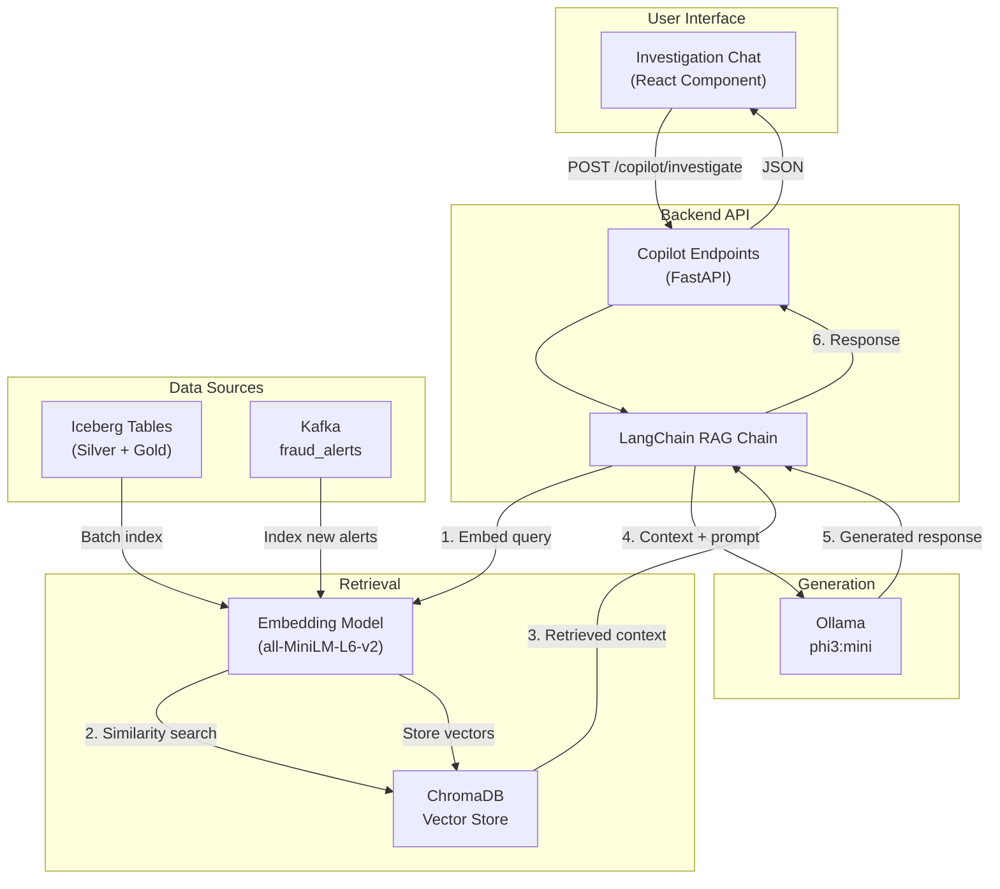
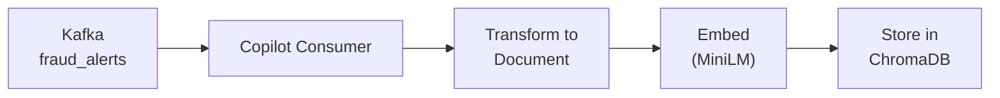
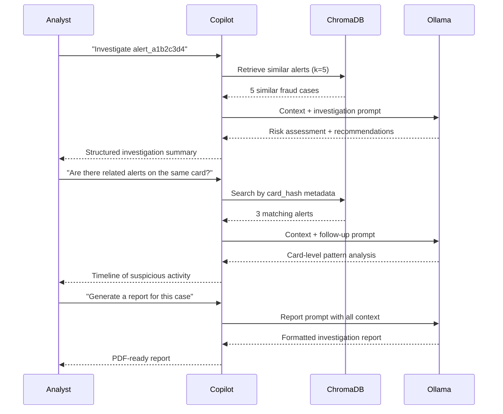

# GenAI Investigation Copilot

The Investigation Copilot is a Retrieval-Augmented Generation (RAG) system that helps fraud analysts investigate alerts using natural language. It combines a local LLM (Ollama with phi3:mini) with a ChromaDB vector store containing indexed fraud alerts and investigation history.

## RAG Architecture



## Ollama Model

The copilot uses **phi3:mini** (3.8B parameters, 2.7 GB) running locally via Ollama.

| Property | Value |
|----------|-------|
| Model | `phi3:mini` |
| Parameters | 3.8 billion |
| Size on disk | 2.7 GB |
| Context window | 4,096 tokens |
| Memory usage | ~2 GB at inference |
| Quantization | Q4_K_M (4-bit) |

!!! info "Why phi3:mini"
    phi3:mini offers the best quality-to-size ratio for local inference. It handles structured reasoning tasks (fraud investigation) well within its 4K context window. At 2.7 GB, it fits within the 2 GB memory allocation for the AI profile. See [ADR-005](../architecture/decisions.md#adr-005-ollama-phi3mini-for-local-llm).

### Model Management

```bash
# Check loaded model
curl http://localhost:11434/api/tags | jq '.models[].name'

# Pull model manually (if not done by make init)
docker exec ollama ollama pull phi3:mini

# Test model directly
docker exec ollama ollama run phi3:mini "Explain what a velocity fraud pattern is"
```

## ChromaDB Vector Store

ChromaDB stores embedded fraud alerts and investigation context for retrieval.

### Configuration

| Setting | Value |
|---------|-------|
| Host | `chromadb:8100` |
| Collection | `fraud_alerts` |
| Embedding model | `all-MiniLM-L6-v2` (384 dimensions) |
| Distance metric | Cosine similarity |
| Persistence | `/chroma/data` (Docker volume) |
| Max results per query | 5 |

### Document Structure

Each document in ChromaDB represents a fraud alert with metadata:

```json
{
  "id": "alert_a1b2c3d4",
  "document": "CRITICAL fraud alert on card ending 4532. Amount: $4,892.00 at electronics merchant. Geo-velocity: 1,240 km/h (impossible travel from NYC to LA in 12 min). Device mismatch: new Android device, card typically uses iOS. 8 transactions in last hour (normal: 2). Amount 4.2x above average.",
  "metadata": {
    "transaction_id": "tx_98765",
    "fraud_score": 0.92,
    "fraud_label": "CRITICAL",
    "timestamp": "2024-01-15T14:23:00Z",
    "amount": 4892.00,
    "merchant_category": "electronics",
    "primary_pattern": "geo_anomaly"
  }
}
```

## Embedding Pipeline

### Real-Time Indexing (Kafka Consumer)

New fraud alerts are indexed into ChromaDB as they arrive:



### Batch Indexing (Airflow DAG)

Historical alerts are batch-indexed from the Iceberg Silver table:

```python
# Batch index from Iceberg
alerts_df = spark.read.table("nessie.fraud_db.silver_transactions") \
    .filter(col("fraud_score") >= 0.40) \
    .select("transaction_id", "fraud_score", "fraud_label", ...)

for batch in alerts_df.toLocalIterator():
    document = format_alert_document(batch)
    embedding = embed_model.encode(document)
    collection.add(
        ids=[batch.transaction_id],
        documents=[document],
        embeddings=[embedding],
        metadatas=[{...}]
    )
```

## LangChain Chain Architecture

The RAG chain orchestrates retrieval and generation:

```python
from langchain.chains import RetrievalQA
from langchain_community.llms import Ollama
from langchain_community.vectorstores import Chroma
from langchain_community.embeddings import HuggingFaceEmbeddings

# Components
embeddings = HuggingFaceEmbeddings(model_name="all-MiniLM-L6-v2")
vectorstore = Chroma(
    collection_name="fraud_alerts",
    embedding_function=embeddings,
    persist_directory="/chroma/data"
)
llm = Ollama(model="phi3:mini", base_url="http://ollama:11434")
retriever = vectorstore.as_retriever(search_kwargs={"k": 5})

# RAG chain
chain = RetrievalQA.from_chain_type(
    llm=llm,
    chain_type="stuff",
    retriever=retriever,
    return_source_documents=True
)
```

## Prompt Templates

### Investigation Prompt

```
You are a fraud investigation assistant. Analyze the following fraud alert
and related historical alerts to provide an investigation summary.

Current Alert:
{alert_details}

Similar Historical Alerts:
{retrieved_context}

Provide:
1. Risk assessment (CRITICAL/HIGH/MEDIUM/LOW) with justification
2. Primary fraud pattern identified
3. Recommended investigation steps
4. Similar past cases and their outcomes
5. Suggested immediate actions

Be concise and actionable. Focus on facts from the data.
```

### Explanation Prompt

```
You are a fraud analyst assistant. Explain why this transaction was
flagged as potentially fraudulent in plain language.

Transaction Details:
{transaction_data}

Feature Analysis:
{feature_values}

Model Scores:
{model_scores}

Explain the key risk factors that contributed to the fraud score
in order of importance. Use language a non-technical analyst can understand.
```

### Report Prompt

```
Generate a formal fraud investigation report for the following case.

Case ID: {case_id}
Alerts: {alert_list}
Investigation Notes: {retrieved_context}

Format as a structured report with:
- Executive Summary
- Timeline of Events
- Risk Indicators
- Evidence Summary
- Recommended Actions
- Confidence Assessment
```

### Search Prompt

```
You are a fraud search assistant. Convert the following natural language
query into structured search criteria and find matching fraud alerts.

User Query: {user_query}

Available search fields: fraud_score, fraud_label, merchant_category,
amount, geo_velocity_kmh, timestamp, card_hash

Return matching alerts from the context and explain why they match.
```

## API Endpoints

### POST `/api/copilot/investigate`

Start an investigation on a fraud alert.

```bash
curl -X POST http://localhost:8000/api/copilot/investigate \
  -H "Content-Type: application/json" \
  -d '{
    "alert_id": "alert_a1b2c3d4",
    "question": "What fraud patterns do you see and what should I investigate first?"
  }'
```

**Response:**

```json
{
  "response": "This alert exhibits a **geo-velocity anomaly** pattern. The cardholder made a transaction in NYC at 14:11 UTC and another in LA at 14:23 UTC — a velocity of 1,240 km/h, which exceeds commercial flight speeds (900 km/h).\n\n**Recommended investigation steps:**\n1. Check if cardholder has a history of bicoastal travel\n2. Verify the device fingerprints — the LA transaction uses a new Android device\n3. Contact the merchant (electronics, $4,892) for transaction verification\n\n**Similar cases:** 3 alerts in the past week with geo-velocity > 1,000 km/h — all confirmed fraud.",
  "sources": [
    {"id": "alert_x1y2z3", "score": 0.94, "label": "CRITICAL"},
    {"id": "alert_m4n5o6", "score": 0.88, "label": "CRITICAL"}
  ],
  "confidence": 0.87,
  "latency_ms": 2340
}
```

### POST `/api/copilot/explain/{transaction_id}`

Explain why a transaction was flagged.

```bash
curl -X POST http://localhost:8000/api/copilot/explain/tx_98765
```

### POST `/api/copilot/report/{case_id}`

Generate a formal investigation report.

```bash
curl -X POST http://localhost:8000/api/copilot/report/case_001
```

### POST `/api/copilot/search`

Natural language search across fraud alerts.

```bash
curl -X POST http://localhost:8000/api/copilot/search \
  -H "Content-Type: application/json" \
  -d '{
    "query": "Show me all velocity fraud alerts above $5000 from last week"
  }'
```

### GET `/api/copilot/health`

Check LLM and vector store connectivity.

```bash
curl http://localhost:8000/api/copilot/health
```

```json
{
  "status": "healthy",
  "ollama": {"status": "connected", "model": "phi3:mini", "loaded": true},
  "chromadb": {"status": "connected", "documents": 15423},
  "embedding_model": "all-MiniLM-L6-v2"
}
```

## Example Investigation Workflow



## Performance

| Metric | Target | Actual |
|--------|--------|--------|
| Embedding latency (per document) | < 50ms | 35ms |
| Vector search latency (k=5) | < 100ms | 65ms |
| LLM generation latency (first token) | < 2s | 1.4s |
| End-to-end response time | < 5s | 3.2s |
| Context window utilization | < 80% | ~60% |
| ChromaDB memory usage | < 512 MB | ~350 MB |

!!! warning "Cold start latency"
    The first request after Ollama starts takes 5-10 seconds as the model loads into memory. Subsequent requests are significantly faster. The health endpoint pre-warms the model on startup.

## Next Steps

- [Backend API](backend-api.md) — API server hosting the copilot endpoints
- [Frontend Dashboard](frontend.md) — Chat interface component
- [Architecture Decisions](../architecture/decisions.md#adr-005-ollama-phi3mini-for-local-llm) — Model selection rationale
