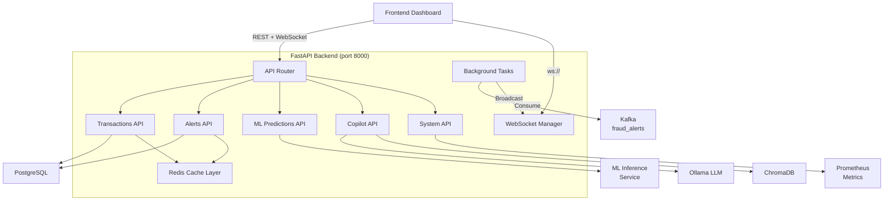

# FastAPI Backend

The backend API is a FastAPI application that serves as the central hub connecting the streaming pipeline, ML models, investigation copilot, and frontend dashboard.

## Service Architecture



## Endpoint Reference

### Transactions API

| Method | Path | Description | Auth |
|--------|------|-------------|------|
| `GET` | `/api/transactions` | List transactions with pagination and filtering | Optional |
| `GET` | `/api/transactions/{id}` | Get transaction by ID with full feature data | Optional |
| `GET` | `/api/transactions/search` | Advanced search with multiple filter criteria | Optional |
| `GET` | `/api/transactions/stats` | Aggregate statistics (count, volume, fraud rate) | Optional |

**GET `/api/transactions`** — List with pagination

```bash
curl "http://localhost:8000/api/transactions?page=1&size=20&fraud_label=CRITICAL&sort=-fraud_score"
```

```json
{
  "items": [
    {
      "transaction_id": "tx_98765",
      "timestamp": "2024-01-15T14:23:00Z",
      "amount": 4892.00,
      "merchant_category": "electronics",
      "fraud_score": 0.92,
      "fraud_label": "CRITICAL",
      "card_hash": "a1b2...f8"
    }
  ],
  "total": 1547,
  "page": 1,
  "size": 20,
  "pages": 78
}
```

**Query parameters:**

| Parameter | Type | Default | Description |
|-----------|------|---------|-------------|
| `page` | int | 1 | Page number |
| `size` | int | 20 | Items per page (max 100) |
| `fraud_label` | string | — | Filter: CRITICAL, HIGH, MEDIUM, LOW |
| `min_score` | float | — | Minimum fraud score |
| `max_score` | float | — | Maximum fraud score |
| `start_date` | datetime | — | Filter by timestamp range start |
| `end_date` | datetime | — | Filter by timestamp range end |
| `merchant_category` | string | — | Filter by merchant category |
| `sort` | string | `-timestamp` | Sort field (prefix `-` for descending) |

### Fraud Alerts API

| Method | Path | Description | Auth |
|--------|------|-------------|------|
| `GET` | `/api/alerts` | List fraud alerts with filters | Optional |
| `GET` | `/api/alerts/{id}` | Alert detail with features and model scores | Optional |
| `PUT` | `/api/alerts/{id}/status` | Update alert investigation status | Required |
| `GET` | `/api/alerts/stats` | Alert statistics by severity, time, pattern | Optional |

**GET `/api/alerts/{id}`** — Alert detail

```json
{
  "alert_id": "alert_a1b2c3d4",
  "transaction_id": "tx_98765",
  "timestamp": "2024-01-15T14:23:00Z",
  "fraud_score": 0.92,
  "fraud_label": "CRITICAL",
  "status": "open",
  "amount": 4892.00,
  "merchant_category": "electronics",
  "features": {
    "tx_count_1h": 15,
    "tx_count_24h": 45,
    "amount_zscore": 3.2,
    "geo_velocity_kmh": 1240.0,
    "merchant_risk_score": 0.7,
    "device_consistency": false,
    "time_since_last_tx": 30.0,
    "is_unusual_hour": false,
    "rapid_tx_count": 8,
    "amount_to_avg_ratio": 4.5
  },
  "model_scores": {
    "xgboost": 0.91,
    "random_forest": 0.84,
    "isolation_forest": 0.78
  }
}
```

**PUT `/api/alerts/{id}/status`** — Update status

```bash
curl -X PUT http://localhost:8000/api/alerts/alert_a1b2c3d4/status \
  -H "Content-Type: application/json" \
  -H "Authorization: Bearer <token>" \
  -d '{"status": "investigating", "analyst_notes": "Checking with cardholder"}'
```

Status transitions: `open` → `investigating` → `confirmed_fraud` | `false_positive` | `resolved`

### ML Predictions API

| Method | Path | Description | Auth |
|--------|------|-------------|------|
| `POST` | `/api/ml/predict` | Score a single transaction | Optional |
| `POST` | `/api/ml/predict/batch` | Batch score up to 100 transactions | Optional |
| `GET` | `/api/ml/model/info` | Active model versions and metadata | — |
| `POST` | `/api/ml/model/reload` | Hot-reload models from registry | Required |

### Investigation Copilot API

| Method | Path | Description | Auth |
|--------|------|-------------|------|
| `POST` | `/api/copilot/investigate` | Investigate a fraud alert | Optional |
| `POST` | `/api/copilot/explain/{tx_id}` | Explain why a transaction was flagged | Optional |
| `POST` | `/api/copilot/report/{case_id}` | Generate investigation report | Optional |
| `POST` | `/api/copilot/search` | Natural language fraud search | Optional |
| `GET` | `/api/copilot/health` | Check LLM and vector store status | — |

### System API

| Method | Path | Description |
|--------|------|-------------|
| `GET` | `/api/health` | Service health check |
| `GET` | `/api/metrics` | Prometheus metrics endpoint |
| `GET` | `/docs` | OpenAPI documentation (Swagger UI) |
| `GET` | `/redoc` | ReDoc API documentation |

## WebSocket Protocol

The backend pushes real-time fraud alerts to connected clients via WebSocket.

### Connection

```javascript
const ws = new WebSocket("ws://localhost:8000/ws/alerts?token=<jwt_token>");
```

### Server → Client Messages

```json
{"type": "alert", "data": {"alert_id": "...", "fraud_score": 0.92, ...}}
{"type": "metric", "data": {"total_alerts": 1547, "avg_score": 0.68, ...}}
{"type": "heartbeat", "timestamp": "2024-01-15T14:23:00Z"}
```

### Connection Management

- Heartbeat interval: 30 seconds
- Client must respond with `{"type": "pong"}` within 10 seconds
- Automatic disconnect after 2 missed heartbeats
- Max clients per backend worker: 100

## Background Tasks

### Kafka Alert Consumer

A background task consumes from the `fraud_alerts` Kafka topic and broadcasts to WebSocket clients:

```python
async def kafka_alert_consumer():
    consumer = AIOKafkaConsumer(
        "fraud_alerts",
        bootstrap_servers="kafka:29092",
        group_id="backend-alerts-group",
        auto_offset_reset="latest",
    )
    await consumer.start()
    async for message in consumer:
        alert = json.loads(message.value)
        # Cache in Redis
        await redis.setex(f"alert:{alert['alert_id']}", 300, message.value)
        # Broadcast to WebSocket clients
        await ws_manager.broadcast({"type": "alert", "data": alert})
```

### Metrics Aggregator

Periodically computes and broadcasts system metrics:

```python
@repeat_every(seconds=10)
async def aggregate_metrics():
    stats = await compute_alert_stats()
    await ws_manager.broadcast({"type": "metric", "data": stats})
```

## Redis Caching Strategy

| Key Pattern | TTL | Purpose |
|-------------|-----|---------|
| `alert:{id}` | 5 min | Recent fraud alerts for fast retrieval |
| `tx:{id}` | 2 min | Transaction detail cache |
| `stats:alerts` | 10 sec | Aggregated alert statistics |
| `stats:transactions` | 30 sec | Transaction volume statistics |
| `model:info` | 60 sec | ML model metadata |

```python
# Cache-aside pattern
async def get_alert(alert_id: str):
    cached = await redis.get(f"alert:{alert_id}")
    if cached:
        return json.loads(cached)
    alert = await db.fetch_alert(alert_id)
    await redis.setex(f"alert:{alert_id}", 300, json.dumps(alert))
    return alert
```

## Error Handling

All endpoints return consistent error responses:

```json
{
  "error": {
    "code": "ALERT_NOT_FOUND",
    "message": "Alert with ID 'alert_xyz' not found",
    "details": {"alert_id": "alert_xyz"}
  },
  "status_code": 404
}
```

| Status Code | Error Code | Description |
|-------------|-----------|-------------|
| 400 | `VALIDATION_ERROR` | Invalid request body or parameters |
| 401 | `UNAUTHORIZED` | Missing or invalid JWT token |
| 403 | `FORBIDDEN` | Insufficient permissions |
| 404 | `NOT_FOUND` | Resource not found |
| 429 | `RATE_LIMITED` | Too many requests |
| 500 | `INTERNAL_ERROR` | Server error |
| 503 | `SERVICE_UNAVAILABLE` | Dependency not ready (Kafka, ML service) |

## Prometheus Metrics

The `/api/metrics` endpoint exposes:

| Metric | Type | Description |
|--------|------|-------------|
| `http_requests_total` | Counter | Total HTTP requests by method, path, status |
| `http_request_duration_seconds` | Histogram | Request latency distribution |
| `websocket_connections_active` | Gauge | Current WebSocket connections |
| `kafka_messages_consumed_total` | Counter | Messages consumed from Kafka |
| `alerts_broadcast_total` | Counter | Alerts pushed to WebSocket clients |
| `redis_cache_hits_total` | Counter | Cache hit count |
| `redis_cache_misses_total` | Counter | Cache miss count |
| `ml_prediction_duration_seconds` | Histogram | ML inference latency |
| `copilot_response_duration_seconds` | Histogram | Copilot response latency |

## CORS Configuration

```python
app.add_middleware(
    CORSMiddleware,
    allow_origins=["http://localhost:3000"],  # Frontend
    allow_credentials=True,
    allow_methods=["*"],
    allow_headers=["*"],
)
```

!!! tip "Multiple origins"
    For additional frontend instances, set `BACKEND_CORS_ORIGINS` to a comma-separated list in `.env`.

## Authentication (JWT)

JWT authentication is optional for read endpoints and required for write operations.

```python
# Generate token
POST /api/auth/token
{"username": "analyst", "password": "..."}
# Returns: {"access_token": "eyJ...", "token_type": "bearer", "expires_in": 3600}

# Use token
GET /api/alerts
Authorization: Bearer eyJ...
```

## Next Steps

- [Frontend Dashboard](frontend.md) — React UI consuming these APIs
- [WebSocket Protocol](../api-reference/websocket.md) — Detailed WebSocket documentation
- [REST API Reference](../api-reference/rest-api.md) — Complete endpoint documentation
