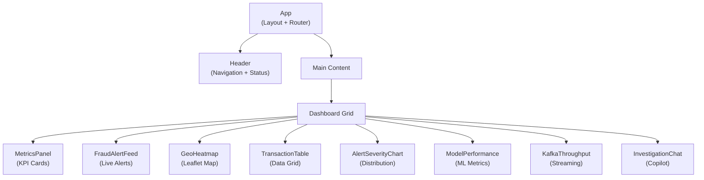

# React Dashboard

The frontend is a React single-page application built with Vite, providing real-time fraud monitoring through WebSocket-connected components, interactive visualizations, and an integrated investigation copilot chat interface.

## Component Hierarchy



## Page Layout

The dashboard uses a responsive grid layout with the following arrangement:

```
┌──────────────────────────────────────────────────────────────┐
│  Header: Platform name | Service status indicators | Theme  │
├──────────┬──────────┬──────────┬─────────────────────────────┤
│  Total   │  Fraud   │  Avg     │  Alerts/min                 │
│  Txns    │  Rate    │  Score   │                             │
│  (KPI)   │  (KPI)   │  (KPI)   │  (KPI)                     │
├──────────┴──────────┴──────────┴──────┬──────────────────────┤
│                                       │                      │
│  Fraud Alert Feed                     │  Geographic Heatmap  │
│  (live WebSocket stream)              │  (Leaflet + clusters)│
│                                       │                      │
├───────────────────────────────────────┼──────────────────────┤
│                                       │  Alert Severity      │
│  Transaction Table                    │  Chart               │
│  (searchable, sortable, paginated)    │  (pie/donut)         │
│                                       │                      │
├───────────────────────────────────────┼──────────────────────┤
│  Model Performance                    │  Kafka Throughput    │
│  (AUC-ROC, Precision, Recall)         │  (msgs/sec, lag)     │
├───────────────────────────────────────┴──────────────────────┤
│  Investigation Copilot Chat                                  │
│  (expandable panel)                                          │
└──────────────────────────────────────────────────────────────┘
```

## Component Reference

### FraudAlertFeed

Real-time stream of fraud alerts received via WebSocket.

```tsx
// Features:
// - Auto-scrolling alert list with newest at top
// - Severity-based color coding (CRITICAL=red, HIGH=orange, MEDIUM=yellow)
// - Click to expand alert details
// - Filter by severity level
// - Pause/resume auto-scroll

interface FraudAlert {
  alert_id: string;
  transaction_id: string;
  timestamp: string;
  amount: number;
  fraud_score: number;
  fraud_label: "CRITICAL" | "HIGH" | "MEDIUM";
  merchant_category: string;
  primary_pattern: string;
}
```

| Feature | Implementation |
|---------|---------------|
| Auto-scroll | `useRef` with `scrollIntoView({ behavior: "smooth" })` |
| Severity badge | Tailwind classes: `bg-red-500`, `bg-orange-400`, `bg-yellow-400` |
| Max visible items | 100 (oldest removed from DOM, kept in state) |
| Animation | CSS `@keyframes slideIn` on new alert entry |

### GeoHeatmap

Interactive map showing fraud alert locations with clustering.

```tsx
// Built with React-Leaflet + Leaflet.markercluster
// - Cluster markers expand on zoom
// - Popup shows alert summary on click
// - Heat layer for density visualization
// - Auto-centers on latest alert cluster

interface MapProps {
  alerts: FraudAlert[];
  center: [number, number];  // Default: [39.8283, -98.5795] (US center)
  zoom: number;              // Default: 4
}
```

| Feature | Library |
|---------|---------|
| Base map | Leaflet with OpenStreetMap tiles |
| Clustering | `react-leaflet-markercluster` |
| Heat layer | `leaflet.heat` |
| Geocoding | Latitude/longitude from transaction data |

### MetricsPanel

KPI cards showing real-time platform metrics.

```tsx
interface Metrics {
  total_transactions: number;      // Updated every 10s via WebSocket
  fraud_rate: number;              // Percentage (e.g., 2.1%)
  avg_fraud_score: number;         // Average score of flagged alerts
  alerts_per_minute: number;       // Rolling 5-minute window
  active_investigations: number;   // Open alert count
  model_accuracy: number;          // Latest AUC-ROC
}
```

Each KPI card shows:

- Current value with large typography
- Trend arrow (up/down) compared to previous period
- Sparkline chart for last 30 data points
- Color indicator (green=normal, yellow=warning, red=critical)

### TransactionTable

Searchable, sortable, paginated table of recent transactions.

| Column | Sortable | Filterable | Description |
|--------|----------|------------|-------------|
| Transaction ID | No | Search | Unique identifier |
| Timestamp | Yes | Date range | Event time |
| Amount | Yes | Min/Max | Transaction amount ($) |
| Merchant | Yes | Category dropdown | Merchant category |
| Fraud Score | Yes | Min/Max slider | ML ensemble score |
| Severity | Yes | Multi-select | CRITICAL/HIGH/MEDIUM/LOW |
| Status | Yes | Multi-select | open/investigating/resolved |

```tsx
// Built with TanStack Table (React Table v8)
// - Server-side pagination via API
// - Column visibility toggle
// - Export to CSV
// - Row click navigates to alert detail
```

### ModelPerformance

Real-time ML model performance metrics.

```tsx
// Displays:
// - AUC-ROC curve (Recharts LineChart)
// - Precision-Recall curve
// - Confusion matrix (color-coded grid)
// - Per-model scores (XGBoost, RF, IF)
// - Score distribution histogram
// - Threshold slider for what-if analysis
```

### InvestigationChat

Chat interface for the GenAI investigation copilot.

```tsx
// Features:
// - Chat bubble UI with markdown rendering
// - Context-aware: auto-loads selected alert context
// - Suggested prompts ("Investigate this alert", "Explain the score")
// - Response streaming (character by character)
// - Chat history maintained per session
// - Expandable/collapsible panel

interface ChatMessage {
  id: string;
  role: "user" | "assistant";
  content: string;            // Markdown-formatted
  sources?: AlertSource[];     // Retrieved documents
  timestamp: string;
}
```

### KafkaThroughput

Streaming pipeline metrics visualization.

```tsx
// Displays:
// - Messages/second (line chart, 5-min window)
// - Consumer lag per partition (bar chart)
// - Spark batch duration (gauge)
// - Pipeline latency p50/p99 (line chart)
```

### AlertSeverityChart

Distribution of alerts by severity level.

```tsx
// Recharts PieChart / DonutChart
// - CRITICAL: red (#EF4444)
// - HIGH: orange (#F97316)
// - MEDIUM: yellow (#EAB308)
// - LOW: green (#22C55E)
// - Animated transitions on data update
// - Tooltip with count and percentage
```

## State Management

### TanStack Query (React Query)

All server state is managed with TanStack Query v5:

```tsx
// Queries with automatic refetching
const { data: alerts } = useQuery({
  queryKey: ["alerts", filters],
  queryFn: () => fetchAlerts(filters),
  refetchInterval: 10_000,        // Refresh every 10s
  staleTime: 5_000,               // Consider stale after 5s
});

// Mutations with optimistic updates
const updateStatus = useMutation({
  mutationFn: (data) => updateAlertStatus(data),
  onSuccess: () => queryClient.invalidateQueries(["alerts"]),
});
```

| Query Key | Refetch Interval | Stale Time |
|-----------|-----------------|------------|
| `["alerts"]` | 10s | 5s |
| `["transactions"]` | 30s | 15s |
| `["metrics"]` | — (WebSocket) | 0 |
| `["model-info"]` | 60s | 30s |
| `["copilot-health"]` | 30s | 15s |

## WebSocket Hook

Custom hook for WebSocket management with reconnection:

```tsx
function useWebSocket(url: string) {
  const [status, setStatus] = useState<"connecting" | "connected" | "disconnected">();
  const wsRef = useRef<WebSocket | null>(null);
  const reconnectAttempts = useRef(0);
  const maxReconnectAttempts = 10;

  const connect = useCallback(() => {
    const ws = new WebSocket(url);
    
    ws.onopen = () => {
      setStatus("connected");
      reconnectAttempts.current = 0;
    };

    ws.onmessage = (event) => {
      const message = JSON.parse(event.data);
      if (message.type === "heartbeat") {
        ws.send(JSON.stringify({ type: "pong" }));
        return;
      }
      // Dispatch to appropriate handler
      handlers.current[message.type]?.(message.data);
    };

    ws.onclose = () => {
      setStatus("disconnected");
      // Exponential backoff reconnection
      const delay = Math.min(1000 * 2 ** reconnectAttempts.current, 30000);
      reconnectAttempts.current++;
      if (reconnectAttempts.current < maxReconnectAttempts) {
        setTimeout(connect, delay);
      }
    };

    wsRef.current = ws;
  }, [url]);

  // ...
}
```

| Parameter | Value |
|-----------|-------|
| Initial reconnect delay | 1 second |
| Max reconnect delay | 30 seconds |
| Backoff multiplier | 2x (exponential) |
| Max reconnect attempts | 10 |
| Heartbeat interval | 30 seconds |
| Heartbeat timeout | 10 seconds |

## Tailwind CSS Theme

```javascript
// tailwind.config.js
module.exports = {
  theme: {
    extend: {
      colors: {
        fraud: {
          critical: "#EF4444",  // red-500
          high: "#F97316",      // orange-500
          medium: "#EAB308",    // yellow-500
          low: "#22C55E",       // green-500
        },
        dashboard: {
          bg: "#0F172A",        // slate-900
          card: "#1E293B",      // slate-800
          border: "#334155",    // slate-700
          text: "#E2E8F0",      // slate-200
          muted: "#94A3B8",     // slate-400
          accent: "#3B82F6",    // blue-500
        },
      },
    },
  },
};
```

The dashboard uses a dark theme optimized for SOC (Security Operations Center) environments where analysts work in low-light conditions.

## Build Process

### Development

```bash
# Start Vite dev server with HMR
make dev-frontend
# or: cd frontend && npm run dev

# Available at http://localhost:3000
# Hot Module Replacement enabled
```

### Production Build

```bash
# Build optimized static assets
make build-frontend
# or: cd frontend && npm run build

# Output: frontend/dist/
# Served by Nginx in Docker
```

### Build Output

| Metric | Value |
|--------|-------|
| Bundle size (gzipped) | ~180 KB |
| First Contentful Paint | < 1.5s |
| Largest Contentful Paint | < 2.5s |
| Chunks | vendor.js, app.js, map.js (lazy) |

## Next Steps

- [Backend API](backend-api.md) — API endpoints consumed by the frontend
- [Observability](observability.md) — Grafana dashboards for monitoring
- [Quick Start](../getting-started/quick-start.md#dashboard-walkthrough) — First look at the dashboard
