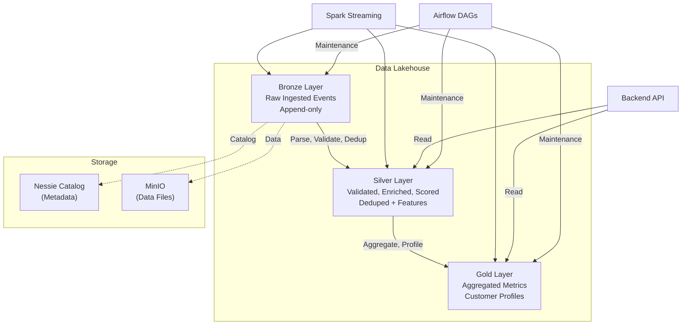
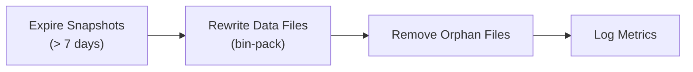
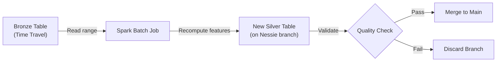

# Apache Iceberg Lakehouse

Apache Iceberg provides the persistent storage layer for the platform, implementing a medallion architecture (Bronze → Silver → Gold) with time travel, schema evolution, and snapshot management backed by the Nessie catalog and MinIO object storage.

## Architecture



## Table Schemas

### Bronze: `fraud_db.bronze_transactions`

Raw transaction events exactly as received from Kafka. No transformations applied.

```sql
CREATE TABLE nessie.fraud_db.bronze_transactions (
    transaction_id    STRING     NOT NULL,
    event_timestamp   TIMESTAMP  NOT NULL,
    raw_payload       STRING     NOT NULL,   -- Original JSON
    kafka_partition   INT,
    kafka_offset      BIGINT,
    kafka_timestamp   TIMESTAMP,
    ingestion_time    TIMESTAMP  NOT NULL
)
USING iceberg
PARTITIONED BY (days(event_timestamp))
TBLPROPERTIES (
    'write.format.default' = 'parquet',
    'write.parquet.compression-codec' = 'snappy',
    'write.metadata.delete-after-commit.enabled' = 'true',
    'write.metadata.previous-versions-max' = '10'
);
```

| Property | Value | Reason |
|----------|-------|--------|
| Partition | `days(event_timestamp)` | Daily partitions for time-range pruning |
| Format | Parquet + Snappy | Columnar with fast compression |
| Write mode | Append-only | Immutable audit trail |
| Retention | 90 days | Replay window |

### Silver: `fraud_db.silver_transactions`

Parsed, validated, deduplicated transactions enriched with computed features and fraud scores.

```sql
CREATE TABLE nessie.fraud_db.silver_transactions (
    transaction_id      STRING      NOT NULL,
    event_timestamp     TIMESTAMP   NOT NULL,
    card_hash           STRING      NOT NULL,
    amount              DOUBLE      NOT NULL,
    merchant_id         STRING,
    merchant_category   STRING,
    location_lat        DOUBLE,
    location_lon        DOUBLE,
    device_id           STRING,
    -- Computed features
    tx_count_1h         INT,
    tx_count_24h        INT,
    amount_zscore       DOUBLE,
    geo_velocity_kmh    DOUBLE,
    merchant_risk_score DOUBLE,
    device_consistency  BOOLEAN,
    time_since_last_tx  DOUBLE,
    is_unusual_hour     BOOLEAN,
    rapid_tx_count      INT,
    amount_to_avg_ratio DOUBLE,
    -- Fraud scoring
    fraud_score         DOUBLE,
    fraud_label         STRING,        -- CRITICAL, HIGH, MEDIUM, LOW
    is_fraud_ground_truth BOOLEAN,     -- From simulator
    -- Metadata
    processing_time     TIMESTAMP,
    spark_batch_id      LONG
)
USING iceberg
PARTITIONED BY (days(event_timestamp), fraud_label)
TBLPROPERTIES (
    'write.format.default' = 'parquet',
    'write.parquet.compression-codec' = 'zstd',
    'write.target-file-size-bytes' = '134217728'
);
```

| Property | Value | Reason |
|----------|-------|--------|
| Partition | `days(event_timestamp)`, `fraud_label` | Time-range + severity filtering |
| Compression | Zstd | Better ratio for analytical queries |
| Target file size | 128 MB | Optimal for scan performance |

### Gold: `fraud_db.gold_fraud_metrics`

Aggregated metrics, customer risk profiles, and merchant scores for dashboard and reporting.

```sql
CREATE TABLE nessie.fraud_db.gold_fraud_metrics (
    metric_date         DATE        NOT NULL,
    metric_hour         INT,
    total_transactions  BIGINT,
    fraud_count         BIGINT,
    fraud_rate          DOUBLE,
    avg_fraud_score     DOUBLE,
    max_fraud_score     DOUBLE,
    total_amount        DOUBLE,
    fraud_amount        DOUBLE,
    top_merchant_categories ARRAY<STRING>,
    geographic_clusters     ARRAY<STRING>,
    model_precision     DOUBLE,
    model_recall        DOUBLE,
    model_auc_roc       DOUBLE
)
USING iceberg
PARTITIONED BY (metric_date)
TBLPROPERTIES (
    'write.format.default' = 'parquet',
    'write.parquet.compression-codec' = 'zstd'
);
```

## Schema Evolution

Iceberg supports schema evolution without rewriting data files.

### Adding a Column

```sql
ALTER TABLE nessie.fraud_db.silver_transactions
  ADD COLUMN ip_country STRING AFTER device_id;
```

### Renaming a Column

```sql
ALTER TABLE nessie.fraud_db.silver_transactions
  RENAME COLUMN fraud_label TO severity;
```

!!! tip "Non-breaking changes"
    Adding columns, renaming columns, reordering columns, and widening types (e.g., `INT` → `LONG`) are all non-breaking in Iceberg. Existing Parquet files remain untouched — new metadata maps old files to the updated schema.

## Time Travel

### Query by Timestamp

```sql
-- What did the Silver table look like yesterday at noon?
SELECT * FROM nessie.fraud_db.silver_transactions
  TIMESTAMP AS OF '2024-01-14T12:00:00'
WHERE fraud_score > 0.8;
```

### Query by Snapshot ID

```sql
-- List available snapshots
SELECT * FROM nessie.fraud_db.silver_transactions.snapshots;

-- Query a specific snapshot
SELECT * FROM nessie.fraud_db.silver_transactions
  VERSION AS OF 3821495723014;
```

### Rollback

```sql
-- Rollback to a previous snapshot (undo bad writes)
CALL nessie.system.rollback_to_snapshot(
  'fraud_db.silver_transactions',
  3821495723014
);
```

!!! warning "Rollback does not delete data files"
    Rollback only changes the metadata pointer. The data files from rolled-back snapshots remain on MinIO until explicitly expired.

## Snapshot Management

### List Snapshots

```sql
SELECT
    snapshot_id,
    committed_at,
    operation,
    summary['added-data-files'] AS files_added,
    summary['total-records'] AS total_records
FROM nessie.fraud_db.silver_transactions.snapshots
ORDER BY committed_at DESC
LIMIT 10;
```

### Expire Old Snapshots

```sql
-- Keep only the last 7 days of snapshots
CALL nessie.system.expire_snapshots(
  table => 'fraud_db.silver_transactions',
  older_than => TIMESTAMP '2024-01-08T00:00:00',
  retain_last => 10
);
```

### Compaction

Small files degrade read performance. The compaction job (Airflow DAG) rewrites them:

```sql
-- Rewrite small files into target size (128 MB)
CALL nessie.system.rewrite_data_files(
  table => 'fraud_db.silver_transactions',
  strategy => 'binpack',
  options => map(
    'target-file-size-bytes', '134217728',
    'min-file-size-bytes', '67108864',
    'max-file-size-bytes', '268435456'
  )
);
```

The `iceberg_maintenance_dag` runs compaction daily:



## Nessie Catalog Operations

Nessie provides Git-like version control for Iceberg metadata.

### Branch Operations

```bash
# List branches
curl -s http://localhost:19120/api/v1/trees | jq '.references[].name'

# Create a branch for experimental changes
curl -X POST http://localhost:19120/api/v1/trees/branch \
  -H "Content-Type: application/json" \
  -d '{"name": "experiment/new-features", "hash": "<main-hash>"}'

# Merge branch back to main
curl -X POST http://localhost:19120/api/v1/trees/branch/main/merge \
  -H "Content-Type: application/json" \
  -d '{"fromRefName": "experiment/new-features"}'
```

### Tag Operations

```bash
# Tag a known-good state
curl -X POST http://localhost:19120/api/v1/trees/tag \
  -H "Content-Type: application/json" \
  -d '{"name": "release/v1.0", "hash": "<main-hash>"}'
```

!!! info "Why Nessie over Hive Metastore"
    Nessie uses ~256 MB vs. 512 MB+ for Hive Metastore (which also requires MySQL). Nessie's Git-like branching allows safe experimentation with table schemas without affecting the main data pipeline. See [ADR-008](../architecture/decisions.md#adr-008-nessie-over-hive-metastore).

## Storage Layout in MinIO

```
s3a://iceberg-warehouse/
├── fraud_db/
│   ├── bronze_transactions/
│   │   ├── metadata/
│   │   │   ├── v1.metadata.json
│   │   │   ├── v2.metadata.json
│   │   │   ├── snap-384729384.avro     # Snapshot manifest
│   │   │   └── ...
│   │   └── data/
│   │       ├── event_timestamp_day=2024-01-14/
│   │       │   ├── 00000-0-abc123.parquet
│   │       │   └── 00001-0-def456.parquet
│   │       └── event_timestamp_day=2024-01-15/
│   │           └── ...
│   ├── silver_transactions/
│   │   ├── metadata/
│   │   └── data/
│   │       ├── event_timestamp_day=2024-01-14/fraud_label=CRITICAL/
│   │       ├── event_timestamp_day=2024-01-14/fraud_label=HIGH/
│   │       └── ...
│   └── gold_fraud_metrics/
│       ├── metadata/
│       └── data/
│           └── metric_date=2024-01-14/
```

Browse the storage in the MinIO Console at [http://localhost:9001](http://localhost:9001).

## Replay Engine

The replay engine re-processes historical data through the pipeline using Iceberg time travel as the source:



```bash
# Replay January 14th data with updated model
make replay START_DATE=2024-01-14 END_DATE=2024-01-15 BRANCH=replay/jan14
```

## Next Steps

- [ML Pipeline](ml-pipeline.md) — Models that consume Iceberg features
- [Data Flow Architecture](../architecture/data-flow.md) — Full medallion pipeline
- [Operations Runbook](../runbook/operations.md#iceberg-table-maintenance) — Maintenance tasks
