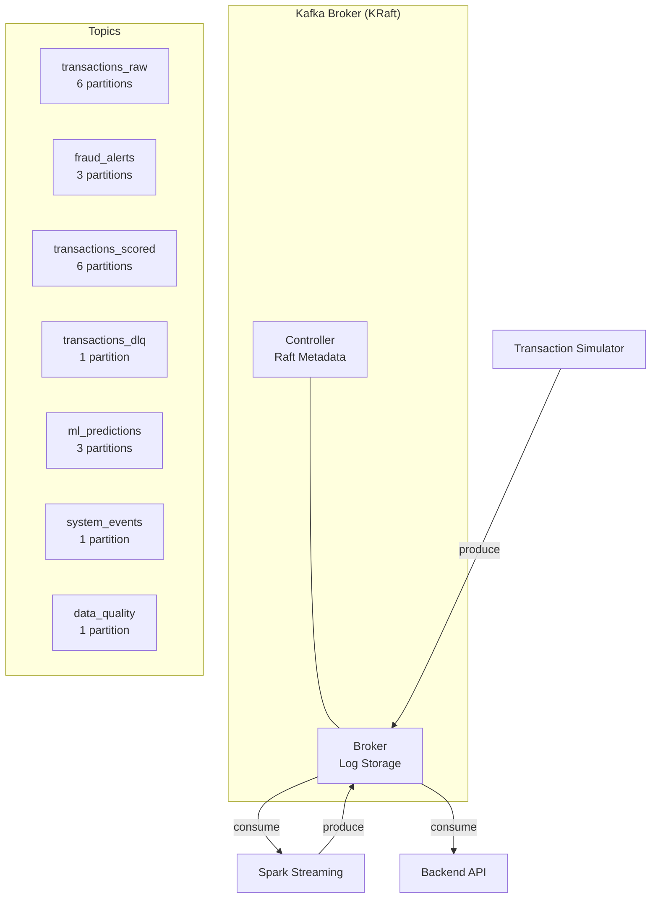
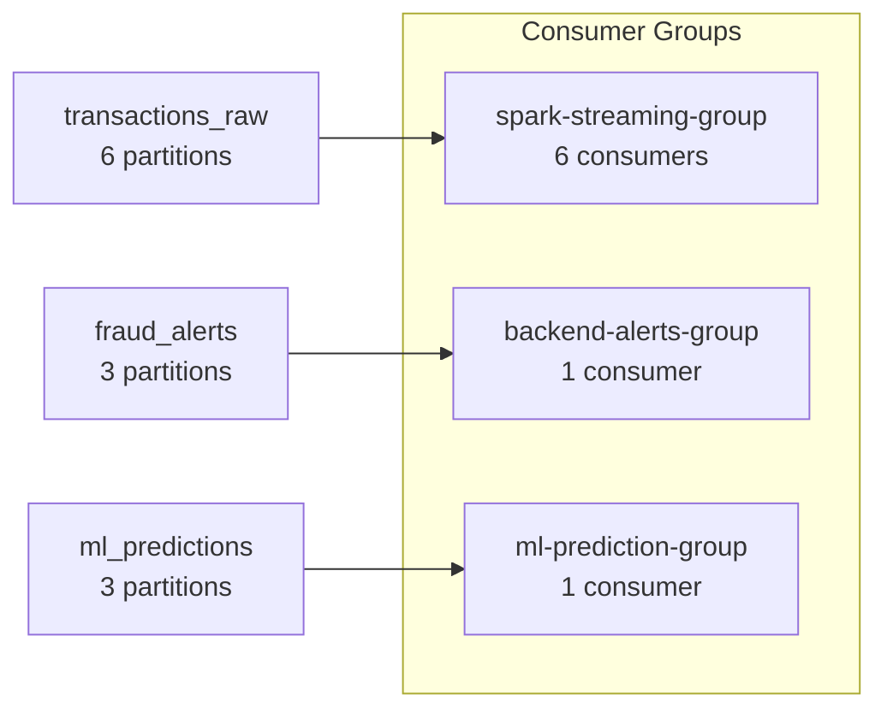
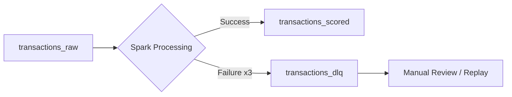

# Apache Kafka

Kafka serves as the central nervous system of the Fraud Intelligence Platform, handling all event streaming between producers and consumers using the KRaft consensus protocol.

## Architecture

### KRaft Mode

The platform runs Kafka in KRaft mode, eliminating the Zookeeper dependency. A single combined controller+broker node handles both metadata management and message brokering.



!!! info "Why KRaft over Zookeeper"
    KRaft saves ~512 MB of memory by eliminating the Zookeeper JVM. On a 16 GB laptop with 8 GB Docker allocation, every megabyte counts. See [ADR-001](../architecture/decisions.md#adr-001-kraft-over-zookeeper).

## Topic Inventory

| Topic | Partitions | Retention | Cleanup Policy | Compression | Purpose |
|-------|-----------|-----------|----------------|-------------|---------|
| `transactions_raw` | 6 | 7 days | delete | snappy | Raw transaction events from simulator |
| `transactions_scored` | 6 | 7 days | delete | snappy | Transactions enriched with fraud scores |
| `fraud_alerts` | 3 | 30 days | delete | snappy | High-confidence fraud detections |
| `ml_predictions` | 3 | 7 days | delete | snappy | Raw ML model prediction outputs |
| `transactions_dlq` | 1 | 30 days | delete | none | Dead letter queue for failed processing |
| `system_events` | 1 | 3 days | delete | none | Platform lifecycle and health events |
| `data_quality` | 1 | 7 days | delete | none | Data quality validation results |

## Partition Strategy

### `transactions_raw` (6 partitions)

Partitioned by `card_hash` (hash of card number) to ensure all transactions for the same card land on the same partition. This enables:

- **Ordered processing** — Spark sees transactions for a card in order
- **Stateful aggregation** — Window functions (velocity, frequency) are partition-local
- **Parallel consumption** — 6 partitions allow up to 6 consumer threads

```python
# Producer partition key
key = hashlib.md5(transaction["card_number"].encode()).hexdigest()
producer.send("transactions_raw", key=key, value=transaction)
```

### `fraud_alerts` (3 partitions)

Partitioned by `alert_severity` to enable priority-based consumption:

- Partition 0: CRITICAL alerts (score >= 0.85)
- Partition 1: HIGH alerts (score >= 0.60)
- Partition 2: MEDIUM alerts (score >= 0.40)

## Producer Configuration

The transaction simulator uses the following producer settings optimized for throughput on a single broker:

```properties
# Batching — accumulate messages before sending
batch.size=32768
linger.ms=10
buffer.memory=33554432

# Compression — reduce network/disk usage
compression.type=snappy

# Reliability
acks=all
enable.idempotence=true
max.in.flight.requests.per.connection=5
retries=3
retry.backoff.ms=100

# Serialization
key.serializer=org.apache.kafka.common.serialization.StringSerializer
value.serializer=org.apache.kafka.common.serialization.StringSerializer
```

!!! tip "Idempotent producer"
    With `enable.idempotence=true`, Kafka deduplicates messages on the broker side using producer IDs and sequence numbers. This guarantees exactly-once delivery from producer to broker even with retries.

## Consumer Group Design



| Consumer Group | Topic | Consumers | Auto Commit | Strategy |
|---------------|-------|-----------|-------------|----------|
| `spark-streaming-group` | `transactions_raw` | 6 (1 per partition) | false | Manual commit after Spark checkpoint |
| `backend-alerts-group` | `fraud_alerts` | 1 | true | Broadcast to WebSocket clients |
| `ml-prediction-group` | `ml_predictions` | 1 | true | Store in Redis cache |

## Dead Letter Queue (DLQ)

Messages that fail processing after 3 retries are routed to `transactions_dlq`:



Each DLQ message includes:

```json
{
  "original_message": { ... },
  "error": "Feature computation failed: null card_hash",
  "source_topic": "transactions_raw",
  "source_partition": 2,
  "source_offset": 145823,
  "failure_timestamp": "2024-01-15T10:23:45Z",
  "retry_count": 3
}
```

## Monitoring

### Key Metrics

| Metric | Source | Alert Threshold | Description |
|--------|--------|----------------|-------------|
| `kafka_consumer_lag` | JMX / Prometheus | > 10,000 | Messages waiting to be consumed |
| `kafka_messages_in_per_sec` | JMX | < 10 (expected: 100) | Incoming message rate |
| `kafka_bytes_in_per_sec` | JMX | — | Network ingress bandwidth |
| `kafka_under_replicated_partitions` | JMX | > 0 | Partitions below replication target |
| `kafka_active_controller_count` | JMX | != 1 | KRaft controller election issues |
| `kafka_log_size_bytes` | JMX | > 5 GB | Total log storage |

### Checking Consumer Lag

```bash
# Via Makefile
make kafka-lag

# Direct command
docker exec kafka kafka-consumer-groups \
  --bootstrap-server localhost:29092 \
  --describe --group spark-streaming-group
```

**Healthy output:**

```
GROUP                    TOPIC             PARTITION  CURRENT-OFFSET  LOG-END-OFFSET  LAG
spark-streaming-group    transactions_raw  0          145823          145830          7
spark-streaming-group    transactions_raw  1          142567          142570          3
spark-streaming-group    transactions_raw  2          147892          147895          3
```

!!! warning "Lag > 10,000"
    If consumer lag grows consistently, Spark is processing slower than the ingest rate. See [Performance Tuning](../runbook/performance-tuning.md#spark-tuning).

## Tuning for 16 GB Laptop

The default Kafka configuration is optimized for a memory-constrained environment:

```properties
# JVM Heap (512 MB — do not exceed on 8 GB Docker)
KAFKA_HEAP_OPTS=-Xmx512m -Xms512m

# Log segments (smaller for faster cleanup)
log.segment.bytes=268435456  # 256 MB (default: 1 GB)

# Flush settings (relaxed for single broker)
log.flush.interval.messages=10000
log.flush.interval.ms=1000

# Thread pools (minimal for single broker)
num.network.threads=3
num.io.threads=4
num.recovery.threads.per.data.dir=1
```

## Common Operations

```bash
# List all topics
make kafka-topics

# Describe a specific topic
docker exec kafka kafka-topics \
  --bootstrap-server localhost:29092 \
  --describe --topic transactions_raw

# Consume messages from a topic (debug)
docker exec kafka kafka-console-consumer \
  --bootstrap-server localhost:29092 \
  --topic fraud_alerts \
  --from-beginning --max-messages 5

# Produce a test message
docker exec kafka kafka-console-producer \
  --bootstrap-server localhost:29092 \
  --topic transactions_raw

# Check broker metadata
docker exec kafka kafka-metadata --snapshot /var/lib/kafka/data/__cluster_metadata-0/00000000000000000000.log --cluster-id MkU3OEVBNTcwNTJENDM2Qk
```

## Troubleshooting

### Broker won't start

**Symptoms:** Container exits immediately, logs show `NotControllerException`.

**Diagnosis:**

```bash
make logs SERVICE=kafka | tail -50
```

**Common causes:**

1. **Corrupted KRaft metadata** — Delete the metadata directory:
   ```bash
   docker compose down kafka
   docker volume rm fraud-intelligence-platform_kafka-data
   docker compose up -d kafka
   ```

2. **Cluster ID mismatch** — Ensure `KAFKA_KRAFT_CLUSTER_ID` in `.env` matches the formatted storage:
   ```bash
   docker exec kafka cat /var/lib/kafka/data/meta.properties
   ```

### Topic creation fails

**Symptoms:** `TopicExistsException` or `InvalidReplicationFactorException`.

**Fix:**

```bash
# Delete and recreate
docker exec kafka kafka-topics \
  --bootstrap-server localhost:29092 \
  --delete --topic transactions_raw

# Wait 5 seconds, then recreate via init
make init-kafka
```

### Consumer lag growing unbounded

**Symptoms:** Lag increases steadily across all partitions.

**Diagnosis:**

```bash
# Check Spark streaming is running
docker exec spark-master curl -s http://localhost:8080/json/ | jq '.activeapps'

# Check for processing errors
make logs SERVICE=spark-worker | grep ERROR | tail -20
```

**Fix:** Restart the Spark streaming job:

```bash
make restart-spark
```

## Next Steps

- [Spark Structured Streaming](spark.md) — How Spark consumes from Kafka
- [Data Flow Architecture](../architecture/data-flow.md) — End-to-end pipeline
- [Performance Tuning](../runbook/performance-tuning.md#kafka-tuning) — Kafka-specific tuning
