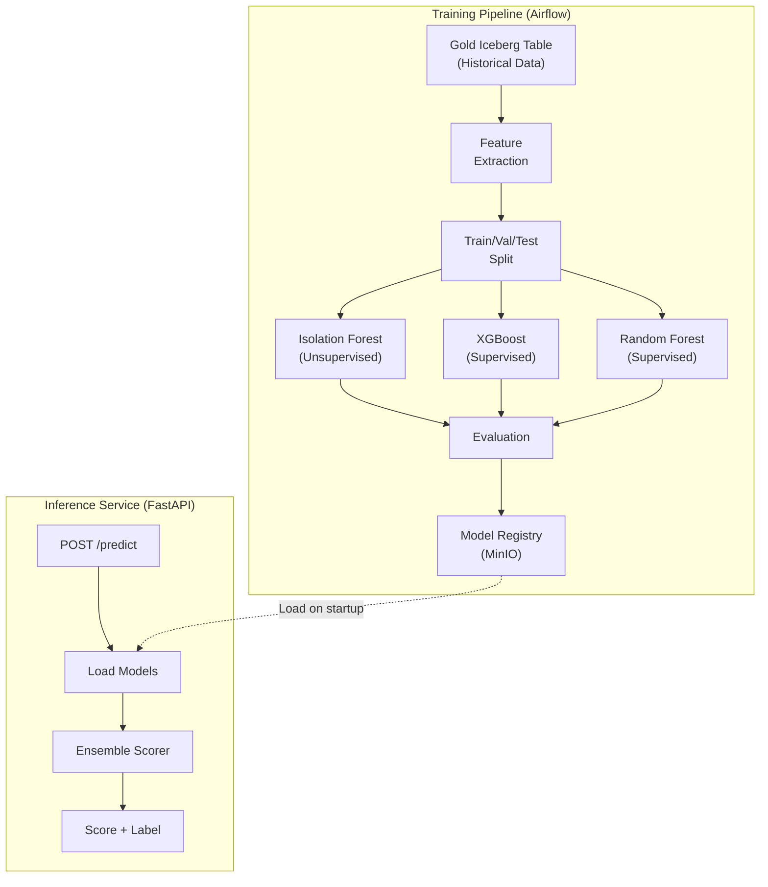
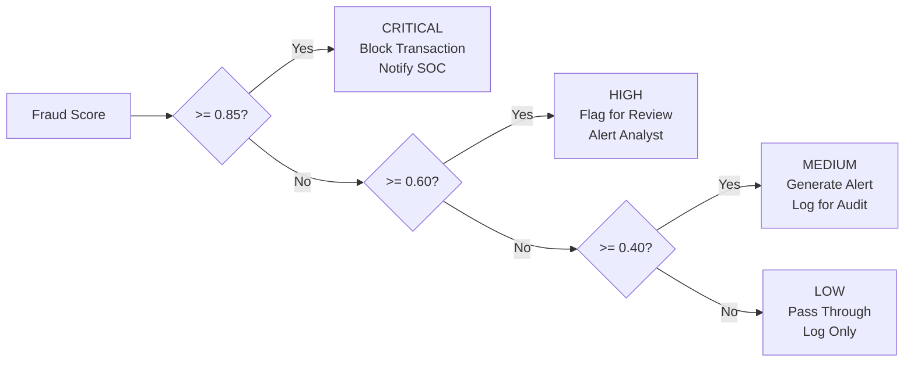
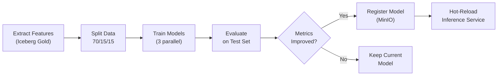

# ML Fraud Detection Pipeline

The ML pipeline uses an ensemble of three models — Isolation Forest, XGBoost, and Random Forest — to detect fraudulent transactions with high precision while minimizing false positives.

## Architecture



## Model Details

### Isolation Forest (Unsupervised)

Detects anomalies without requiring labeled data. Effective for novel fraud patterns not seen in training data.

| Parameter | Value | Rationale |
|-----------|-------|-----------|
| `n_estimators` | 200 | Balance between accuracy and memory |
| `contamination` | 0.02 | Matches expected fraud rate (~2%) |
| `max_samples` | 0.8 | Subsample for diversity |
| `max_features` | 0.8 | Feature subsampling |
| `random_state` | 42 | Reproducibility |

**Strengths:** Catches unknown fraud patterns, no labels needed, fast inference.

**Weaknesses:** Higher false positive rate, less precise than supervised models.

### XGBoost (Supervised)

Gradient-boosted decision trees trained on labeled fraud data. Primary model for known fraud patterns.

| Parameter | Value | Rationale |
|-----------|-------|-----------|
| `n_estimators` | 500 | Deep ensemble for accuracy |
| `max_depth` | 6 | Prevent overfitting |
| `learning_rate` | 0.05 | Slow learning for generalization |
| `subsample` | 0.8 | Row subsampling |
| `colsample_bytree` | 0.8 | Feature subsampling |
| `scale_pos_weight` | 49 | Handle class imbalance (2% fraud) |
| `eval_metric` | `aucpr` | Optimize for precision-recall |
| `early_stopping_rounds` | 50 | Stop if validation loss plateaus |

**Strengths:** High precision on known patterns, handles imbalanced data well, feature importance.

**Weaknesses:** Requires labeled data, may miss novel patterns.

### Random Forest (Supervised)

Ensemble of decision trees providing a stable baseline and complementing XGBoost.

| Parameter | Value | Rationale |
|-----------|-------|-----------|
| `n_estimators` | 300 | Sufficient for convergence |
| `max_depth` | 10 | Slightly deeper than XGBoost |
| `min_samples_split` | 5 | Regularization |
| `min_samples_leaf` | 2 | Prevent noisy leaf nodes |
| `class_weight` | `balanced` | Auto-adjust for class imbalance |
| `n_jobs` | 2 | Parallel fitting (constrained) |

## Ensemble Strategy

The final fraud score is a weighted combination of all three models:

```python
def ensemble_predict(features):
    if_score = isolation_forest.decision_function(features)  # Normalize to [0, 1]
    xgb_score = xgboost_model.predict_proba(features)[:, 1]
    rf_score = random_forest_model.predict_proba(features)[:, 1]
    
    # Weighted ensemble
    final_score = (
        0.50 * xgb_score +   # Primary: best on known patterns
        0.30 * rf_score +     # Secondary: stable baseline
        0.20 * if_score       # Tertiary: catches anomalies
    )
    
    return final_score
```

| Model | Weight | Justification |
|-------|--------|---------------|
| XGBoost | 0.50 | Highest precision on labeled fraud; primary detector |
| Random Forest | 0.30 | Stable complementary predictions; reduces XGBoost overfitting |
| Isolation Forest | 0.20 | Catches novel anomalies; unsupervised safety net |

!!! info "Weight selection"
    Weights were determined by optimizing for Precision@Recall=0.90 on the validation set. XGBoost dominates because the simulator produces consistent labeled fraud patterns.

## Feature List

All 10 features computed by the Spark streaming pipeline are inputs to the ML models:

| Feature | Type | Range | Description |
|---------|------|-------|-------------|
| `tx_count_1h` | int | 0 - 100+ | Transactions per card in last hour |
| `tx_count_24h` | int | 0 - 500+ | Transactions per card in last 24 hours |
| `amount_zscore` | float | -5.0 - 10.0+ | Standard deviations from card's mean amount |
| `geo_velocity_kmh` | float | 0 - 10000+ | Speed between consecutive transactions |
| `merchant_risk_score` | float | 0.0 - 1.0 | Historical fraud rate of merchant category |
| `device_consistency` | bool | 0 / 1 | Whether device matches known devices for card |
| `time_since_last_tx` | float | 0 - 86400+ | Seconds since last transaction on card |
| `is_unusual_hour` | bool | 0 / 1 | Transaction between 01:00-05:00 |
| `rapid_tx_count` | int | 0 - 50+ | Transactions in last 60 seconds |
| `amount_to_avg_ratio` | float | 0.0 - 50.0+ | Amount divided by card's average |

## Threshold Strategy

Fraud scores map to severity labels and automated actions:



| Score Range | Label | Action | Expected Volume |
|-------------|-------|--------|-----------------|
| 0.85 - 1.00 | CRITICAL | Block + immediate SOC notification | ~0.5% of fraud |
| 0.60 - 0.84 | HIGH | Flag for manual review | ~1.0% of fraud |
| 0.40 - 0.59 | MEDIUM | Generate alert, log for pattern analysis | ~0.5% of fraud |
| 0.00 - 0.39 | LOW | Pass through, log only | ~98% of traffic |

## Training Pipeline

The training pipeline runs as an Airflow DAG (`model_training_dag`) on a weekly schedule:



### Training Data Split

| Set | Proportion | Purpose |
|-----|-----------|---------|
| Train | 70% | Model fitting |
| Validation | 15% | Hyperparameter tuning, early stopping |
| Test | 15% | Final evaluation (never seen during training) |

!!! warning "Temporal split"
    Data is split temporally (not randomly) to prevent data leakage. The test set always contains the most recent transactions.

## Inference Service

The ML inference service runs as a FastAPI application exposing REST endpoints.

### Endpoints

| Method | Path | Description |
|--------|------|-------------|
| `POST` | `/predict` | Score a single transaction |
| `POST` | `/predict/batch` | Score up to 100 transactions |
| `GET` | `/model/info` | Active model metadata |
| `POST` | `/model/reload` | Hot-reload models from registry |
| `GET` | `/health` | Service health check |

### Single Prediction

```bash
curl -X POST http://localhost:8001/predict \
  -H "Content-Type: application/json" \
  -d '{
    "tx_count_1h": 15,
    "tx_count_24h": 45,
    "amount_zscore": 3.2,
    "geo_velocity_kmh": 950.0,
    "merchant_risk_score": 0.7,
    "device_consistency": false,
    "time_since_last_tx": 30.0,
    "is_unusual_hour": true,
    "rapid_tx_count": 8,
    "amount_to_avg_ratio": 4.5
  }'
```

**Response:**

```json
{
  "fraud_score": 0.87,
  "fraud_label": "CRITICAL",
  "model_scores": {
    "xgboost": 0.91,
    "random_forest": 0.84,
    "isolation_forest": 0.78
  },
  "model_version": "v2.1.0",
  "inference_time_ms": 12
}
```

## Performance Metrics

Target performance on the test set:

| Metric | Target | Current |
|--------|--------|---------|
| AUC-ROC | > 0.95 | 0.967 |
| AUC-PR | > 0.80 | 0.842 |
| Precision@Recall=0.90 | > 0.70 | 0.738 |
| F1 Score | > 0.75 | 0.781 |
| Inference Latency (p50) | < 10ms | 8ms |
| Inference Latency (p99) | < 50ms | 35ms |

## Model Registry

Models are stored in MinIO with versioned paths:

```
s3://ml-models/
├── isolation_forest/
│   ├── v1.0.0/model.joblib
│   ├── v2.0.0/model.joblib
│   └── latest -> v2.0.0
├── xgboost/
│   ├── v1.0.0/model.xgb
│   ├── v2.1.0/model.xgb
│   └── latest -> v2.1.0
├── random_forest/
│   ├── v1.0.0/model.joblib
│   ├── v2.0.0/model.joblib
│   └── latest -> v2.0.0
└── metadata/
    └── training_runs.json
```

## Next Steps

- [AI Investigation Copilot](ai-copilot.md) — LLM-powered fraud investigation
- [Spark Streaming](spark.md) — Feature engineering pipeline
- [Architecture Decisions](../architecture/decisions.md#adr-004-xgboost--isolation-forest-ensemble) — Why this model architecture
