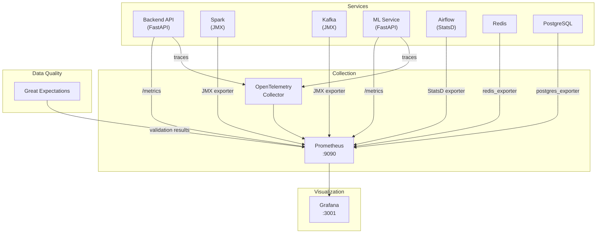

# Observability Stack

The observability layer provides metrics collection, visualization, distributed tracing, data quality validation, and structured logging across all platform services.

## Architecture



## Prometheus

### Scrape Configuration

Prometheus scrapes metrics from all platform services at regular intervals:

```yaml
# prometheus/prometheus.yml
global:
  scrape_interval: 15s
  evaluation_interval: 15s

scrape_configs:
  - job_name: "backend-api"
    static_configs:
      - targets: ["backend:8000"]
    metrics_path: "/api/metrics"

  - job_name: "ml-service"
    static_configs:
      - targets: ["ml-service:8001"]
    metrics_path: "/metrics"

  - job_name: "kafka"
    static_configs:
      - targets: ["kafka:9404"]

  - job_name: "spark-master"
    static_configs:
      - targets: ["spark-master:8080"]
    metrics_path: "/metrics/prometheus"

  - job_name: "spark-worker"
    static_configs:
      - targets: ["spark-worker:8081"]
    metrics_path: "/metrics/prometheus"

  - job_name: "redis"
    static_configs:
      - targets: ["redis-exporter:9121"]

  - job_name: "postgres"
    static_configs:
      - targets: ["postgres-exporter:9187"]

  - job_name: "airflow"
    static_configs:
      - targets: ["airflow-webserver:8082"]
    metrics_path: "/admin/metrics"

  - job_name: "node-exporter"
    static_configs:
      - targets: ["node-exporter:9100"]
```

### Alert Rules

```yaml
# prometheus/alert_rules.yml
groups:
  - name: fraud_platform
    rules:
      - alert: HighFraudRate
        expr: |
          rate(fraud_alerts_total[5m]) / rate(transactions_processed_total[5m]) > 0.05
        for: 5m
        labels:
          severity: warning
        annotations:
          summary: "Fraud rate exceeds 5% (current: {{ $value | humanizePercentage }})"

      - alert: KafkaConsumerLagCritical
        expr: kafka_consumer_group_lag > 50000
        for: 10m
        labels:
          severity: critical
        annotations:
          summary: "Kafka consumer lag on {{ $labels.topic }} exceeds 50K"

      - alert: SparkBatchDurationHigh
        expr: spark_streaming_lastCompletedBatch_processingTime_ms > 15000
        for: 5m
        labels:
          severity: warning
        annotations:
          summary: "Spark batch processing time {{ $value }}ms exceeds trigger interval"

      - alert: MLServiceLatencyHigh
        expr: histogram_quantile(0.99, rate(ml_prediction_duration_seconds_bucket[5m])) > 0.1
        for: 5m
        labels:
          severity: warning
        annotations:
          summary: "ML inference p99 latency {{ $value }}s exceeds 100ms threshold"

      - alert: BackendErrorRate
        expr: |
          rate(http_requests_total{status=~"5.."}[5m]) / rate(http_requests_total[5m]) > 0.01
        for: 5m
        labels:
          severity: critical
        annotations:
          summary: "Backend 5xx error rate above 1%"

      - alert: ServiceDown
        expr: up == 0
        for: 1m
        labels:
          severity: critical
        annotations:
          summary: "{{ $labels.job }} is down"
```

### Recording Rules

Pre-computed metrics for dashboard performance:

```yaml
# prometheus/recording_rules.yml
groups:
  - name: fraud_aggregations
    rules:
      - record: fraud:rate5m
        expr: rate(fraud_alerts_total[5m]) / rate(transactions_processed_total[5m])

      - record: fraud:alerts_by_severity
        expr: sum by (severity) (increase(fraud_alerts_total[1h]))

      - record: pipeline:end_to_end_latency_p99
        expr: histogram_quantile(0.99, rate(pipeline_latency_seconds_bucket[5m]))

      - record: api:request_rate
        expr: sum(rate(http_requests_total[5m])) by (method, path)
```

## Grafana Dashboards

Five pre-provisioned dashboards provide full platform visibility:

### 1. Platform Overview

High-level health and throughput metrics.

| Panel | Type | Data Source | Description |
|-------|------|-------------|-------------|
| Service Health Grid | Stat | Prometheus | UP/DOWN status for all services |
| Transaction Throughput | Time series | Prometheus | Transactions/sec over time |
| Fraud Rate | Gauge | Prometheus | Current fraud detection rate |
| Pipeline Latency | Time series | Prometheus | End-to-end p50, p95, p99 |
| Active Alerts | Stat | Prometheus | Open fraud alerts count |
| Docker Resource Usage | Time series | Node Exporter | CPU, memory, disk per container |

### 2. Streaming Pipeline

Kafka + Spark metrics for pipeline health.

| Panel | Type | Description |
|-------|------|-------------|
| Kafka Messages In/Out | Time series | Producer/consumer throughput |
| Consumer Lag by Partition | Bar chart | Lag per topic partition |
| Topic Size | Time series | Messages stored per topic |
| Spark Batch Duration | Time series | Processing time per micro-batch |
| Spark Scheduling Delay | Time series | Time waiting to start batch |
| Records Processed/sec | Time series | Spark input rate |
| Checkpoint Duration | Time series | Time to write checkpoint to MinIO |
| State Store Size | Time series | RocksDB state size |

### 3. Fraud Detection

ML model performance and alert analysis.

| Panel | Type | Description |
|-------|------|-------------|
| Fraud Score Distribution | Histogram | Distribution of ensemble scores |
| Alerts by Severity | Pie chart | CRITICAL/HIGH/MEDIUM breakdown |
| Per-Model Scores | Time series | XGBoost, RF, IF scores over time |
| False Positive Rate | Gauge | FP rate from resolved alerts |
| Alert Volume | Time series | Alerts per minute |
| Top Fraud Patterns | Bar chart | Most common fraud patterns |
| Geographic Distribution | Geomap | Alert locations on world map |
| Inference Latency | Histogram | ML prediction response time |

### 4. API & Backend

FastAPI service metrics.

| Panel | Type | Description |
|-------|------|-------------|
| Request Rate | Time series | Requests/sec by endpoint |
| Response Latency | Heatmap | Latency distribution over time |
| Error Rate | Time series | 4xx and 5xx rates |
| WebSocket Connections | Gauge | Active WebSocket clients |
| Redis Cache Hit Rate | Gauge | Cache effectiveness |
| Connection Pool | Time series | DB connection pool utilization |
| Copilot Latency | Time series | Investigation response time |

### 5. Infrastructure

System-level resource monitoring.

| Panel | Type | Description |
|-------|------|-------------|
| Container CPU | Time series | CPU usage per Docker container |
| Container Memory | Time series | Memory usage vs. limits |
| Container Network I/O | Time series | Network bytes in/out |
| Disk Usage | Gauge | Docker volume usage |
| PostgreSQL Connections | Time series | Active/idle DB connections |
| PostgreSQL Query Time | Heatmap | Slow query distribution |
| Redis Memory | Time series | Redis memory usage |
| Redis Operations | Time series | Commands processed/sec |

### Accessing Grafana

```
URL:      http://localhost:3001
Username: admin
Password: admin
```

Dashboards are auto-provisioned on startup from `monitoring/grafana/dashboards/`.

## OpenTelemetry Tracing

Distributed tracing follows requests across service boundaries:

```python
# Backend API tracing setup
from opentelemetry import trace
from opentelemetry.instrumentation.fastapi import FastAPIInstrumentor
from opentelemetry.instrumentation.httpx import HTTPXClientInstrumentor
from opentelemetry.exporter.prometheus import PrometheusMetricReader

# Auto-instrument FastAPI
FastAPIInstrumentor.instrument_app(app)

# Auto-instrument HTTP client (for ML service calls)
HTTPXClientInstrumentor().instrument()
```

### Trace Flow Example

```
[Frontend] → [Backend API] → [ML Service] → [Backend API] → [Redis Cache]
   │                │              │               │              │
   └── span: fetch  └── span: api └── span: pred  └── span: ws   └── span: cache
```

## Great Expectations (Data Quality)

### Validation Suites

| Suite | Table | Schedule | Expectations |
|-------|-------|----------|-------------|
| `bronze_completeness` | Bronze transactions | Every batch | Not null: transaction_id, timestamp, raw_payload |
| `silver_schema` | Silver transactions | Every batch | Column types, value ranges, feature bounds |
| `silver_freshness` | Silver transactions | Every 5 min | Max age < 60 seconds |
| `gold_consistency` | Gold metrics | Hourly | fraud_count <= total_transactions, rates in [0,1] |
| `feature_bounds` | Silver features | Every batch | z-score in [-10,10], velocity >= 0, counts >= 0 |

### Example Expectations

```python
# silver_schema suite
expectation_suite = context.create_expectation_suite("silver_schema")

# Fraud score must be between 0 and 1
suite.add_expectation(
    ExpectColumnValuesToBeBetween(column="fraud_score", min_value=0.0, max_value=1.0)
)

# No null transaction IDs
suite.add_expectation(
    ExpectColumnValuesToNotBeNull(column="transaction_id")
)

# Geo velocity must be non-negative
suite.add_expectation(
    ExpectColumnValuesToBeBetween(column="geo_velocity_kmh", min_value=0.0)
)

# Fraud label must be valid enum
suite.add_expectation(
    ExpectColumnValuesToBeInSet(
        column="fraud_label", 
        value_set=["CRITICAL", "HIGH", "MEDIUM", "LOW"]
    )
)
```

## Structured Logging

All services use JSON-formatted structured logs with correlation IDs:

```json
{
  "timestamp": "2024-01-15T14:23:45.123Z",
  "level": "INFO",
  "service": "backend-api",
  "correlation_id": "req-a1b2c3d4",
  "message": "Fraud alert processed",
  "context": {
    "alert_id": "alert_xyz",
    "fraud_score": 0.92,
    "latency_ms": 12,
    "endpoint": "/api/alerts"
  }
}
```

### Correlation ID Propagation

```
Frontend → Backend API → ML Service → Backend API → WebSocket
  X-Request-ID: req-a1b2c3d4 (propagated through all services)
```

## Key Metrics to Monitor

| Metric | Normal Range | Warning | Critical | Action |
|--------|-------------|---------|----------|--------|
| Transaction throughput | 80-120 TPS | < 50 TPS | < 10 TPS | Check simulator + Kafka |
| Fraud rate | 1.5-3% | > 5% | > 10% | Investigate model or data |
| Kafka consumer lag | < 1,000 | > 10,000 | > 50,000 | Scale Spark or check errors |
| Spark batch duration | < 10s | > 15s | > 30s | Tune Spark memory/partitions |
| API p99 latency | < 100ms | > 500ms | > 1s | Check DB queries + cache |
| ML inference p99 | < 50ms | > 100ms | > 500ms | Check model service |
| Copilot response | < 5s | > 10s | > 30s | Check Ollama memory |
| Docker memory | < 7 GB | > 7.5 GB | > 7.8 GB | Reduce service allocations |
| Error rate (5xx) | < 0.1% | > 0.5% | > 1% | Check service logs |

## SLA Definitions

| SLA | Target | Measurement |
|-----|--------|-------------|
| Pipeline freshness | < 30s from transaction to dashboard | End-to-end latency p99 |
| API availability | 99.5% uptime | `up{job="backend-api"}` |
| Alert delivery | < 15s from detection to WebSocket | Alert broadcast latency p99 |
| Data quality | > 99% expectations passing | Great Expectations suite results |
| Model accuracy | AUC-ROC > 0.95 | Weekly model evaluation |

## Next Steps

- [Operations Runbook](../runbook/operations.md) — Day-to-day monitoring procedures
- [Performance Tuning](../runbook/performance-tuning.md) — Optimization guidance
- [Troubleshooting](../runbook/troubleshooting.md) — Issue diagnosis
