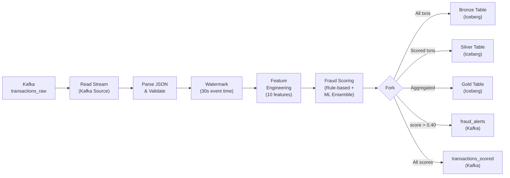

# Spark Structured Streaming

Apache Spark processes the real-time transaction stream, computing features, scoring fraud risk, and writing results to the Iceberg lakehouse.

## Architecture



## Streaming Pipeline

The main streaming job runs as a Spark Structured Streaming application on the Spark worker node.

### Source: Kafka Consumer

```python
raw_stream = (
    spark.readStream
    .format("kafka")
    .option("kafka.bootstrap.servers", "kafka:29092")
    .option("subscribe", "transactions_raw")
    .option("startingOffsets", "latest")
    .option("maxOffsetsPerTrigger", 10000)
    .option("failOnDataLoss", "false")
    .load()
)
```

### Parse and Validate

```python
transaction_schema = StructType([
    StructField("transaction_id", StringType(), False),
    StructField("timestamp", TimestampType(), False),
    StructField("card_hash", StringType(), False),
    StructField("amount", DoubleType(), False),
    StructField("merchant_id", StringType(), False),
    StructField("merchant_category", StringType(), True),
    StructField("location_lat", DoubleType(), True),
    StructField("location_lon", DoubleType(), True),
    StructField("device_id", StringType(), True),
    StructField("ip_address", StringType(), True),
    StructField("is_fraud", BooleanType(), True),  # ground truth from simulator
])

parsed = (
    raw_stream
    .selectExpr("CAST(value AS STRING) as json_str")
    .select(from_json(col("json_str"), transaction_schema).alias("data"))
    .select("data.*")
    .filter(col("transaction_id").isNotNull())
)
```

### Watermarking

```python
watermarked = parsed.withWatermark("timestamp", "30 seconds")
```

!!! info "Watermark threshold"
    The 30-second watermark allows late-arriving events up to 30 seconds past the latest event time. Events arriving later are dropped. This is tuned for the local environment where network delays are negligible.

## Feature Engineering

The pipeline computes 10 features in real-time for each transaction. Features fall into three categories: windowed aggregations, stateful computations, and lookup enrichments.

### Feature Reference

| # | Feature | Type | Computation | Window/State |
|---|---------|------|-------------|-------------|
| 1 | `tx_count_1h` | Windowed | Count of transactions per card in last 1 hour | 1h tumbling window |
| 2 | `tx_count_24h` | Windowed | Count of transactions per card in last 24 hours | 24h sliding window |
| 3 | `amount_zscore` | Stateful | Z-score of amount vs. card's historical mean/stddev | Running mean + variance per card |
| 4 | `geo_velocity_kmh` | Stateful | Speed between consecutive transaction locations | Last location per card |
| 5 | `merchant_risk_score` | Lookup | Historical fraud rate for the merchant category | Pre-computed lookup table |
| 6 | `device_consistency` | Lookup | Whether device matches card's known devices | Device-card mapping |
| 7 | `time_since_last_tx` | Stateful | Seconds since card's last transaction | Last timestamp per card |
| 8 | `is_unusual_hour` | Rule | Whether transaction is between 01:00-05:00 local time | None |
| 9 | `rapid_tx_count` | Windowed | Transactions within 60-second burst window | 60s tumbling window |
| 10 | `amount_to_avg_ratio` | Stateful | Transaction amount / card's rolling average | Running average per card |

### Windowed Features

```python
# tx_count_1h: Tumbling window aggregation
tx_count_1h = (
    watermarked
    .groupBy(
        window(col("timestamp"), "1 hour"),
        col("card_hash")
    )
    .agg(count("*").alias("tx_count_1h"))
)
```

### Stateful Features (mapGroupsWithState)

```python
# geo_velocity_kmh: Requires previous location per card
def compute_geo_velocity(card_hash, transactions, state):
    prev_state = state.getOption
    if prev_state:
        prev_lat, prev_lon, prev_ts = prev_state
        for tx in transactions:
            distance_km = haversine(prev_lat, prev_lon, tx.location_lat, tx.location_lon)
            time_hours = (tx.timestamp - prev_ts).total_seconds() / 3600
            velocity = distance_km / max(time_hours, 0.001)
            state.update((tx.location_lat, tx.location_lon, tx.timestamp))
            yield Row(card_hash=card_hash, geo_velocity_kmh=velocity, ...)
    else:
        for tx in transactions:
            state.update((tx.location_lat, tx.location_lon, tx.timestamp))
            yield Row(card_hash=card_hash, geo_velocity_kmh=0.0, ...)
```

!!! warning "State store size"
    Stateful features maintain per-card state in RocksDB. With 100 TPS and ~50K unique cards, the state store grows to approximately 50-100 MB. State is checkpointed to MinIO every micro-batch.

## Rule-Based Fraud Scoring

After feature engineering, a rule-based scoring formula produces the initial fraud score:

```python
def compute_fraud_score(features):
    score = 0.0
    
    # Velocity anomaly (weight: 0.25)
    if features.geo_velocity_kmh > 800:  # Faster than commercial flight
        score += 0.25
    elif features.geo_velocity_kmh > 200:
        score += 0.15
    
    # Amount anomaly (weight: 0.20)
    if abs(features.amount_zscore) > 3.0:
        score += 0.20
    elif abs(features.amount_zscore) > 2.0:
        score += 0.10
    
    # Frequency anomaly (weight: 0.20)
    if features.rapid_tx_count > 5:
        score += 0.20
    elif features.tx_count_1h > 20:
        score += 0.10
    
    # Time anomaly (weight: 0.10)
    if features.is_unusual_hour:
        score += 0.10
    
    # Merchant risk (weight: 0.15)
    score += features.merchant_risk_score * 0.15
    
    # Device mismatch (weight: 0.10)
    if not features.device_consistency:
        score += 0.10
    
    return min(score, 1.0)
```

## Checkpointing

Spark checkpoints streaming state and offsets to MinIO for fault tolerance:

```python
query = (
    scored_stream
    .writeStream
    .format("iceberg")
    .outputMode("append")
    .option("checkpointLocation", "s3a://spark-checkpoints/fraud-pipeline/")
    .trigger(processingTime="10 seconds")
    .start("nessie.fraud_db.silver_transactions")
)
```

### Checkpoint Contents

```
s3a://spark-checkpoints/fraud-pipeline/
├── commits/          # Batch completion markers
├── offsets/          # Kafka offsets per micro-batch
├── sources/          # Source metadata (topic partitions)
└── state/            # RocksDB state snapshots (stateful features)
```

### Recovery Scenarios

| Scenario | Recovery Behavior |
|----------|-------------------|
| Spark worker restart | Resumes from last committed offset; reprocesses in-flight batch |
| Checkpoint corruption | Delete checkpoint dir, restart with `startingOffsets=earliest` |
| Kafka topic reset | Delete checkpoint dir, recreate topics, restart pipeline |

## Spark Configuration

Settings tuned for 2 GB worker memory on a local Docker deployment:

```properties
# Memory
spark.executor.memory=1g
spark.driver.memory=1g
spark.executor.memoryOverhead=256m

# Parallelism (low for single worker)
spark.sql.shuffle.partitions=4
spark.default.parallelism=4

# Adaptive Query Execution
spark.sql.adaptive.enabled=true
spark.sql.adaptive.coalescePartitions.enabled=true

# Streaming
spark.sql.streaming.stateStore.stateSchemaCheck=false
spark.sql.streaming.metricsEnabled=true

# Iceberg
spark.sql.catalog.nessie=org.apache.iceberg.spark.SparkCatalog
spark.sql.catalog.nessie.catalog-impl=org.apache.iceberg.nessie.NessieCatalog
spark.sql.catalog.nessie.uri=http://nessie:19120/api/v1
spark.sql.catalog.nessie.warehouse=s3a://iceberg-warehouse/
```

## Monitoring

### Spark UI

Access the Spark Master UI at [http://localhost:8080](http://localhost:8080) to monitor:

- Active streaming applications
- Executor memory usage
- Task distribution across stages

### Key Metrics

| Metric | Target | Alert If |
|--------|--------|----------|
| **Batch duration** | < 10s (trigger interval) | > 15s (falling behind) |
| **Scheduling delay** | < 1s | > 5s (resource contention) |
| **Records/sec** | ~100 (matches simulator TPS) | < 50 (throughput degradation) |
| **State rows** | ~50K (unique cards) | > 200K (state bloat) |
| **Input rows/batch** | ~1,000 (100 TPS × 10s) | 0 (Kafka disconnection) |

### Monitoring Commands

```bash
# Check streaming job status
make spark-status

# View Spark logs
make logs SERVICE=spark-worker

# Check processing metrics via Prometheus
curl -s http://localhost:9090/api/v1/query?query=spark_streaming_batch_duration_ms
```

## Debugging

### Common Issues

=== "OutOfMemoryError"

    **Cause:** Spark executor exceeds 1 GB allocation.
    
    **Fix:** Reduce state size or increase memory:
    ```bash
    # In .env
    SPARK_WORKER_MEMORY=3g
    SPARK_EXECUTOR_MEMORY=2g
    ```

=== "Checkpoint Corruption"

    **Cause:** Ungraceful shutdown during checkpoint write.
    
    **Fix:**
    ```bash
    # Delete checkpoint directory
    docker exec minio mc rm --recursive --force \
      local/spark-checkpoints/fraud-pipeline/
    
    # Restart Spark
    make restart-spark
    ```

=== "Slow Batch Processing"

    **Cause:** Too many shuffle partitions or large state.
    
    **Fix:** Verify shuffle partitions are set to 4:
    ```bash
    docker exec spark-worker cat /opt/spark/conf/spark-defaults.conf | grep shuffle
    ```

=== "Iceberg Write Failures"

    **Cause:** MinIO connectivity or schema mismatch.
    
    **Fix:**
    ```bash
    # Test MinIO connectivity from Spark
    docker exec spark-worker curl -s http://minio:9000/minio/health/live
    
    # Check Nessie catalog
    docker exec spark-worker curl -s http://nessie:19120/api/v1/trees
    ```

## Next Steps

- [Apache Iceberg](iceberg.md) — Where Spark writes processed data
- [Data Flow Architecture](../architecture/data-flow.md) — Full pipeline view
- [Performance Tuning](../runbook/performance-tuning.md#spark-tuning) — Spark-specific optimization
