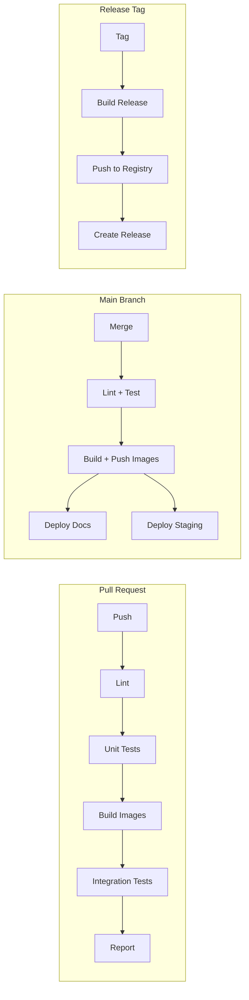
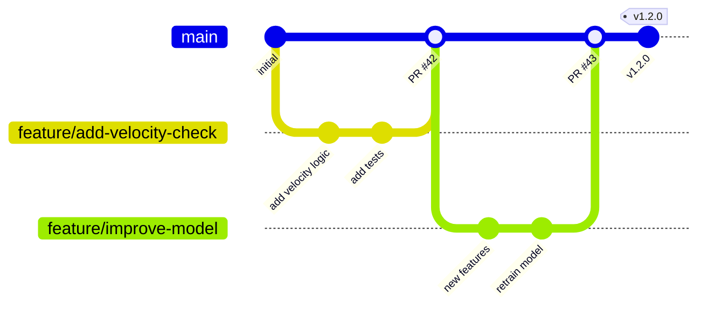

# CI/CD Pipeline

Continuous integration and deployment configuration for the Fraud Intelligence Platform.

---

## Pipeline Overview



---

## Pipeline Stages

### Stage 1: Lint

```yaml
lint:
  runs-on: ubuntu-latest
  steps:
    - uses: actions/checkout@v4

    - name: Set up Python
      uses: actions/setup-python@v5
      with:
        python-version: '3.11'
        cache: 'pip'

    - name: Python linting
      run: |
        pip install ruff
        ruff check . --output-format=github
        ruff format --check .

    - name: TypeScript linting
      working-directory: services/frontend
      run: |
        npm ci
        npm run lint
        npm run type-check

    - name: YAML validation
      run: |
        pip install yamllint
        yamllint -c .yamllint.yml .

    - name: Dockerfile linting
      uses: hadolint/hadolint-action@v3
      with:
        recursive: true
```

### Stage 2: Unit Tests

```yaml
test-python:
  needs: lint
  runs-on: ubuntu-latest
  strategy:
    matrix:
      service: [backend, ml-service, spark-jobs, airflow]
  steps:
    - uses: actions/checkout@v4

    - name: Set up Python
      uses: actions/setup-python@v5
      with:
        python-version: '3.11'
        cache: 'pip'

    - name: Install dependencies
      run: |
        pip install -r services/${{ matrix.service }}/requirements.txt
        pip install -r services/${{ matrix.service }}/requirements-dev.txt

    - name: Run tests
      run: |
        pytest services/${{ matrix.service }}/tests/unit/ \
          -v --cov=services/${{ matrix.service }}/src \
          --cov-report=xml:coverage-${{ matrix.service }}.xml \
          --junitxml=junit-${{ matrix.service }}.xml

    - name: Upload coverage
      uses: codecov/codecov-action@v4
      with:
        file: coverage-${{ matrix.service }}.xml
        flags: ${{ matrix.service }}

test-frontend:
  needs: lint
  runs-on: ubuntu-latest
  steps:
    - uses: actions/checkout@v4
    - uses: actions/setup-node@v4
      with:
        node-version: '20'
        cache: 'npm'
        cache-dependency-path: services/frontend/package-lock.json
    - run: cd services/frontend && npm ci
    - run: cd services/frontend && npm test -- --coverage
```

### Stage 3: Build Images

```yaml
build:
  needs: [test-python, test-frontend]
  runs-on: ubuntu-latest
  strategy:
    matrix:
      service: [backend, frontend, ml-service, spark-jobs, airflow]
  steps:
    - uses: actions/checkout@v4

    - name: Set up Docker Buildx
      uses: docker/setup-buildx-action@v3

    - name: Build image
      uses: docker/build-push-action@v5
      with:
        context: services/${{ matrix.service }}
        push: false
        tags: fraud-platform/${{ matrix.service }}:${{ github.sha }}
        cache-from: type=gha,scope=${{ matrix.service }}
        cache-to: type=gha,mode=max,scope=${{ matrix.service }}
        outputs: type=docker,dest=/tmp/${{ matrix.service }}.tar

    - name: Upload image artifact
      uses: actions/upload-artifact@v4
      with:
        name: image-${{ matrix.service }}
        path: /tmp/${{ matrix.service }}.tar
        retention-days: 1
```

### Stage 4: Integration Tests

```yaml
integration:
  needs: build
  runs-on: ubuntu-latest
  steps:
    - uses: actions/checkout@v4

    - name: Download all images
      uses: actions/download-artifact@v4
      with:
        pattern: image-*
        path: /tmp/images

    - name: Load images
      run: |
        for img in /tmp/images/image-*/*.tar; do
          docker load < "$img"
        done

    - name: Start test environment
      run: |
        docker compose --profile test up -d
        sleep 60  # Wait for all services to be healthy

    - name: Run integration tests
      run: |
        pip install -r requirements-test.txt
        pytest tests/integration/ -v --timeout=120

    - name: Collect logs on failure
      if: failure()
      run: |
        docker compose logs > docker-logs.txt
        docker compose ps >> docker-logs.txt

    - name: Upload logs
      if: failure()
      uses: actions/upload-artifact@v4
      with:
        name: docker-logs
        path: docker-logs.txt

    - name: Teardown
      if: always()
      run: docker compose --profile test down -v
```

### Stage 5: Deploy

```yaml
deploy-docs:
  needs: integration
  if: github.ref == 'refs/heads/main'
  runs-on: ubuntu-latest
  permissions:
    pages: write
    id-token: write
  steps:
    - uses: actions/checkout@v4
    - uses: actions/setup-python@v5
      with:
        python-version: '3.11'
    - run: pip install mkdocs-material mkdocs-mermaid2-plugin
    - run: mkdocs build
    - uses: actions/upload-pages-artifact@v3
      with:
        path: site
    - uses: actions/deploy-pages@v4

push-images:
  needs: integration
  if: github.ref == 'refs/heads/main'
  runs-on: ubuntu-latest
  permissions:
    packages: write
  strategy:
    matrix:
      service: [backend, frontend, ml-service, spark-jobs, airflow]
  steps:
    - name: Login to GHCR
      uses: docker/login-action@v3
      with:
        registry: ghcr.io
        username: ${{ github.actor }}
        password: ${{ secrets.GITHUB_TOKEN }}

    - name: Download image
      uses: actions/download-artifact@v4
      with:
        name: image-${{ matrix.service }}
        path: /tmp

    - name: Load and push image
      run: |
        docker load < /tmp/${{ matrix.service }}.tar
        docker tag fraud-platform/${{ matrix.service }}:${{ github.sha }} \
          ghcr.io/${{ github.repository }}/${{ matrix.service }}:${{ github.sha }}
        docker tag fraud-platform/${{ matrix.service }}:${{ github.sha }} \
          ghcr.io/${{ github.repository }}/${{ matrix.service }}:latest
        docker push ghcr.io/${{ github.repository }}/${{ matrix.service }}:${{ github.sha }}
        docker push ghcr.io/${{ github.repository }}/${{ matrix.service }}:latest
```

---

## Branch Strategy



| Branch | Purpose | Merges To | CI Actions |
|--------|---------|-----------|------------|
| `main` | Production-ready code | — | Full pipeline + deploy |
| `feature/*` | New features | `main` via PR | Lint + test + build + integration |
| `fix/*` | Bug fixes | `main` via PR | Lint + test + build + integration |
| `docs/*` | Documentation changes | `main` via PR | Lint + deploy docs |

---

## Docker Image Building

### Multi-Stage Dockerfile Pattern

```dockerfile
# Build stage
FROM python:3.11-slim AS builder
WORKDIR /app
COPY requirements.txt .
RUN pip install --no-cache-dir --prefix=/install -r requirements.txt

# Runtime stage
FROM python:3.11-slim AS runtime
COPY --from=builder /install /usr/local
WORKDIR /app
COPY src/ src/
EXPOSE 8000
CMD ["uvicorn", "src.main:app", "--host", "0.0.0.0", "--port", "8000"]
```

### Image Tagging Strategy

| Tag Pattern | Example | Use Case |
|-------------|---------|----------|
| `<sha>` | `abc1234` | Immutable, traceable builds |
| `latest` | `latest` | Latest main branch build |
| `v<semver>` | `v1.2.0` | Release versions |
| `<branch>-<sha>` | `feature-abc1234` | Branch-specific builds |

---

## Secrets Management

| Secret | Where Used | How to Set |
|--------|------------|------------|
| `GITHUB_TOKEN` | GHCR push, PR comments | Automatic (GitHub) |
| `CODECOV_TOKEN` | Coverage upload | Repository settings |
| `KUBE_CONFIG` | Staging deployment | Repository secrets |
| `DOCKER_HUB_TOKEN` | Docker Hub push (optional) | Repository secrets |

!!! warning "Security Best Practices"
    - Never commit `.env` files or secrets to the repository
    - Use GitHub Actions secrets for all sensitive values
    - Rotate tokens periodically
    - Use OIDC for cloud provider authentication where possible
    - Audit secrets access in repository settings

---

## Documentation Deployment

MkDocs builds and deploys to GitHub Pages on every merge to `main`:

```bash
# Local preview
make docs-serve   # Serves at http://localhost:8000

# Manual build
mkdocs build      # Output in ./site/

# Manual deploy (if needed)
mkdocs gh-deploy --force
```
