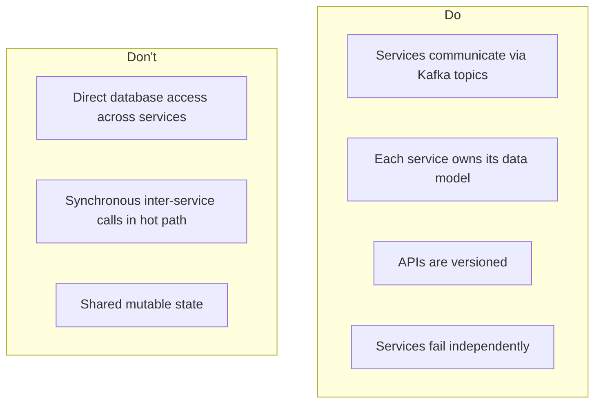

# Contributing Guide

Guidelines for contributing to the Fraud Intelligence Platform.

---

## Getting Started

1. Fork the repository and clone your fork
2. Set up your [local development environment](local-setup.md)
3. Create a feature branch from `main`
4. Make your changes
5. Run tests and linting
6. Submit a pull request

---

## Code Style

### Python (Backend, ML, Spark, Airflow)

We use **ruff** for linting and formatting:

```bash
# Check for issues
ruff check .

# Auto-fix issues
ruff check --fix .

# Format code
ruff format .
```

Configuration in `pyproject.toml`:

```toml
[tool.ruff]
target-version = "py311"
line-length = 100

[tool.ruff.lint]
select = ["E", "F", "W", "I", "N", "UP", "B", "A", "SIM", "RUF"]
ignore = ["E501"]  # Line length handled by formatter

[tool.ruff.lint.isort]
known-first-party = ["src"]
```

### TypeScript (Frontend)

We use **ESLint** and **Prettier**:

```bash
cd services/frontend

# Lint
npm run lint

# Format
npm run format

# Type check
npm run type-check
```

### SQL

- Use uppercase for keywords (`SELECT`, `FROM`, `WHERE`)
- Prefix CTEs with descriptive names
- Include comments for complex queries
- Use explicit `JOIN` syntax (never implicit joins)

---

## Commit Message Format

We follow [Conventional Commits](https://www.conventionalcommits.org/):

```
<type>(<scope>): <description>

[optional body]

[optional footer]
```

### Types

| Type | Description | Example |
|------|-------------|---------|
| `feat` | New feature | `feat(ml): add velocity-based features` |
| `fix` | Bug fix | `fix(spark): handle null amounts in pipeline` |
| `perf` | Performance improvement | `perf(kafka): optimize batch size for throughput` |
| `refactor` | Code restructuring | `refactor(backend): extract alert service` |
| `test` | Adding/updating tests | `test(ml): add model accuracy regression tests` |
| `docs` | Documentation changes | `docs: add deployment runbook` |
| `ci` | CI/CD changes | `ci: add integration test stage` |
| `chore` | Maintenance tasks | `chore: update dependencies` |

### Scopes

| Scope | Service/Area |
|-------|-------------|
| `backend` | Backend API service |
| `frontend` | React frontend |
| `ml` | ML service |
| `spark` | Spark streaming jobs |
| `kafka` | Kafka configuration |
| `airflow` | Airflow DAGs |
| `iceberg` | Iceberg table schemas |
| `docker` | Docker/compose configuration |
| `copilot` | AI Investigation Copilot |

---

## Pull Request Process

### Before Submitting

```bash
# Run all checks
make lint          # Linting
make type-check    # Type checking
make test-unit     # Unit tests
make test          # All tests (if time allows)
```

### PR Template

```markdown
## What
Brief description of changes.

## Why
Motivation and context.

## How
Implementation approach.

## Testing
- [ ] Unit tests added/updated
- [ ] Integration tests (if applicable)
- [ ] Manual testing performed

## Checklist
- [ ] Code follows project style guidelines
- [ ] Self-review completed
- [ ] Documentation updated (if applicable)
- [ ] No new warnings introduced
```

### Review Expectations

- PRs should be reviewed within 1 business day
- Address all review comments or explain why you disagree
- Keep PRs focused — one feature/fix per PR
- Large changes should be discussed in an issue first

---

## Architecture Guidelines

### Service Boundaries



### Adding New Components

When adding new functionality, follow these principles:

1. **Single Responsibility**: Each service does one thing well
2. **Event-Driven**: Communicate through Kafka topics, not direct HTTP calls
3. **Idempotent**: Operations should be safe to retry
4. **Observable**: Add logging, metrics, and health checks
5. **Testable**: Write unit tests alongside implementation

---

## Adding a New Fraud Pattern Generator

To add a new fraud pattern to the transaction simulator:

### Step 1: Define the Pattern

```python
# services/simulator/src/patterns/new_pattern.py
from dataclasses import dataclass
from .base import FraudPattern

@dataclass
class AccountTakeoverPattern(FraudPattern):
    """Simulates account takeover fraud.

    Generates a burst of transactions from a compromised account,
    typically with changed shipping addresses and high-value purchases.
    """
    name = "account_takeover"
    description = "Burst of high-value transactions after credential compromise"

    def generate(self, account_id: str, num_transactions: int = 5) -> list[dict]:
        transactions = []
        for i in range(num_transactions):
            txn = {
                "account_id": account_id,
                "amount": self.rng.uniform(500, 5000),
                "merchant_category": self.rng.choice(["electronics", "gift_cards", "jewelry"]),
                "is_international": self.rng.random() > 0.7,
                "shipping_address_changed": True,
                "time_since_last_txn_seconds": self.rng.randint(30, 300),
            }
            transactions.append(txn)
        return transactions
```

### Step 2: Register the Pattern

```python
# services/simulator/src/patterns/__init__.py
from .account_takeover import AccountTakeoverPattern

PATTERNS = {
    # ... existing patterns ...
    "account_takeover": AccountTakeoverPattern,
}
```

### Step 3: Add Tests

```python
# services/simulator/tests/unit/test_account_takeover.py
def test_account_takeover_generates_burst():
    pattern = AccountTakeoverPattern(seed=42)
    txns = pattern.generate("acc_001", num_transactions=5)
    assert len(txns) == 5
    assert all(t["shipping_address_changed"] for t in txns)
    assert all(t["amount"] >= 500 for t in txns)
```

---

## Adding a New ML Model

### Step 1: Create the Model Class

```python
# services/ml-service/src/models/new_model.py
from .base import BaseModel
import xgboost as xgb

class GradientBoostFraudModel(BaseModel):
    name = "gradient_boost_v1"

    def __init__(self):
        self.model = None
        self.feature_columns = [
            "amount", "hour_of_day", "is_international",
            "merchant_risk_score", "velocity_1h", "velocity_24h",
        ]

    def train(self, X_train, y_train, **kwargs):
        dtrain = xgb.DMatrix(X_train[self.feature_columns], label=y_train)
        params = {
            "objective": "binary:logistic",
            "max_depth": 6,
            "learning_rate": 0.1,
            "eval_metric": "aucpr",
        }
        self.model = xgb.train(params, dtrain, num_boost_round=100)

    def predict(self, features: dict) -> float:
        import numpy as np
        X = np.array([[features.get(c, 0) for c in self.feature_columns]])
        dmatrix = xgb.DMatrix(X, feature_names=self.feature_columns)
        return float(self.model.predict(dmatrix)[0])
```

### Step 2: Register in Model Registry

```python
# services/ml-service/src/models/__init__.py
from .gradient_boost import GradientBoostFraudModel

MODEL_REGISTRY = {
    # ... existing models ...
    "gradient_boost_v1": GradientBoostFraudModel,
}
```

### Step 3: Add Training DAG Task

```python
# dags/model_training_dag.py — add to existing DAG
train_gradient_boost = PythonOperator(
    task_id="train_gradient_boost",
    python_callable=train_model,
    op_kwargs={"model_name": "gradient_boost_v1"},
)
```

---

## Adding a New Airflow DAG

### Step 1: Create the DAG File

```python
# dags/my_new_dag.py
from datetime import datetime, timedelta
from airflow import DAG
from airflow.operators.python import PythonOperator

default_args = {
    "owner": "fraud-platform",
    "retries": 2,
    "retry_delay": timedelta(minutes=5),
    "depends_on_past": False,
}

with DAG(
    dag_id="my_new_dag",
    default_args=default_args,
    description="Description of what this DAG does",
    schedule="0 * * * *",  # Hourly
    start_date=datetime(2024, 1, 1),
    catchup=False,
    tags=["fraud-platform"],
) as dag:

    def my_task_callable(**context):
        # Task implementation
        pass

    task = PythonOperator(
        task_id="my_task",
        python_callable=my_task_callable,
    )
```

### Step 2: Add Tests

```python
# tests/unit/test_my_new_dag.py
from airflow.models import DagBag

def test_dag_loads():
    dagbag = DagBag(dag_folder="dags/", include_examples=False)
    assert "my_new_dag" in dagbag.dags
    assert len(dagbag.import_errors) == 0

def test_dag_structure():
    dagbag = DagBag(dag_folder="dags/", include_examples=False)
    dag = dagbag.dags["my_new_dag"]
    assert dag.schedule_interval == "0 * * * *"
    assert len(dag.tasks) >= 1
```

---

## Questions?

- Open an issue for bugs or feature requests
- Start a discussion for architecture proposals
- Tag `@maintainers` for urgent issues
