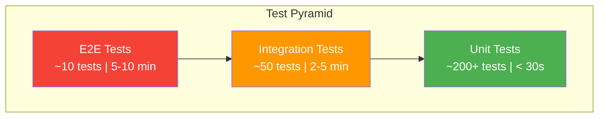

# Testing Strategy

Comprehensive testing guide covering unit, integration, end-to-end, data quality, load, and chaos testing for the Fraud Intelligence Platform.

---

## Test Pyramid



---

## Unit Tests

### What to Test Per Service

| Service | Focus Areas | Framework |
|---------|-------------|-----------|
| Backend API | Route handlers, validation, serializers, business logic | pytest + httpx |
| ML Service | Feature engineering, model loading, prediction pipeline | pytest |
| Spark Jobs | Transformations, aggregations, UDFs (using local SparkSession) | pytest + pyspark |
| Airflow DAGs | DAG structure, task dependencies, custom operators | pytest |
| Frontend | Components, hooks, state management, utilities | Vitest + Testing Library |

### Running Unit Tests

```bash
# All unit tests
make test-unit

# By service
pytest services/backend/tests/unit/ -v
pytest services/ml-service/tests/unit/ -v
pytest services/spark-jobs/tests/unit/ -v
pytest services/airflow/tests/unit/ -v

# Frontend
cd services/frontend && npm test
```

### Backend Unit Test Examples

```python
# tests/unit/test_fraud_detector.py
import pytest
from src.fraud_detector import RuleBasedDetector

class TestRuleBasedDetector:
    def setup_method(self):
        self.detector = RuleBasedDetector(
            velocity_threshold=5,
            amount_threshold=10000,
            time_window_minutes=60,
        )

    def test_high_amount_flagged(self):
        txn = {"amount": 15000, "merchant": "electronics_store"}
        result = self.detector.evaluate(txn)
        assert result.is_flagged is True
        assert "high_amount" in result.triggered_rules

    def test_normal_transaction_passes(self):
        txn = {"amount": 50, "merchant": "grocery_store"}
        result = self.detector.evaluate(txn)
        assert result.is_flagged is False

    def test_velocity_check(self):
        txns = [{"amount": 100, "timestamp": f"2024-01-01T10:0{i}:00Z"}
                for i in range(6)]
        result = self.detector.evaluate_velocity(txns)
        assert result.is_flagged is True
        assert "velocity_exceeded" in result.triggered_rules
```

### Spark Unit Test Examples

```python
# tests/unit/test_transformations.py
import pytest
from pyspark.sql import SparkSession
from src.transformations import enrich_transaction, compute_velocity_features

@pytest.fixture(scope="session")
def spark():
    return SparkSession.builder \
        .master("local[2]") \
        .appName("test") \
        .config("spark.sql.shuffle.partitions", "2") \
        .getOrCreate()

def test_enrich_transaction(spark):
    data = [("txn_001", 100.0, "merchant_a", "2024-01-01T10:00:00Z")]
    df = spark.createDataFrame(data, ["id", "amount", "merchant", "timestamp"])

    result = enrich_transaction(df)

    assert "amount_bucket" in result.columns
    assert "hour_of_day" in result.columns
    row = result.collect()[0]
    assert row.hour_of_day == 10
```

---

## Integration Tests

### Docker Compose Test Profile

```bash
# Start test environment
docker compose --profile test up -d

# Wait for services to be healthy
make wait-healthy

# Run integration tests
make test-integration

# Teardown
docker compose --profile test down -v
```

### Integration Test Structure

```python
# tests/integration/test_pipeline_integration.py
import pytest
import httpx
from kafka import KafkaProducer, KafkaConsumer
import json
import time

BACKEND_URL = "http://localhost:8000"
KAFKA_BOOTSTRAP = "localhost:9092"

@pytest.fixture(scope="module")
def kafka_producer():
    return KafkaProducer(
        bootstrap_servers=KAFKA_BOOTSTRAP,
        value_serializer=lambda v: json.dumps(v).encode("utf-8"),
    )

class TestPipelineIntegration:
    def test_transaction_flows_through_pipeline(self, kafka_producer):
        """Verify a transaction flows from Kafka to the API."""
        txn = {
            "transaction_id": "test_txn_001",
            "amount": 5000.0,
            "merchant": "test_merchant",
            "timestamp": "2024-01-01T12:00:00Z",
        }

        # Produce to Kafka
        kafka_producer.send("transactions", value=txn)
        kafka_producer.flush()

        # Wait for processing (Spark streaming + API)
        time.sleep(15)

        # Verify via API
        resp = httpx.get(f"{BACKEND_URL}/api/transactions/test_txn_001")
        assert resp.status_code == 200
        data = resp.json()
        assert data["amount"] == 5000.0

    def test_fraud_alert_generated(self, kafka_producer):
        """Verify high-amount transactions generate alerts."""
        txn = {
            "transaction_id": "test_fraud_001",
            "amount": 50000.0,
            "merchant": "suspicious_merchant",
            "timestamp": "2024-01-01T12:00:00Z",
        }

        kafka_producer.send("transactions", value=txn)
        kafka_producer.flush()
        time.sleep(20)

        resp = httpx.get(
            f"{BACKEND_URL}/api/alerts",
            params={"transaction_id": "test_fraud_001"},
        )
        assert resp.status_code == 200
        alerts = resp.json()["data"]
        assert len(alerts) >= 1
```

---

## End-to-End Tests

Full pipeline verification from transaction generation through UI display.

```bash
# Run E2E tests (requires full platform running)
make test-e2e
```

```python
# tests/e2e/test_full_pipeline.py
import pytest
import httpx
import time

class TestFullPipeline:
    def test_simulator_to_dashboard(self):
        """Verify transactions appear on the dashboard."""
        # Start simulator with known parameters
        resp = httpx.put("http://localhost:8000/api/simulator/config",
                         json={"tps": 5, "fraud_ratio": 0.1, "duration_seconds": 30})
        assert resp.status_code == 200

        # Wait for processing
        time.sleep(45)

        # Check transactions were stored
        resp = httpx.get("http://localhost:8000/api/transactions/stats")
        stats = resp.json()
        assert stats["total_count"] > 0

        # Check alerts were generated
        resp = httpx.get("http://localhost:8000/api/alerts/stats")
        alert_stats = resp.json()
        assert alert_stats["total_count"] > 0

    def test_ml_prediction_endpoint(self):
        """Verify ML model can score transactions."""
        txn = {
            "amount": 9999.99,
            "merchant_category": "electronics",
            "hour_of_day": 3,
            "is_international": True,
        }
        resp = httpx.post("http://localhost:8001/api/ml/predict", json=txn)
        assert resp.status_code == 200
        result = resp.json()
        assert 0.0 <= result["fraud_probability"] <= 1.0
```

---

## Data Quality Tests

### Great Expectations

```bash
# Run data quality suite
make data-quality

# Run specific checkpoint
docker exec airflow-worker great_expectations checkpoint run fraud_transactions
```

```python
# great_expectations/expectations/fraud_transactions_suite.py
{
    "expectation_suite_name": "fraud_transactions",
    "expectations": [
        {
            "expectation_type": "expect_column_values_to_not_be_null",
            "kwargs": {"column": "transaction_id"}
        },
        {
            "expectation_type": "expect_column_values_to_be_between",
            "kwargs": {"column": "amount", "min_value": 0.01, "max_value": 1000000}
        },
        {
            "expectation_type": "expect_column_values_to_be_in_set",
            "kwargs": {
                "column": "status",
                "value_set": ["pending", "approved", "declined", "flagged"]
            }
        },
        {
            "expectation_type": "expect_column_values_to_match_regex",
            "kwargs": {
                "column": "transaction_id",
                "regex": "^txn_[a-f0-9]{8}-[a-f0-9]{4}-[a-f0-9]{4}-[a-f0-9]{4}-[a-f0-9]{12}$"
            }
        }
    ]
}
```

---

## Load Tests

### Benchmarking with Configurable TPS

```bash
# Run load test at 100 TPS for 5 minutes
make benchmark TPS=100 DURATION=300

# With detailed reporting
python tests/load/benchmark.py \
  --target-tps 100 \
  --duration 300 \
  --report-interval 10 \
  --output results/load_test_$(date +%Y%m%d).json
```

### Expected Results

| TPS | Latency (p50) | Latency (p99) | Memory Usage | Status |
|-----|---------------|---------------|--------------|--------|
| 10 | < 2s | < 5s | ~8 GB | Green |
| 50 | < 3s | < 8s | ~12 GB | Green |
| 100 | < 5s | < 15s | ~14 GB | Yellow |
| 200+ | Variable | Variable | ~16 GB | Depends on hardware |

---

## Chaos Tests

### Failure Injection

```bash
# Kill Kafka broker (test recovery)
docker stop kafka && sleep 30 && docker start kafka

# Kill Spark (test checkpoint recovery)
docker kill spark-master && sleep 10 && docker start spark-master

# Exhaust MinIO storage
dd if=/dev/zero of=/tmp/filler bs=1M count=500
docker cp /tmp/filler minio:/data/

# Network partition (disconnect Spark from Kafka)
docker network disconnect fraud-network spark-master
sleep 30
docker network connect fraud-network spark-master
```

### Chaos Test Expectations

| Scenario | Expected Behavior | Recovery Time |
|----------|-------------------|---------------|
| Kafka broker restart | Producers buffer, consumers resume from checkpoint | < 30s |
| Spark crash | Restarts from checkpoint, no data loss | < 60s |
| MinIO unavailable | Spark retries writes, queues in memory | < 30s after recovery |
| ML service down | Falls back to rule-based detection | Immediate |
| Network partition | Backpressure, then resume | < 30s after reconnect |

---

## Test Commands Summary

```bash
make test              # Run all tests
make test-unit         # Unit tests only (< 30s)
make test-integration  # Integration tests (2-5 min)
make test-e2e          # End-to-end tests (5-10 min)
make test-coverage     # Unit tests with coverage report
make data-quality      # Great Expectations checks
make benchmark         # Load/performance tests
make test-chaos        # Chaos/resilience tests
make lint              # Ruff + ESLint
make type-check        # mypy + TypeScript tsc
```
