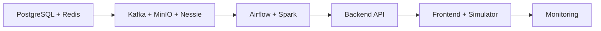

# Quick Start

Get the Fraud Intelligence Platform running in under 5 minutes.

!!! note "Prerequisites"
    Ensure you have completed the [Prerequisites](prerequisites.md) setup before proceeding. Docker Desktop must be running with **8 GB RAM** allocated.

## 1. Clone the Repository

```bash
git clone https://github.com/Abhishek543-dotcom/fraud-intelligence-platform.git
cd fraud-intelligence-platform
```

## 2. Build Docker Images

```bash
make build
```

??? info "What this does"
    - Builds custom Docker images for: backend API, frontend dashboard, ML inference service, transaction simulator, Spark jobs
    - Pulls pre-built images for: Kafka, MinIO, PostgreSQL, Nessie, Airflow, Redis, Ollama, ChromaDB, Prometheus, Grafana
    - Uses Docker BuildKit for layer caching — subsequent builds are much faster

**Expected output:**

```
[+] Building 142/142
 ✔ backend          Built
 ✔ frontend         Built  
 ✔ ml-service       Built
 ✔ simulator        Built
 ✔ spark-jobs       Built
```

!!! tip "First build takes 5-10 minutes"
    The initial build downloads base images and installs dependencies. Subsequent builds leverage Docker layer caching and complete in under 30 seconds.

## 3. Start the Platform

```bash
make up
```

This starts all 16 services in dependency order. The startup sequence is:



**Expected startup time:** 60-90 seconds for all services to reach healthy state.

## 4. Initialize the Platform

```bash
make init
```

??? info "What this does"
    - Creates Kafka topics (7 topics with configured partitions and retention)
    - Creates MinIO buckets (iceberg-warehouse, spark-checkpoints, ml-models)
    - Initializes Iceberg tables (Bronze, Silver, Gold layers)
    - Seeds Airflow connections and variables
    - Downloads the Ollama model (`phi3:mini`, ~2.7 GB on first run)
    - Runs initial data quality validation

!!! warning "Ollama model download"
    The first `make init` downloads the `phi3:mini` LLM (~2.7 GB). This is a one-time download. Subsequent runs skip this step.

## 5. Verify Services

```bash
make ps
```

**Expected output — all services running:**

```
NAME                STATUS          PORTS
kafka               running         9092, 29092
spark-master        running         8080, 7077
spark-worker        running         8081
minio               running         9000, 9001
nessie              running         19120
postgres            running         5432
redis               running         6379
airflow-webserver   running         8082
airflow-scheduler   running
backend             running         8000
frontend            running         3000
simulator           running
ml-service          running         8001
ollama              running         11434
chromadb            running         8100
prometheus          running         9090
grafana             running         3001
```

Run the health check to verify all services are responding:

```bash
make health
```

**Expected output:**

```
✔ Kafka broker        — healthy (3 topics ready)
✔ Spark master        — healthy (1 worker connected)
✔ MinIO               — healthy (3 buckets)
✔ Nessie catalog      — healthy
✔ PostgreSQL          — healthy
✔ Redis               — healthy (connected)
✔ Airflow             — healthy (5 DAGs loaded)
✔ Backend API         — healthy (v1.0.0)
✔ Frontend            — healthy (build: production)
✔ ML Service          — healthy (3 models loaded)
✔ Ollama              — healthy (phi3:mini ready)
✔ ChromaDB            — healthy
✔ Prometheus          — healthy (17 targets)
✔ Grafana             — healthy (5 dashboards)

All 14 services healthy ✔
```

## Service Access URLs

Once running, access the platform services at:

| Service | URL | Credentials |
|---------|-----|-------------|
| **React Dashboard** | [http://localhost:3000](http://localhost:3000) | — |
| **Backend API** | [http://localhost:8000](http://localhost:8000) | — |
| **API Documentation** | [http://localhost:8000/docs](http://localhost:8000/docs) | — |
| **ML Inference API** | [http://localhost:8001](http://localhost:8001) | — |
| **Airflow UI** | [http://localhost:8082](http://localhost:8082) | `admin` / `admin` |
| **Spark Master UI** | [http://localhost:8080](http://localhost:8080) | — |
| **Spark Worker UI** | [http://localhost:8081](http://localhost:8081) | — |
| **MinIO Console** | [http://localhost:9001](http://localhost:9001) | `minioadmin` / `minioadmin` |
| **Nessie UI** | [http://localhost:19120](http://localhost:19120) | — |
| **Grafana** | [http://localhost:3001](http://localhost:3001) | `admin` / `admin` |
| **Prometheus** | [http://localhost:9090](http://localhost:9090) | — |
| **ChromaDB** | [http://localhost:8100](http://localhost:8100) | — |

## Your First Fraud Alert

Once the platform is running, the transaction simulator begins generating synthetic transactions. Here is what happens end-to-end:

### What to Expect

1. **Transaction Simulator** generates realistic payment transactions at ~100 TPS, with ~2% containing fraud patterns (velocity abuse, geographic anomalies, amount spikes)

2. **Kafka** receives raw transactions on the `transactions_raw` topic and distributes them across 6 partitions

3. **Spark Structured Streaming** consumes transactions in micro-batches, computes 10 real-time features (velocity, geo-velocity, z-scores), and applies the ML ensemble scoring

4. **Fraud alerts** with scores above 0.40 are published to the `fraud_alerts` Kafka topic and written to the Gold Iceberg table

5. **Backend API** consumes fraud alerts and pushes them to connected dashboard clients via WebSocket

6. **React Dashboard** displays alerts in real-time with severity coloring, geographic heatmap updates, and model performance metrics

### Dashboard Walkthrough

Open [http://localhost:3000](http://localhost:3000) and observe:

- **Alert Feed** (left panel) — Live stream of fraud alerts with severity badges (CRITICAL in red, HIGH in orange, MEDIUM in yellow)
- **Geographic Heatmap** (center) — Leaflet map with fraud hotspots. Clusters indicate geographic fraud patterns
- **Metrics Panel** (top) — KPI cards showing total transactions, fraud rate, average score, alerts per minute
- **Transaction Table** (bottom) — Searchable, sortable table of recent transactions with fraud scores
- **Model Performance** (right panel) — Real-time AUC-ROC, precision, recall metrics for the ML ensemble

!!! info "First alerts appear within 30-60 seconds"
    The Spark streaming job processes micro-batches every 10 seconds. After the first batch completes feature engineering and scoring, alerts begin flowing to the dashboard.

## Stopping the Platform

```bash
# Stop all services (preserves data volumes)
make down

# Stop and remove all data (clean slate)
make clean
```

## Profile-Based Startup

Start only the services you need:

=== "Core Only"

    ```bash
    # Kafka, Spark, MinIO, Nessie, Airflow, Postgres, Redis, Backend, Simulator
    make up-core
    ```

=== "Core + ML"

    ```bash
    # Core services + ML inference
    make up-ml
    ```

=== "Core + AI Copilot"

    ```bash
    # Core services + Ollama + ChromaDB
    make up-ai
    ```

=== "Full Platform"

    ```bash
    # All services including monitoring and frontend
    make up
    ```

## Troubleshooting Quick Fixes

| Problem | Solution |
|---------|----------|
| Service won't start | `make logs SERVICE=<name>` to check logs |
| Port already in use | `make down` then check for orphan containers: `docker ps -a` |
| Out of memory | Verify Docker Desktop has 8 GB allocated |
| Kafka not ready | Wait 30s after startup; KRaft election takes time |
| Ollama model missing | Run `make init` to trigger model download |
| Build fails | Run `make clean-build` to clear Docker cache |

For detailed troubleshooting, see the [Troubleshooting Runbook](../runbook/troubleshooting.md).

## Next Steps

- [Configuration Reference](configuration.md) — Customize environment variables and Docker profiles
- [Architecture Overview](../architecture/overview.md) — Understand the system design
- [Component Deep Dives](../components/kafka.md) — Explore individual services
