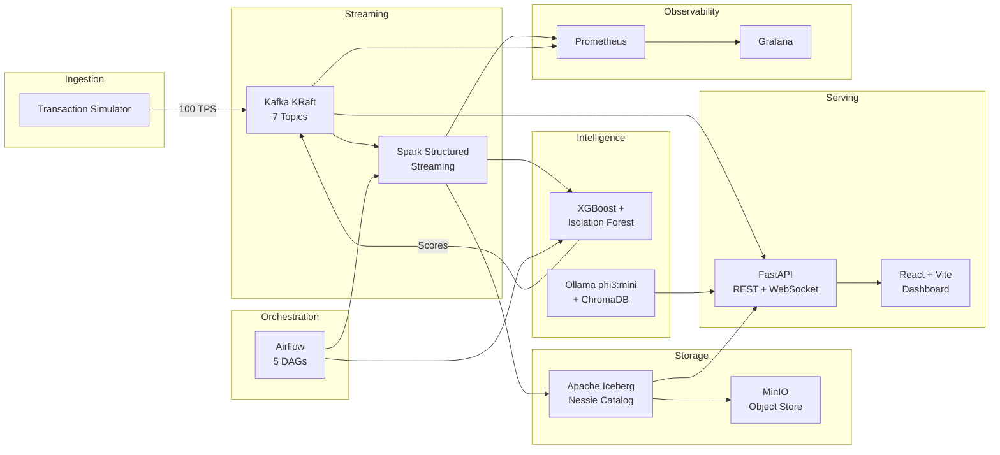

# Fraud Intelligence Platform

<div style="text-align: center; margin: 2rem 0;">
<strong style="font-size: 1.4em;">Real-Time Fraud Detection · ML Scoring · AI Investigation Copilot</strong>
<br/>
<em>A production-grade streaming analytics platform built entirely on open-source technologies</em>
</div>

---

## :material-lightning-bolt: What This Project Demonstrates

| Capability | Implementation |
|---|---|
| **Real-Time Streaming** | Kafka (KRaft) → Spark Structured Streaming → Iceberg lakehouse |
| **ML Fraud Scoring** | XGBoost + Isolation Forest ensemble with 10 engineered features |
| **AI Copilot** | RAG pipeline with Ollama phi3:mini + ChromaDB for natural-language investigation |
| **Medallion Architecture** | Bronze → Silver → Gold data layers with Apache Iceberg + Nessie catalog |
| **Orchestration** | Airflow DAGs for batch retraining, data quality checks, and compaction |
| **Observability** | Prometheus + Grafana dashboards with real-time pipeline health metrics |
| **Interactive Dashboard** | React + Vite SPA with live WebSocket updates and drill-down analytics |

---

## :material-chart-arc: Architecture at a Glance



---

## :material-counter: Project by the Numbers

<div class="grid cards" markdown>

-   :material-file-code:{ .lg .middle } **261 Files**

    ---

    Across 13 implementation phases, covering every layer from ingestion to visualization

-   :material-docker:{ .lg .middle } **16 Docker Services**

    ---

    Fully containerized with Docker Compose, running within an 8GB memory budget

-   :material-database:{ .lg .middle } **1M+ Events/Day**

    ---

    Sustained throughput of 100 TPS through the complete streaming pipeline

-   :material-brain:{ .lg .middle } **2 ML Models**

    ---

    XGBoost (supervised) + Isolation Forest (unsupervised) ensemble scoring

-   :material-robot:{ .lg .middle } **RAG Copilot**

    ---

    Natural-language fraud investigation powered by local LLM with vector search

-   :material-chart-line:{ .lg .middle } **13 Phases**

    ---

    Structured build from infrastructure through ML, LLM, and production hardening

</div>

---

## :material-stack-overflow: Technology Stack

| Layer | Technology | Version | Purpose |
|---|---|---|---|
| **Streaming** | Apache Kafka (KRaft) | 3.7 | Event backbone, 7 topics, exactly-once semantics |
| **Processing** | Apache Spark | 3.5 | Structured Streaming with watermarks and stateful ops |
| **Storage** | Apache Iceberg | 1.5 | ACID lakehouse tables with time travel |
| **Catalog** | Nessie | 0.77 | Git-like REST catalog for Iceberg |
| **Object Store** | MinIO | latest | S3-compatible storage for Iceberg data files |
| **ML Supervised** | XGBoost | 2.0 | Gradient-boosted trees for known fraud patterns |
| **ML Unsupervised** | Isolation Forest | scikit-learn | Anomaly detection for novel fraud patterns |
| **LLM** | Ollama + phi3:mini | 2.7GB | Local inference for investigation copilot |
| **Vector DB** | ChromaDB | 0.4 | Persistent embeddings for RAG retrieval |
| **API** | FastAPI | 0.110 | REST + WebSocket serving layer |
| **Dashboard** | React + Vite | 18 / 5 | Interactive SPA with live updates |
| **Orchestration** | Apache Airflow | 2.8 | Batch DAGs for retraining and maintenance |
| **Monitoring** | Prometheus + Grafana | latest | Metrics collection and visualization |
| **Containers** | Docker Compose | 3.8 | Full environment orchestration |

---

## :material-navigation: Documentation Guide

| Section | Description |
|---|---|
| [**Getting Started**](getting-started/prerequisites.md) | Prerequisites, installation, first-run walkthrough |
| [**Architecture**](architecture/overview.md) | System design, data flow, ADRs, scaling strategy |
| [**Components**](components/kafka.md) | Deep-dives into each technology component |
| [**Development**](development/project-structure.md) | Project structure, coding standards, testing |
| [**API Reference**](api/rest-endpoints.md) | REST endpoints, WebSocket protocol, schemas |
| [**Runbooks**](runbooks/troubleshooting.md) | Operational troubleshooting and disaster recovery |

---

## :material-memory: Resource Profile

This platform runs on a **16GB MacBook with Apple Silicon**, allocating 8GB to Docker:

```yaml title="Memory Budget (8GB Total)"
Kafka (KRaft):        1.0 GB   # No Zookeeper overhead
Spark Driver+Worker:  2.0 GB   # Structured Streaming
Iceberg + Nessie:     0.5 GB   # Catalog + metadata
MinIO:                0.5 GB   # Object storage
Airflow:              0.75 GB  # Scheduler + webserver
FastAPI:              0.25 GB  # Serving layer
Ollama (phi3:mini):   2.0 GB   # Local LLM inference
ChromaDB:             0.25 GB  # Vector store
Prometheus + Grafana: 0.5 GB   # Monitoring stack
React Dev Server:     0.25 GB  # Dashboard
```

!!! tip "Designed for Laptops"
    Every technology choice was made with a strict memory budget. See [ADR decisions](architecture/decisions.md) for the reasoning behind each choice.

---

## :material-rocket-launch: Quick Start

```bash
# Clone and start the entire platform
git clone https://github.com/your-org/fraud-intelligence-platform.git
cd fraud-intelligence-platform
docker compose up -d

# Verify all 16 services are healthy
docker compose ps

# Open the dashboard
open http://localhost:5173
```

!!! info "Full setup instructions"
    See the [Prerequisites](getting-started/prerequisites.md) and [Installation](getting-started/installation.md) guides for detailed setup steps.

---

<div style="text-align: center; margin-top: 2rem;">
<em>Built as a portfolio project demonstrating end-to-end data engineering, ML engineering, and platform engineering skills.</em>
</div>
