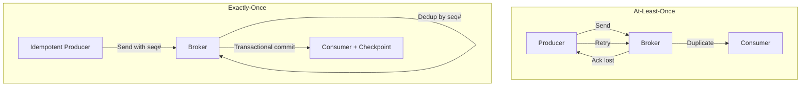
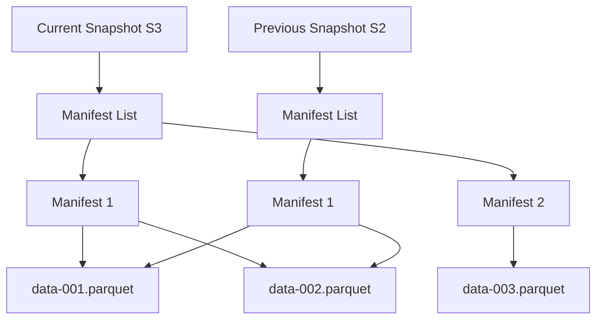
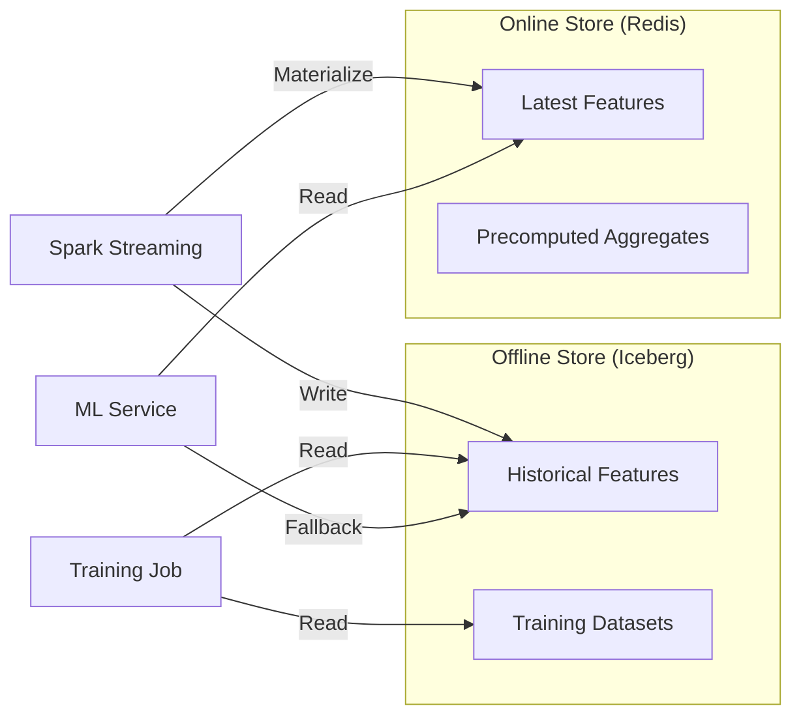
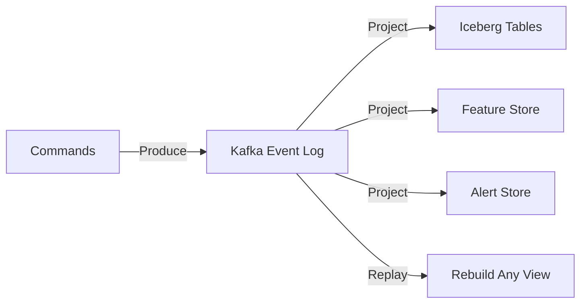
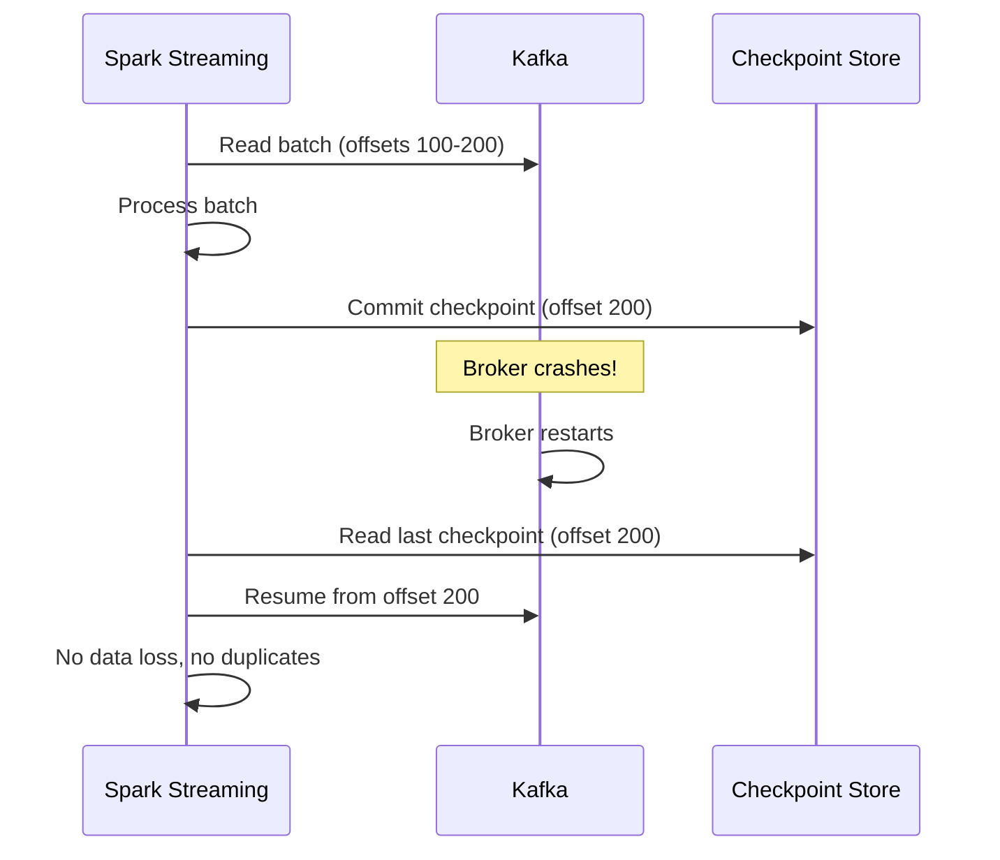

# Technical Deep Dives

In-depth technical topics for demonstrating expertise during interviews about the Fraud Intelligence Platform.

---

## Streaming Systems

### Exactly-Once vs At-Least-Once



| Guarantee | How Achieved | Overhead | When to Use |
|-----------|-------------|----------|-------------|
| At-most-once | Fire and forget, no retry | Minimal | Metrics, logs (loss acceptable) |
| At-least-once | Retry until ack, consumer dedup | Low-medium | Default for most systems |
| Exactly-once | Idempotent producer + transactional consumer | Medium | Financial transactions, billing |

**In our platform:**

- Kafka producers use `enable.idempotence=true` — the broker deduplicates by producer ID + sequence number
- Spark Structured Streaming checkpoints are committed atomically with the output batch
- Iceberg MERGE on `transaction_id` provides a final deduplication safety net

### Watermarking Strategies

| Strategy | Watermark | Tradeoff |
|----------|-----------|----------|
| Aggressive | 1 minute | Low latency, may miss late events |
| Moderate | 10 minutes | Balanced — our default |
| Conservative | 1 hour | High completeness, high memory use |
| None | Unbounded | Complete but unbounded state growth |

```python
# Spark watermark configuration
transactions = spark.readStream \
    .format("kafka") \
    .load() \
    .withWatermark("event_time", "10 minutes")

# Window aggregation respects watermark
velocity = transactions \
    .groupBy(
        window("event_time", "1 hour", "5 minutes"),
        "customer_id"
    ).count()
```

### Backpressure Handling

When Spark can't keep up with Kafka ingestion:

1. **Rate limiting**: `maxOffsetsPerTrigger` caps records per micro-batch
2. **Adaptive batching**: Trigger interval adjusts dynamically
3. **Consumer lag monitoring**: Alert when lag exceeds threshold
4. **Graceful degradation**: Reduce feature computation complexity under load

### Stream-Stream Joins

```python
# Join transactions with customer profile updates (stream-stream)
enriched = transactions.join(
    customer_updates,
    expr("""
        transactions.customer_id = customer_updates.customer_id AND
        transactions.event_time >= customer_updates.update_time AND
        transactions.event_time < customer_updates.update_time + interval 1 day
    """),
    "leftOuter"
)
```

!!! info "Stream-Stream Join Internals"
    Spark buffers both streams in state store, matching events within a time range. Memory grows with the join window size — keep windows tight for resource-constrained environments.

---

## Data Lake Architecture

### Why Iceberg Over Raw Parquet Files

| Feature | Raw Parquet | Apache Iceberg |
|---------|-------------|----------------|
| ACID transactions | No | Yes (optimistic concurrency) |
| Schema evolution | Manual | Built-in (add, rename, reorder columns) |
| Time travel | No | Yes (snapshot-based) |
| Partition evolution | Requires rewrite | In-place, no data movement |
| Hidden partitioning | No | Yes (users don't see partition columns in queries) |
| File compaction | Manual scripts | Built-in maintenance procedures |
| Concurrent writers | Corrupt data | Safe with conflict resolution |
| Row-level deletes | Full file rewrite | Copy-on-write or merge-on-read |

### Compaction Strategies

=== "Bin-Packing (Default)"

    Merges small files into target size (default: 512 MB). Fast, doesn't sort data.

    ```sql
    CALL fraud_catalog.system.rewrite_data_files(
      table => 'fraud_db.transactions',
      strategy => 'binpack',
      options => map('target-file-size-bytes', '536870912')
    )
    ```

=== "Sort-Based"

    Sorts data within files by specified columns. Better for query performance, slower to execute.

    ```sql
    CALL fraud_catalog.system.rewrite_data_files(
      table => 'fraud_db.transactions',
      strategy => 'sort',
      sort_order => 'customer_id ASC, timestamp DESC'
    )
    ```

### Schema Evolution in Production

```sql
-- Add a new column (no data rewrite needed)
ALTER TABLE fraud_db.transactions ADD COLUMN risk_category STRING;

-- Rename a column
ALTER TABLE fraud_db.transactions RENAME COLUMN merchant TO merchant_name;

-- Widen a type
ALTER TABLE fraud_db.transactions ALTER COLUMN amount TYPE DOUBLE;

-- All existing data continues to work — Iceberg handles the mapping
```

### Time Travel Implementation



Each snapshot points to a manifest list → manifests → data files. Snapshots share data files (copy-on-write), so historical queries read the same physical data as current queries for unchanged partitions.

---

## ML in Production

### Online vs Batch Inference

| Aspect | Online (Real-time) | Batch |
|--------|-------------------|-------|
| Latency | < 50ms | Minutes to hours |
| Throughput | Lower per instance | Very high |
| Feature freshness | Real-time features | Point-in-time features |
| Use case | Transaction scoring | Retraining, backtesting |
| Complexity | Higher (serving infra) | Lower (Spark job) |
| Cost | Higher (always-on) | Lower (scheduled) |

**Our approach:** Online inference for real-time scoring via the ML service, batch inference for retraining and backtesting via Spark + Airflow.

### Model Drift Detection

| Drift Type | Detection Method | Action |
|------------|------------------|--------|
| Data drift | Feature distribution monitoring (KS test, PSI) | Alert, investigate |
| Concept drift | Performance metric degradation (precision, recall) | Trigger retraining |
| Prediction drift | Score distribution shift | Compare with baseline |

```python
# Population Stability Index (PSI) for drift detection
def calculate_psi(expected, actual, buckets=10):
    """PSI > 0.2 indicates significant drift."""
    expected_pct = np.histogram(expected, bins=buckets)[0] / len(expected)
    actual_pct = np.histogram(actual, bins=buckets)[0] / len(actual)
    psi = np.sum((actual_pct - expected_pct) * np.log(actual_pct / expected_pct))
    return psi
```

### Feature Store Architecture



**Offline store (Iceberg):** Historical feature values for training and backtesting. Point-in-time correct joins prevent data leakage.

**Online store (Redis):** Latest feature values for real-time inference. TTL-based expiry ensures freshness.

### A/B Testing Models

| Strategy | Description | Risk |
|----------|-------------|------|
| Shadow mode | New model scores in parallel, results logged but not used | Zero risk |
| Canary | Route 5% of traffic to new model | Very low |
| 50/50 split | Equal traffic split, measure metrics | Moderate |
| Full rollout | Replace production model entirely | Higher |

Our deployment sequence: Shadow → Canary (5%) → Ramp (25%, 50%, 100%) → Full rollout.

---

## Distributed Systems Concepts Demonstrated

### Event Sourcing (Kafka as Source of Truth)



Every transaction event is immutable in Kafka. All downstream state (tables, features, alerts) is a projection that can be rebuilt by replaying the event log.

### CQRS (Separate Read/Write Paths)

| Path | Write Side | Read Side |
|------|-----------|-----------|
| Hot data | Kafka → Spark → Iceberg | Backend API → Iceberg |
| Features | Spark → Feature Store | ML Service → Redis (online) |
| Alerts | Spark → Alert topic → Backend | Dashboard → REST API + WebSocket |

### Saga Pattern (Multi-Step Investigation)

A fraud investigation spans multiple steps, each independently compensatable:

1. Flag transaction → 2. Freeze account → 3. Notify customer → 4. Assign analyst

If step 3 fails, the system compensates by unfreezing the account.

### Circuit Breaker (Adaptive Consumer)

```python
class CircuitBreaker:
    CLOSED = "closed"      # Normal operation
    OPEN = "open"          # Failing, fast-fail
    HALF_OPEN = "half_open"  # Testing recovery

    def __init__(self, failure_threshold=5, recovery_timeout=30):
        self.state = self.CLOSED
        self.failures = 0
        self.failure_threshold = failure_threshold
        self.recovery_timeout = recovery_timeout
```

Used in the ML service client — if the model service is down, the system falls back to rule-based detection instead of queueing failed requests.

### Bulkhead (Docker Resource Isolation)

Each service has resource limits preventing cascading failures:

```yaml
services:
  spark-master:
    deploy:
      resources:
        limits:
          memory: 4g
          cpus: '2.0'
  ml-service:
    deploy:
      resources:
        limits:
          memory: 1g
          cpus: '1.0'
```

If Spark consumes excessive memory, it gets OOM-killed without affecting the ML service or backend.

---

## Failure Scenarios

### Kafka Broker Failure → Checkpoint Recovery



### Spark Executor OOM → Graceful Degradation

1. Spark executor killed by container OOM (exit code 137)
2. Driver detects executor loss
3. Tasks re-scheduled on remaining executors
4. If driver crashes, restarts from checkpoint
5. Streaming query resumes from last committed offset

### Model Service Unavailable → Rule-Based Fallback

```python
async def score_transaction(txn: Transaction) -> float:
    try:
        # Try ML model first (circuit breaker protected)
        score = await ml_client.predict(txn, timeout=2.0)
        return score
    except (TimeoutError, ServiceUnavailable):
        # Fall back to rule-based scoring
        logger.warning("ML service unavailable, using rule-based fallback")
        return rule_engine.evaluate(txn)
```

### MinIO Unavailable → Checkpoint Retry with Backoff

Spark's Iceberg writer retries with exponential backoff when MinIO is temporarily unavailable. Micro-batches queue in memory up to `spark.sql.streaming.stateStore.maintenanceInterval` before failing the query. On MinIO recovery, pending writes drain automatically.

| Retry | Delay | Total Wait | Action if Still Down |
|-------|-------|------------|---------------------|
| 1 | 1s | 1s | Retry write |
| 2 | 2s | 3s | Retry write |
| 3 | 4s | 7s | Retry write |
| 4 | 8s | 15s | Retry write |
| 5 | 16s | 31s | Fail batch, restart from checkpoint |
