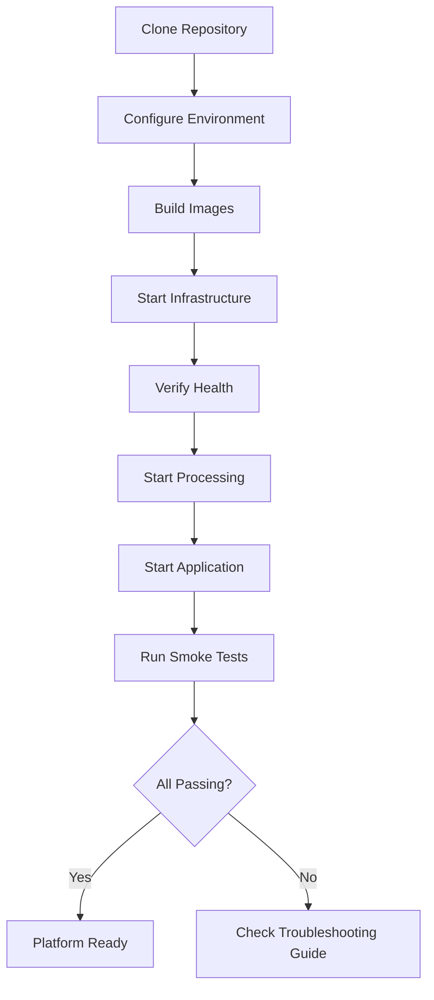
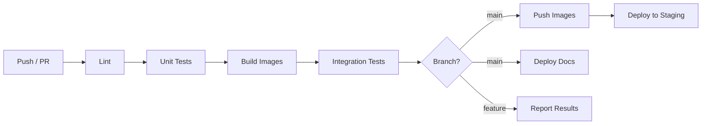

# Deployment Guide

Deployment procedures for the Fraud Intelligence Platform across Docker Compose, Kubernetes, and CI/CD environments.

---

## Docker Compose Deployment (Primary)

### Full Deployment Walkthrough



#### Step 1: Configure Environment

```bash
# Clone the repository
git clone https://github.com/your-org/fraud-intelligence-platform.git
cd fraud-intelligence-platform

# Copy environment template
cp .env.example .env

# Edit configuration (adjust memory, ports, etc.)
vim .env
```

Key environment variables:

| Variable | Default | Description |
|----------|---------|-------------|
| `KAFKA_HEAP_OPTS` | `-Xmx1g` | Kafka JVM heap size |
| `SPARK_DRIVER_MEMORY` | `2g` | Spark driver memory |
| `SIMULATOR_TPS` | `10` | Transaction generation rate |
| `FRAUD_RATIO` | `0.02` | Percentage of fraudulent transactions |
| `OLLAMA_MODEL` | `llama3.2:3b` | LLM model for Investigation Copilot |
| `BACKEND_PORT` | `8000` | Backend API port |
| `FRONTEND_PORT` | `3000` | Frontend UI port |

#### Step 2: Build Images

```bash
# Build all images (uses BuildKit for caching)
make build

# Or build specific services
docker compose build backend frontend ml-service
```

#### Step 3: Start Services

```bash
# Start with full profile
make start

# Monitor startup progress
docker compose logs -f --tail=50
```

#### Step 4: Verify Health

```bash
# Automated health check
make health

# Manual verification
curl -s http://localhost:8000/api/health | jq .
curl -s http://localhost:8001/health | jq .
curl -s http://localhost:9001/minio/health/live
```

### Profile Combinations

| Scenario | Command | Services |
|----------|---------|----------|
| Data pipeline only | `docker compose --profile core up -d` | Kafka, Spark, MinIO, Backend, Frontend |
| ML development | `docker compose --profile core --profile ml up -d` | Core + ML Service, Feature Store |
| Full AI experience | `docker compose --profile core --profile ml --profile ai up -d` | Core + ML + Ollama, Copilot |
| With monitoring | `docker compose --profile full --profile monitoring up -d` | All + Prometheus, Grafana |
| Testing | `docker compose --profile test up -d` | Minimal services for integration tests |

### Health Check Verification

All services expose health endpoints. The platform includes a composite health check:

```bash
# Composite health (checks all services)
curl -s http://localhost:8000/api/health | jq .
```

```json
{
  "status": "healthy",
  "services": {
    "kafka": {"status": "healthy", "brokers": 1},
    "spark": {"status": "healthy", "streaming": "active"},
    "minio": {"status": "healthy", "buckets": ["fraud-data"]},
    "ml_service": {"status": "healthy", "model_version": "v2.4.0"},
    "ollama": {"status": "healthy", "model": "llama3.2:3b"},
    "redis": {"status": "healthy", "connected_clients": 3},
    "airflow": {"status": "healthy", "dags_active": 5}
  },
  "uptime_seconds": 3842
}
```

### Rolling Updates for Code Changes

```bash
# Update a single service without downtime
docker compose up -d --no-deps --build backend

# Update multiple services
docker compose up -d --no-deps --build backend ml-service frontend

# Verify the update
docker compose ps backend
curl -s http://localhost:8000/api/health | jq '.version'
```

### Zero-Downtime Redeployment

```bash
# Scale up new instance before removing old
docker compose up -d --scale backend=2 --no-recreate
sleep 10  # Wait for new instance to be healthy

# Remove old instance
docker compose up -d --scale backend=1

# For stateful services (Spark), drain first
docker exec spark-master /opt/spark/bin/spark-submit --kill <app-id>
docker compose up -d --no-deps --build spark-master
```

---

## Kubernetes Deployment (Optional)

### Prerequisites

- Docker Desktop with Kubernetes enabled, or a Kubernetes cluster
- `kubectl` configured and connected
- `helm` v3 installed (for Helm deployment)

### Deploying with Kustomize

```bash
# Directory structure
k8s/
├── base/
│   ├── kustomization.yaml
│   ├── namespace.yaml
│   ├── kafka/
│   ├── spark/
│   ├── minio/
│   ├── backend/
│   └── frontend/
└── overlays/
    ├── dev/
    └── staging/
```

```bash
# Apply the dev overlay
kubectl apply -k k8s/overlays/dev

# Watch pods come up
kubectl get pods -n fraud-platform -w

# Check all resources
kubectl get all -n fraud-platform
```

### Deploying with Helm

```bash
# Add required Helm repos
helm repo add bitnami https://charts.bitnami.com/bitnami
helm repo add spark-operator https://kubeflow.github.io/spark-operator
helm repo update

# Install the platform
helm install fraud-platform ./helm/fraud-platform \
  --namespace fraud-platform \
  --create-namespace \
  --values helm/fraud-platform/values-dev.yaml

# Check release status
helm status fraud-platform -n fraud-platform
```

### Verifying Pods

```bash
# All pods should be Running or Completed
kubectl get pods -n fraud-platform

# Expected output:
# NAME                          READY   STATUS    RESTARTS   AGE
# kafka-0                       1/1     Running   0          5m
# spark-master-0                1/1     Running   0          4m
# spark-worker-0                1/1     Running   0          3m
# minio-0                       1/1     Running   0          5m
# backend-6d8f9b4c7-x2k9j      1/1     Running   0          3m
# frontend-7b5d6e8f9-m3n4p     1/1     Running   0          3m
# ml-service-5c4d3e2f1-q8r7s   1/1     Running   0          3m
```

### Accessing Services via Port-Forward

```bash
# Frontend
kubectl port-forward svc/frontend 3000:3000 -n fraud-platform

# Backend API
kubectl port-forward svc/backend 8000:8000 -n fraud-platform

# Spark UI
kubectl port-forward svc/spark-master 4040:4040 -n fraud-platform

# Airflow UI
kubectl port-forward svc/airflow-webserver 8080:8080 -n fraud-platform

# Grafana (if monitoring enabled)
kubectl port-forward svc/grafana 3001:3000 -n fraud-platform
```

### Scaling Replicas

```bash
# Scale backend for higher throughput
kubectl scale deployment backend --replicas=3 -n fraud-platform

# Scale Spark workers
kubectl scale statefulset spark-worker --replicas=3 -n fraud-platform

# Autoscaling (HPA)
kubectl autoscale deployment backend \
  --min=2 --max=5 \
  --cpu-percent=70 \
  -n fraud-platform
```

### Monitoring in Kubernetes

```bash
# Resource usage
kubectl top pods -n fraud-platform

# Events (useful for debugging)
kubectl get events -n fraud-platform --sort-by='.lastTimestamp'

# Logs
kubectl logs -f deployment/backend -n fraud-platform
kubectl logs -f statefulset/spark-master -n fraud-platform
```

---

## CI/CD Integration

### GitHub Actions Workflow



### Workflow Configuration

```yaml
# .github/workflows/ci.yml
name: CI/CD Pipeline

on:
  push:
    branches: [main]
  pull_request:
    branches: [main]

jobs:
  lint:
    runs-on: ubuntu-latest
    steps:
      - uses: actions/checkout@v4
      - uses: actions/setup-python@v5
        with:
          python-version: '3.11'
      - run: pip install ruff
      - run: ruff check .
      - run: ruff format --check .

  test:
    needs: lint
    runs-on: ubuntu-latest
    steps:
      - uses: actions/checkout@v4
      - uses: actions/setup-python@v5
        with:
          python-version: '3.11'
      - run: pip install -r requirements-test.txt
      - run: pytest tests/unit/ -v --cov=src --cov-report=xml
      - uses: codecov/codecov-action@v4

  build:
    needs: test
    runs-on: ubuntu-latest
    steps:
      - uses: actions/checkout@v4
      - uses: docker/setup-buildx-action@v3
      - uses: docker/build-push-action@v5
        with:
          context: .
          push: false
          tags: fraud-platform/backend:${{ github.sha }}
          cache-from: type=gha
          cache-to: type=gha,mode=max

  integration:
    needs: build
    runs-on: ubuntu-latest
    steps:
      - uses: actions/checkout@v4
      - run: docker compose --profile test up -d
      - run: sleep 30
      - run: make test-integration
      - run: docker compose down

  deploy-docs:
    needs: test
    if: github.ref == 'refs/heads/main'
    runs-on: ubuntu-latest
    steps:
      - uses: actions/checkout@v4
      - uses: actions/setup-python@v5
        with:
          python-version: '3.11'
      - run: pip install mkdocs-material
      - run: mkdocs gh-deploy --force
```

### Image Building and Registry Push

```bash
# Build and tag for registry
docker build -t ghcr.io/your-org/fraud-platform/backend:latest ./backend
docker build -t ghcr.io/your-org/fraud-platform/frontend:latest ./frontend
docker build -t ghcr.io/your-org/fraud-platform/ml-service:latest ./ml-service

# Push to GitHub Container Registry
echo $GITHUB_TOKEN | docker login ghcr.io -u USERNAME --password-stdin
docker push ghcr.io/your-org/fraud-platform/backend:latest
docker push ghcr.io/your-org/fraud-platform/frontend:latest
docker push ghcr.io/your-org/fraud-platform/ml-service:latest
```

### Automated Deployment Triggers

```yaml
# Deploy to staging on main branch push
deploy-staging:
  needs: [build, integration]
  if: github.ref == 'refs/heads/main'
  runs-on: ubuntu-latest
  environment: staging
  steps:
    - uses: actions/checkout@v4
    - uses: azure/k8s-set-context@v3
      with:
        kubeconfig: ${{ secrets.KUBE_CONFIG }}
    - run: |
        kubectl set image deployment/backend \
          backend=ghcr.io/your-org/fraud-platform/backend:${{ github.sha }} \
          -n fraud-platform
        kubectl rollout status deployment/backend -n fraud-platform
```

!!! tip "Deployment Checklist"
    - [ ] All tests passing in CI
    - [ ] Docker images built and pushed
    - [ ] Environment variables configured for target environment
    - [ ] Database migrations applied (if any)
    - [ ] Health checks passing after deployment
    - [ ] Monitoring dashboards showing normal metrics
    - [ ] Rollback procedure documented and tested
