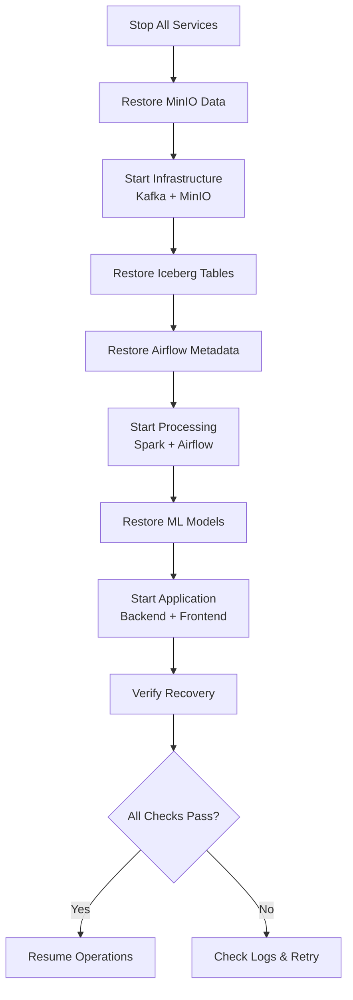
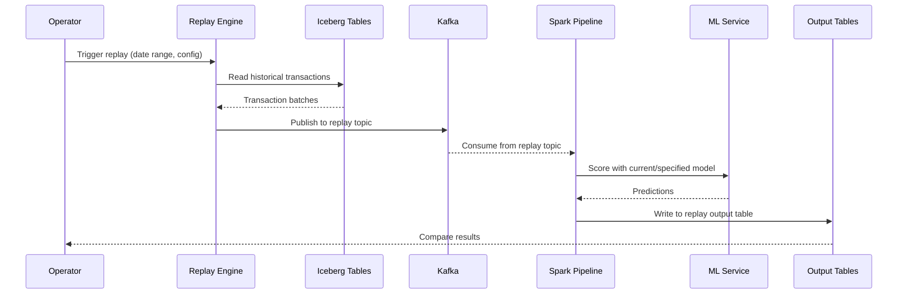
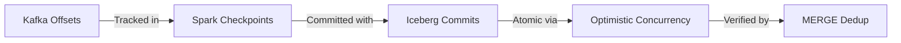

# Disaster Recovery

Backup, recovery, and replay procedures for the Fraud Intelligence Platform.

---

## Backup Strategy

### What to Back Up

| Component | Data Location | Backup Method | Priority | RPO |
|-----------|---------------|---------------|----------|-----|
| Kafka Topics | `kafka-data` volume | Topic mirroring / Iceberg sink | High | 0 (event sourced) |
| Iceberg Tables | MinIO `fraud-data` bucket | MinIO mirror / S3 sync | Critical | 1 hour |
| Iceberg Metadata | MinIO metadata path | Included with table backup | Critical | 1 hour |
| ML Models | Model registry (MinIO) | Versioned in registry | Medium | 1 day |
| Airflow Metadata | PostgreSQL database | `pg_dump` | Medium | 1 day |
| Feature Store | Redis + Iceberg | Redis RDB + Iceberg backup | High | 1 hour |
| Application Config | Git repository | Git push | Low | On change |

### Backup Commands

=== "Iceberg Tables (MinIO)"

    ```bash
    # Mirror entire fraud-data bucket to backup location
    docker exec minio mc mirror local/fraud-data backup/fraud-data

    # Sync to external S3 (if configured)
    docker exec minio mc mirror local/fraud-data s3/fraud-backup/$(date +%Y%m%d)

    # Backup specific table path
    docker exec minio mc cp --recursive \
      local/fraud-data/warehouse/fraud_db/transactions/ \
      backup/fraud-data/transactions-$(date +%Y%m%d)/
    ```

=== "ML Models"

    ```bash
    # Export current model artifacts
    docker exec ml-service python -c "
    from model_registry import ModelRegistry
    registry = ModelRegistry()
    registry.export_model('fraud_detector', version='latest', path='/tmp/model_backup')
    "

    # Copy from container
    docker cp ml-service:/tmp/model_backup ./backups/models/$(date +%Y%m%d)/
    ```

=== "Airflow Metadata"

    ```bash
    # Dump Airflow PostgreSQL database
    docker exec airflow-postgres pg_dump -U airflow airflow \
      > ./backups/airflow/airflow_metadata_$(date +%Y%m%d).sql

    # Backup DAG files
    cp -r ./dags ./backups/dags/$(date +%Y%m%d)/

    # Backup Airflow variables and connections
    docker exec airflow-scheduler airflow variables export /tmp/variables.json
    docker cp airflow-scheduler:/tmp/variables.json ./backups/airflow/
    ```

=== "Volume Backup"

    ```bash
    # Full volume backup using docker
    for vol in kafka-data minio-data spark-checkpoints airflow-postgres; do
      docker run --rm \
        -v fraud-intelligence-platform_${vol}:/data \
        -v $(pwd)/backups:/backup \
        alpine tar czf /backup/${vol}-$(date +%Y%m%d).tar.gz -C /data .
    done
    ```

---

## Recovery Procedures

### Full Platform Recovery from Scratch



```bash
# Step 1: Clean start
make stop
docker volume prune -f

# Step 2: Restore MinIO data
docker compose up -d minio
sleep 10
docker exec minio mc mirror backup/fraud-data local/fraud-data

# Step 3: Start Kafka (fresh, events are in Iceberg)
docker compose up -d kafka
sleep 15

# Step 4: Start Spark (will create fresh checkpoints)
docker compose up -d spark-master

# Step 5: Restore Airflow
docker compose up -d airflow-postgres
docker exec -i airflow-postgres psql -U airflow airflow < ./backups/airflow/airflow_metadata_latest.sql
docker compose up -d airflow-scheduler airflow-worker

# Step 6: Restore ML models
docker compose up -d ml-service
docker cp ./backups/models/latest/ ml-service:/opt/models/

# Step 7: Start application
docker compose up -d backend frontend

# Step 8: Verify
make health
```

### Kafka Topic Recovery (Replay from Iceberg)

Since all transactions are persisted to Iceberg, Kafka topics can be reconstructed:

```bash
# Recreate topics
docker exec kafka kafka-topics.sh \
  --bootstrap-server localhost:9092 \
  --create --topic transactions \
  --partitions 4 --replication-factor 1

# Replay from Iceberg to Kafka using Spark job
docker exec spark-master spark-submit \
  --class com.fraud.ReplayJob \
  /opt/spark/jobs/replay-to-kafka.py \
  --source "fraud_db.transactions" \
  --target-topic "transactions" \
  --start-date "2024-01-01" \
  --end-date "2024-12-31"
```

### Iceberg Table Rollback (Time Travel)

```bash
# List available snapshots
docker exec spark-master spark-sql -e "
  SELECT snapshot_id, committed_at, operation, summary
  FROM fraud_db.transactions.snapshots
  ORDER BY committed_at DESC
  LIMIT 10"

# Rollback to a specific snapshot
docker exec spark-master spark-sql -e "
  CALL fraud_catalog.system.rollback_to_snapshot(
    'fraud_db.transactions',
    <snapshot_id>
  )"

# Rollback to a timestamp
docker exec spark-master spark-sql -e "
  CALL fraud_catalog.system.rollback_to_timestamp(
    'fraud_db.transactions',
    TIMESTAMP '2024-06-15 10:00:00'
  )"
```

!!! tip "Non-Destructive Time Travel"
    You can also query historical data without rolling back:
    ```sql
    SELECT * FROM fraud_db.transactions
    FOR SYSTEM_TIME AS OF TIMESTAMP '2024-06-15 10:00:00'
    WHERE is_fraud = true
    LIMIT 100
    ```

### ML Model Rollback

```bash
# List model versions
curl -s http://localhost:8001/api/ml/model/versions | jq .

# Rollback to specific version
curl -X POST http://localhost:8001/api/ml/model/rollback \
  -H "Content-Type: application/json" \
  -d '{"version": "v2.3.1", "reason": "v2.4.0 showing high false positive rate"}'

# Verify active model
curl -s http://localhost:8001/api/ml/model/info | jq '.version, .metrics'
```

---

## Replay Engine

The Replay Engine allows reprocessing historical data through the pipeline with new models, features, or detection logic.

### How the Replay Engine Works



### Triggering a Replay

```bash
# Full replay for a date range
make replay START=2024-06-01 END=2024-06-30

# Replay with a specific model version
make replay START=2024-06-01 END=2024-06-30 MODEL=v2.3.1

# Replay via API
curl -X POST http://localhost:8000/api/replay/start \
  -H "Content-Type: application/json" \
  -d '{
    "start_date": "2024-06-01",
    "end_date": "2024-06-30",
    "model_version": "latest",
    "output_table": "fraud_db.replay_results_20240701",
    "batch_size": 10000,
    "parallelism": 4
  }'

# Monitor replay progress
curl -s http://localhost:8000/api/replay/status | jq .
```

### Use Cases

| Use Case | Configuration | Output |
|----------|---------------|--------|
| Evaluate new model | Specify `model_version` | Compare precision/recall vs production |
| Backfill features | Set `recompute_features: true` | Updated feature store values |
| Debug false positives | Narrow date range + transaction IDs | Detailed scoring breakdown |
| Regulatory audit | Full date range, all models | Complete audit trail |

---

## Data Consistency

### Ensuring Exactly-Once Semantics

The platform achieves effectively exactly-once processing through:

1. **Kafka → Iceberg**: Spark Structured Streaming with checkpointing provides exactly-once guarantees
2. **Iceberg MERGE**: Deduplication on write prevents duplicate records even after replay
3. **Idempotent Producers**: Kafka producers use `enable.idempotence=true`



### Handling Duplicate Events

```sql
-- Iceberg MERGE for deduplication on write
MERGE INTO fraud_db.transactions t
USING staging_transactions s
ON t.transaction_id = s.transaction_id
WHEN NOT MATCHED THEN
  INSERT *
WHEN MATCHED AND s.event_time > t.event_time THEN
  UPDATE SET *
```

### Deduplication Query for Verification

```sql
-- Check for duplicates
SELECT transaction_id, COUNT(*) as cnt
FROM fraud_db.transactions
GROUP BY transaction_id
HAVING cnt > 1
ORDER BY cnt DESC
LIMIT 20
```

!!! success "Recovery Validation Checklist"
    - [ ] All services report healthy via `make health`
    - [ ] Kafka topics exist with correct partition count
    - [ ] Iceberg tables are queryable with expected row counts
    - [ ] Spark streaming is consuming and processing
    - [ ] ML model is loaded and returning predictions
    - [ ] Frontend displays live data
    - [ ] No duplicate records in Iceberg tables
    - [ ] Airflow DAGs are scheduled and running
