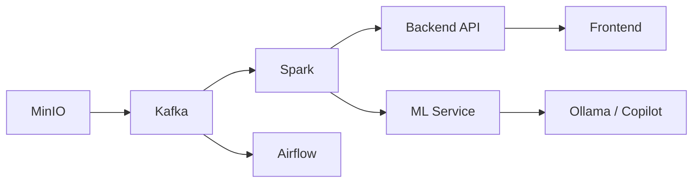

# Day-to-Day Operations

Operational guide for running and managing the Fraud Intelligence Platform in development and production-like environments.

---

## Starting the Platform

### Full Startup Sequence

Services must start in dependency order. The platform uses Docker Compose profiles to manage this automatically.



```bash
# Full platform startup (all services)
make start

# Or with Docker Compose directly
docker compose --profile core --profile ml --profile ai --profile monitoring up -d
```

### Profile-Based Startup

| Profile | Services Included | Memory Required | Use Case |
|---------|-------------------|-----------------|----------|
| `core` | Kafka, Spark, MinIO, Backend, Frontend | ~6 GB | Data pipeline development |
| `core` + `ml` | Core + ML Service, Feature Store | ~10 GB | ML model development |
| `core` + `ml` + `ai` | Core + ML + Ollama, Copilot | ~14 GB | Full AI experience |
| `full` | All services + monitoring stack | ~16 GB | Production simulation |

```bash
# Core pipeline only
make start-core

# Core + ML services
make start-ml

# Full stack with AI
make start-full

# With monitoring (Prometheus + Grafana)
make start-monitoring
```

### Verifying Service Health

```bash
# Quick health check for all services
make health

# Detailed status
docker compose ps --format "table {{.Name}}\t{{.Status}}\t{{.Ports}}"

# Individual service health
curl -s http://localhost:8000/api/health | jq .
curl -s http://localhost:8001/health | jq .
curl -s http://localhost:9001/minio/health/live
```

!!! info "Expected Startup Times"
    | Service | Cold Start | Warm Start |
    |---------|-----------|------------|
    | Kafka (KRaft) | 15-25s | 5-10s |
    | Spark Streaming | 30-45s | 15-20s |
    | MinIO | 5-10s | 3-5s |
    | Backend API | 10-15s | 5-8s |
    | Ollama (first load) | 60-120s | 10-15s |
    | Full Platform | 2-3 min | 45-60s |

---

## Routine Operations

### Checking Kafka Consumer Lag

Consumer lag indicates how far behind processing is from the latest events.

```bash
# Check consumer lag for all groups
docker exec kafka kafka-consumer-groups.sh \
  --bootstrap-server localhost:9092 \
  --describe --all-groups

# Watch lag in real-time (refreshes every 2s)
watch -n 2 'docker exec kafka kafka-consumer-groups.sh \
  --bootstrap-server localhost:9092 \
  --describe --group spark-fraud-detection'
```

!!! warning "Lag Thresholds"
    | Lag Level | Action |
    |-----------|--------|
    | < 100 | Normal operation |
    | 100 - 1,000 | Monitor — may indicate slow processing |
    | 1,000 - 10,000 | Investigate — check Spark batch duration |
    | > 10,000 | Alert — possible backpressure or failure |

### Monitoring Spark Batch Duration

```bash
# Access Spark UI
open http://localhost:4040

# Check streaming query progress via API
curl -s http://localhost:4040/api/v1/applications | jq '.[0].id'
curl -s http://localhost:4040/api/v1/applications/{app-id}/streaming/statistics | jq .
```

Target batch durations:

| Metric | Target | Warning | Critical |
|--------|--------|---------|----------|
| Batch Duration | < 5s | 5-15s | > 15s |
| Input Rate | Matches TPS | ± 20% | > 50% drift |
| Processing Rate | ≥ Input Rate | < Input Rate | Falling behind |

### Reviewing Fraud Alerts

```bash
# Recent alerts via API
curl -s 'http://localhost:8000/api/alerts?limit=20&status=pending' | jq .

# Alert counts by status
curl -s 'http://localhost:8000/api/alerts/stats' | jq .

# High-confidence alerts only
curl -s 'http://localhost:8000/api/alerts?min_score=0.9' | jq .
```

### Triggering Model Retraining

```bash
# Via Airflow
make retrain-model

# Via API
curl -X POST http://localhost:8001/api/ml/model/retrain \
  -H "Content-Type: application/json" \
  -d '{"training_window_days": 30, "min_samples": 10000}'

# Check training status
curl -s http://localhost:8001/api/ml/model/info | jq '.training_status'
```

### Running Data Quality Checks

```bash
# Trigger data quality DAG
make data-quality

# Run Great Expectations suite directly
docker exec airflow-worker python -m great_expectations checkpoint run fraud_transactions

# View latest DQ report
open http://localhost:8080/data-docs/index.html
```

### Iceberg Table Maintenance

```bash
# Run compaction (merge small files)
make iceberg-compact

# Expire old snapshots (keep last 5)
make iceberg-expire-snapshots

# Remove orphan files
make iceberg-clean-orphans

# View table metadata
docker exec spark-master spark-sql -e \
  "SELECT * FROM fraud_db.transactions.snapshots ORDER BY committed_at DESC LIMIT 5"
```

---

## Scaling Operations

### Adjusting Simulator TPS

```bash
# Change transaction rate (transactions per second)
curl -X PUT http://localhost:8000/api/simulator/config \
  -H "Content-Type: application/json" \
  -d '{"tps": 50, "fraud_ratio": 0.02}'

# Or via environment variable
docker compose up -d --no-deps \
  -e SIMULATOR_TPS=100 \
  -e SIMULATOR_FRAUD_RATIO=0.05 \
  transaction-simulator
```

### Changing Fraud Detection Thresholds

```bash
# Update detection threshold (0.0 - 1.0)
curl -X PUT http://localhost:8000/api/config/detection \
  -H "Content-Type: application/json" \
  -d '{
    "score_threshold": 0.75,
    "rule_engine_enabled": true,
    "velocity_check_window_minutes": 60
  }'
```

### Adding Spark Memory

Edit `docker-compose.yml` or use overrides:

```bash
# Create docker-compose.override.yml
cat > docker-compose.override.yml << 'EOF'
services:
  spark-master:
    environment:
      - SPARK_DRIVER_MEMORY=4g
      - SPARK_EXECUTOR_MEMORY=4g
EOF

docker compose up -d spark-master
```

### Kafka Partition Rebalance

```bash
# Check current partition assignment
docker exec kafka kafka-topics.sh \
  --bootstrap-server localhost:9092 \
  --describe --topic transactions

# Increase partitions (cannot decrease)
docker exec kafka kafka-topics.sh \
  --bootstrap-server localhost:9092 \
  --alter --topic transactions \
  --partitions 6
```

---

## Scheduled Tasks (Airflow DAGs)

| DAG | Schedule | Purpose | Dependencies | SLA |
|-----|----------|---------|--------------|-----|
| `fraud_pipeline_dag` | Every 6 hours | Batch processing of accumulated transactions, feature aggregation, model batch scoring | Kafka, Spark, Iceberg | 30 min |
| `model_training_dag` | Weekly (Sun 02:00) | Retrain fraud detection model on latest labeled data | Iceberg, ML Service, Feature Store | 2 hours |
| `data_quality_dag` | Daily (06:00) | Run Great Expectations suites, generate DQ reports, alert on failures | Iceberg, MinIO | 15 min |
| `iceberg_maintenance_dag` | Daily (03:00) | Compact small files, expire snapshots, remove orphan files | Iceberg, MinIO | 45 min |
| `feature_refresh_dag` | Hourly | Refresh materialized feature views, update online feature store | Iceberg, Feature Store | 10 min |

```bash
# Access Airflow UI
open http://localhost:8080
# Default credentials: admin / admin

# Trigger a DAG manually
docker exec airflow-scheduler airflow dags trigger fraud_pipeline_dag

# Check DAG status
docker exec airflow-scheduler airflow dags list-runs -d fraud_pipeline_dag --limit 5
```

---

## Makefile Reference

| Target | Description |
|--------|-------------|
| `make start` | Start all services (full profile) |
| `make start-core` | Start core pipeline services only |
| `make start-ml` | Start core + ML services |
| `make start-full` | Start all services including AI |
| `make start-monitoring` | Start with Prometheus + Grafana |
| `make stop` | Stop all services gracefully |
| `make restart` | Restart all services |
| `make health` | Check health of all services |
| `make logs` | Tail logs for all services |
| `make logs-spark` | Tail Spark-specific logs |
| `make logs-kafka` | Tail Kafka-specific logs |
| `make status` | Show container status |
| `make clean` | Remove containers and volumes |
| `make clean-data` | Remove data volumes only |
| `make build` | Build all Docker images |
| `make build-no-cache` | Build images without cache |
| `make simulate` | Start transaction simulator |
| `make simulate-fraud` | Run high-fraud simulation scenario |
| `make retrain-model` | Trigger model retraining |
| `make data-quality` | Run data quality checks |
| `make iceberg-compact` | Run Iceberg table compaction |
| `make iceberg-expire-snapshots` | Expire old Iceberg snapshots |
| `make iceberg-clean-orphans` | Remove orphan data files |
| `make test` | Run all tests |
| `make test-unit` | Run unit tests only |
| `make test-integration` | Run integration tests |
| `make test-e2e` | Run end-to-end tests |
| `make lint` | Run linters (ruff + eslint) |
| `make format` | Auto-format code |
| `make docs` | Build documentation |
| `make docs-serve` | Serve docs locally |
| `make benchmark` | Run performance benchmarks |
| `make reset` | Full reset (clean + rebuild + start) |
